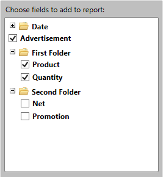

# Overview

This topic covers the specific events exposed by DataProviders of __RadPivotGrid__ control. All of the DataProviders as well as their FieldDescriptionProviders have useful events that can be used for customization purposes.      

## DataProvider Events

* __PrepareDescriptionForField__ - raised whenever the user adds a description to __RadPivotFieldList__. 

For example you can use the event in order to replace a __DoubleGroupDescription__ (__RadPivotGrid__  automatically creates DoubleGroupDescription for each numeric property) with a __PropertyGroupDescription__ as shown below:            

<snippet id='radpivotgrid-events-overview-block_1-cs' />

#### __VB__

<snippet id='radpivotgrid-events-overview-block_2-vb' />

* __StatusChanged__ - raised whenever the status of the DataProvider is changed. It can be used in order to execute custom logic whenever the DataProvider is updated.            

>important The __StatusChanged__ event is raised on multiple threads, so it is required to use Dispatcher when executing a custom logic inside of the event handler. 

You can find an example below that demonstrates how to get the current status of the DataProvider:            

<snippet id='radpivotgrid-events-overview-block_3-cs' />

#### __VB__

<snippet id='radpivotgrid-events-overview-block_4-vb' />

>You can also check for errors through the __Error__ property of the arguments.              

## FieldDescriptionProviders Events

>FieldDescrpitionProviders are used to generate the field infos for each property from your Data/Business object. They are visualized at the top part of __RadPivotFieldList__.

* __GetDescriptionsDataAsyncCompleted__ - raised when FieldTree at the top part of __RadPivotFieldList__ is generated. You can use the event in order to modify the FieldTree - you can add folders, reorder and modify the nodes. For example if you would need to group some of the nodes in folders you can use the following sample code:            

<snippet id='radpivotgrid-events-overview-block_5-cs' />

#### __VB__

<snippet id='radpivotgrid-events-overview-block_6-vb' />

You can observe the final result on __Figure 1__.

Figure 1: Custom folders in the FieldTree.

* __AddingContainerNode (available only for the LocalDataSourceFieldDescriptionsProvider)__ - raised multiple times while the FieldTree is generated - each time a node is added. 

The event can be used in order to add and/or remove nodes from the tree.  

>tip For more details on how to add/remove nodes from the FieldTree you can check the CustomizeFieldTree example from our [online SDK repository](https://github.com/telerik/xaml-sdk/tree/master/PivotGrid/CustomizeFieldTree).              

## See Also

 * [Layouts]()

 * [Understanding RadPivotGrid]()

 * [Populating with Data]()