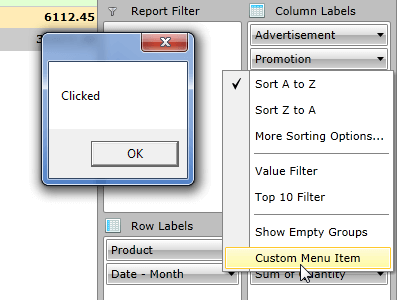

# FieldList ContextMenuBehavior

All of the context menus that appear in the __PivotFieldList__ are generated by its FieldListContextMenuBehavior. The __PivotFieldList__ provides the option to inherit and modify its default FieldListContextMenuBehavior in order to implement custom context menu functionality by adding or removing MenuItems.      

## Implementing a custom FieldListContextMenuBehavior

In this article it will be demonstrated how to implement a custom FieldListContextMenuBehavior and modify the context menu for the PropertyGroupDescription items. First thing you have to do is to create a custom class which inherits from the default __FieldListContextMenuBehavior__. Then you will need to simply override the virtual __CreateContextMenu__ method. Inside of that method you can get the default context menu by calling the base method. So until this point your class should look like as shown below:        


```C#
	public class CustomContextMenuBehavior : FieldListContextMenuBehavior
	{
	    protected override RadContextMenu CreateContextMenu(object dataContext)
	    {
	        var contextMenu = base.CreateContextMenu(dataContext);
	    }
	}
```

#### __VB__

```VB
	Public Class CustomContextMenuBehavior
	    Inherits FieldListContextMenuBehavior
	
	    Protected Overrides Function CreateContextMenu(ByVal dataContext As Object) As RadContextMenu
	        Dim contextMenu = MyBase.CreateContextMenu(dataContext)
	    End Function
	End Class
```

Having the default context menu will allow you to modify it as needed, for example you will be able to remove MenuItems from there or add new ones and attach custom commands to them. Let's imagine that you just need to remove the MenuItem for the Label Filter options and add a new one which is just showing a MessageBox. This should be done the following way:        


```C#
	protected override RadContextMenu CreateContextMenu(object dataContext)
	{
	    var contextMenu = base.CreateContextMenu(dataContext);
	    if (dataContext is PropertyGroupDescription)
	    {
	        var itemToRemove = contextMenu.Items.FirstOrDefault(i => (i as RadMenuItem).Header != null && (i as RadMenuItem).Header.Equals("Label Filter"));
	
	        if (itemToRemove != null)
	        {
	            contextMenu.Items.Remove(itemToRemove);
	        }
	
	        contextMenu.Items.Add(new RadMenuItem { Header = "Custom Menu Item", Command = new DelegateCommand(OnCustomMenuItemClickExecute) });
	    }
	}
	
	private void OnCustomMenuItemClickExecute(object obj)
	{
	    MessageBox.Show("Clicked");
	}
```

#### __VB__

```VB
	Protected Overrides Function CreateContextMenu(ByVal dataContext As Object) As RadContextMenu
	    Dim contextMenu = MyBase.CreateContextMenu(dataContext)
	    If TypeOf dataContext Is PropertyGroupDescription Then
	        Dim itemToRemove = contextMenu.Items.FirstOrDefault(Function(i) (TryCast(i, RadMenuItem)).Header IsNot Nothing AndAlso (TryCast(i, RadMenuItem)).Header.Equals("Label Filter"))
	
	        If itemToRemove IsNot Nothing Then
	            contextMenu.Items.Remove(itemToRemove)
	        End If
	
	        contextMenu.Items.Add(New RadMenuItem With {.Header = "Custom Menu Item", .Command = New DelegateCommand(AddressOf OnCustomMenuItemClickExecute)})
	    End If
	End Function
	
	Private Sub OnCustomMenuItemClickExecute(ByVal obj As Object)
	    MessageBox.Show("Clicked")
	End Sub
```

The final step is to set the custom behavior to the __PivotFieldList__ the follow way:        


```XAML
	<pivot:RadPivotFieldList x:Name="radPivotFieldList">
	    <pivot:FieldListContextMenuBehavior.Behavior>
	        <local:CustomContextMenuBehavior />
	    </pivot:FieldListContextMenuBehavior.Behavior>
	</pivot:RadPivotFieldList>
```

The custom behavior can be also set in the code behind as shown below:        


```C#
	public MainPage()
	{
	    InitializeComponent();  
	
	    var customContextMenuBehavior = new CustomContextMenuBehavior();
	    FieldListContextMenuBehavior.SetBehavior(this.radPivotFieldList, customContextMenuBehavior);
	}
```

#### __VB__

```VB
	Public Sub MainPage()
	    InitializeComponent()
	
	    Dim customContextMenuBehavior = New CustomContextMenuBehavior()
	    FieldListContextMenuBehavior.SetBehavior(Me.radPivotFieldList, customContextMenuBehavior)
	End Sub
```

And this will be the final result:



>You can use exactly the same approach in order to modify the context menu of the other description types. You will need to check whether the dataContext object is a type of the desired group descripton (for example DoubleGroupDescription or AggregateDescriptionBase) and implement the required functionality.          

>tip Find a runnable project of the previous example in the [WPF Samples GitHub repository](https://github.com/telerik/xaml-sdk/tree/master/PivotGrid/CustomContextMenuBehavior).