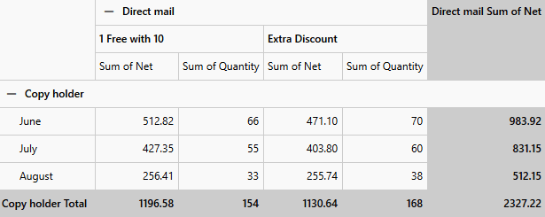

# Editing 

As of **R1 2018**, the **RadPivotGrid** control allows you to implement your custom editing logic through its **EditProvider** property and **EditEnded** event.

>important Please note that the API only provides a visual representation for the editing operation but the actual process should be handled entirely by the developer.

#### Figure 1: RadPivotGrid with custom editing and validation

## EditProvider

The new EditProvider property takes an instance of the **EditProvider** class. The class has the following overridable members:

* **GetEditorControl()**: Gets the editor control instance that will be used for editing. The return type is **FrameworkElement**.
* **PrepareEditorControl()**: Prepares the given editor instance for usage. Sets data binding and configuration properties. The return type is **FrameworkElement**.
* **GetBindingProperty()**: Provides the data binding property of the given editor. The return type is **DependencyProperty**.
* **EnableValidation**: A **boolean** property which indicates whether validation will be executed.
* **Validate(object value)**: Validates the current edit value, generating an error message if it is needed. The return type is **string**.

> The EditProvider must be initialized before any editing operations can take place.

<!-- -->

> The validation of the control utilizes the **IDataErrorInfo** interface which should be taken into account in data-binding scenarios.

## EditEnded Event

Once the user has commited the pending edit, if there are no validation errors, the **EditEnded** event of the RadPivotGrid control is fired. It's event data is of type **EditEndedEventArgs** which exposes the following two properties: 

* **CellAggregate**: The **CellAggregateValue** that was edited. The CellAggregateValue class, on the other hand, exposes a number of useful properties:
	* **RowGroup**: The row for which this value is generated. Its type is **IGroup**.
	* **ColumnGroup**: The column for which this value is generated. Its type is **IGroup**.
	* **Description**: The **IAggregateDescription** which produced the value.
	* **Value**: The value produced by the **IAggregateDescription**. This is a plain **object**.
	* **FormattedValue**: The **string** representation of the value with the **IAggregateDescription**'s string formats applied.

* **EditValue**: Gets the new value.

## See Also

* [Selection]()
* [Export]()
* [Expand Behavior]()