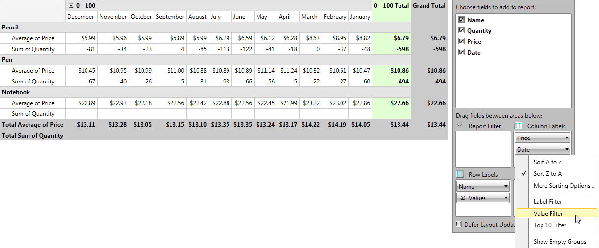

# Features

__RadPivotGrid__ is a very powerful tool for aggregations and calculations.

* Using Filters for the data - you can apply different filters to change the data that will show in __RadPivotGrid__. By using them even the biggest report can be reduced to easy to use and compact view. There are three filters that you can use: __Value Filter__, __Label Filter__ and  __Top 10 Filter__ on all Rows and Columns. The Label Filter is applied on the Header by using string comparison, the __Value Filter__ and __Top 10 filters__ are applied by using number comparison between the GrandTotals of the groups and the value we pass as parameter of the filter.

* Sorting the data - you can use sorting based on the header (ascending or descending) or based on the *GrandTotal* of the aggregates.

* Applying different number formats of the Aggregates - you can use predefined formats like "#.##" (represent the value as a double with two numbers after the decimal sign), "C"(the values will be presented as currency by using the current Culture) or define your own.

* Applying different aggregate functions - Sum, Min, Max, etc. to change the Totals and get a totally different view of your Data.

* Applying different Calculations on the aggregates - you can use % of Grand Total, % of Row Total, Difference From, etc. to view how each group is "participating" in the Total aggregation.

By combining these features you'll be able to modify __RadPivotGrid__ and generate many different reports without modifying your data. All of them can be defined in the __XAML__, code behind or even at runtime by using __RadPivotGrid__.

# See Also

 * [RadPivotFieldList]()

 * [LocalDataSourceProvider]()

 * [Sorting]()

 * [Filtering]()
