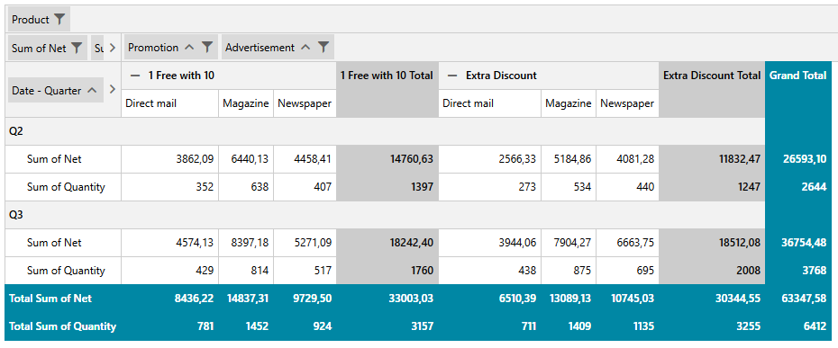
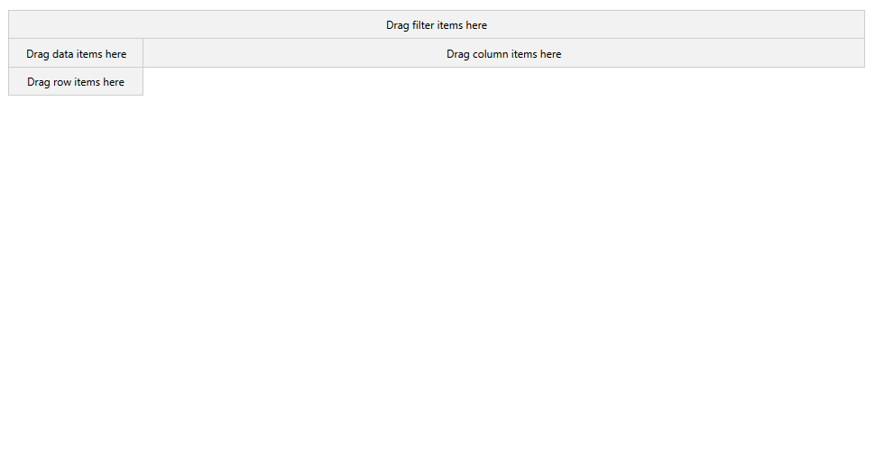
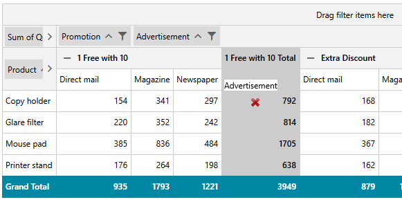
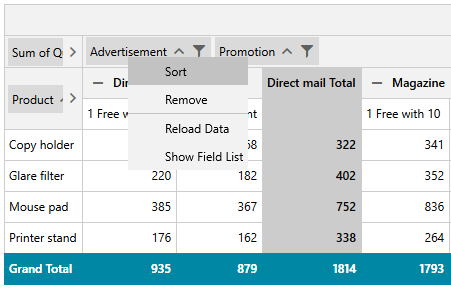
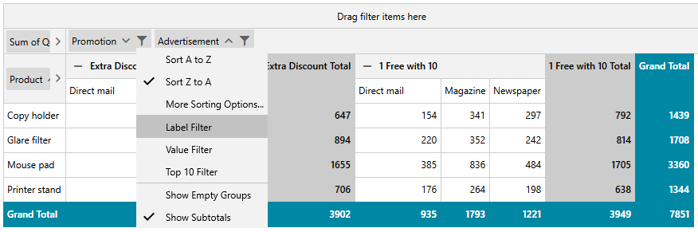
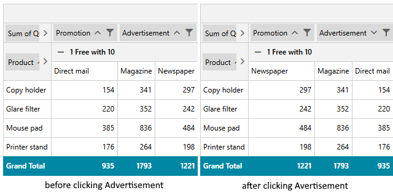

# Inline PivotFieldList

As of **R3 2022**, the RadPivotFieldList can also be displayed inline in the RadPivotGrid control. You can enable this functionality via the attached `FieldListBehavior.ShowInline` property.

>To use the FieldListBehavior class, you need to add the following namespace:
>	*xmlns:pivot="http://schemas.telerik.com/2008/xaml/presentation/pivot"*

__Show pivot field list inline__  
```XAML
	<pivot:RadPivotGrid x:Name="pivotGrid" pivot:FieldListBehavior.ShowInline="True" />
```

__Show pivot field list inline__  
```C#
	FieldListBehavior.SetShowInline(pivotGrid, true);
```

__Show pivot field list inline__  
```VB
	FieldListBehavior.SetShowInline(pivotGrid, true)
```



>important The inline field list requires the same assembly references as the standalone [RadPivotFieldList]() control.

## Drag-Drop

Once the inline PivotFieldList is enabled, you can drag and drop the fields to one of the 4 designated areas corresponding to the `RowGroupDescriptions`, `ColumnGroupDescriptions`, `AggregateDescriptions` and `FilterDescriptions` collections of the data provider.

For the purpose, you can right-click on one of the areas and select the `Show Field List` menu item which will display the `Field Chooser` dialog:



Dragging an item outside of the allowed areas will result in the field being removed.



## Context Menu

Right-clicking on the fields displays a context menu listing possible operations for this field with respect to the position it is currently in. Common actions include **sorting** by the field, **removing** the field from the descriptions collection, **reloading** the data and displaying the Field Chooser dialog.



## Filtering

If a field can be filtered, a filtering funnel icon is displayed beside its name. Upon clicking this icon, the user is presented with a filtering menu similarly to when using the standalone RadPivotFieldList control.



## Sorting

Clicking on the field boxes toggles the sort direction for this particular field.



## See Also 
 * [RadPivotFieldList]()
 * [RadPivotGrid Getting Started]()
 * [Populating with Data]()