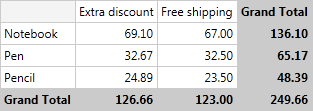
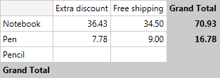
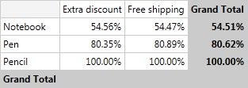
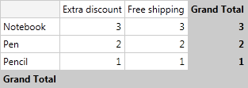
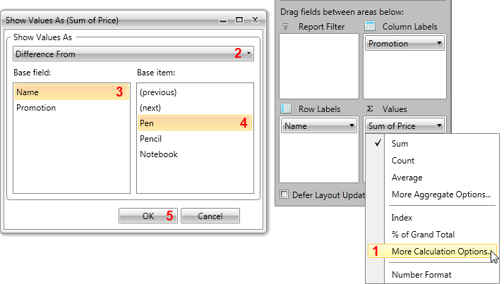

# Calculations

__RadPivotGrid__ can apply different calculations on your data. Instead of presenting the whole Total number by using calculations you can show other information - for example what percentage of the GrandTotal is the value in particular cell.      

## Calculations

There are several predefined calculations that you can use. To explain each of them we will use the below __RadPivotGrid__ and we will apply the calculations on it to show how they will modify the view of __RadPivotGrid__:



* __DifferenceFrom__ - instead of showing Totals in the cells you can show how items differentiate from a particular group. In the example below we have set DifferenceFrom "Pen":            

```XAML
	<pivot:PropertyAggregateDescription PropertyName="Price" AggregateFunction="Sum">
	    <pivot:PropertyAggregateDescription.TotalFormat>
	        <pivot:DifferenceFrom Axis="Rows" Level="0" GroupName="Pen"></pivot:DifferenceFrom>
	    </pivot:PropertyAggregateDescription.TotalFormat>
	</pivot:PropertyAggregateDescription>
```

```C#
	PropertyAggregateDescription aggregate = new PropertyAggregateDescription();
	aggregate.AggregateFunction = AggregateFunctions.Sum;
	aggregate.PropertyName = "Price";
	aggregate.TotalFormat = new DifferenceFrom() { Axis = PivotAxis.Rows, Level = 0, GroupName = "Pen" };
```
```VB.NET
	Dim aggregate As New PropertyAggregateDescription()
	aggregate.AggregateFunction = AggregateFunctions.Sum
	aggregate.PropertyName = "Price"
	aggregate.TotalFormat = New DifferenceFrom() With {.Axis = PivotAxis.Rows, .Level = 0, .GroupName = "Pen"}
	```


You can also set Difference From Next or Difference From Previous - this way each cell will show how the value in it differentiate from the value in next/previous cell. For example we can set DifferenceFromNext for our Rows and here is the result:            

```XAML
	<pivot:PropertyAggregateDescription PropertyName="Price" AggregateFunction="Sum">
	    <pivot:PropertyAggregateDescription.TotalFormat>
	        <pivot:DifferenceFromNext Axis="Rows" Level="0"/>
	    </pivot:PropertyAggregateDescription.TotalFormat>
	</pivot:PropertyAggregateDescription>
```

```C#
	PropertyAggregateDescription aggregate = new PropertyAggregateDescription();
	aggregate.AggregateFunction = AggregateFunctions.Sum;
	aggregate.PropertyName = "Price";
	aggregate.TotalFormat = new DifferenceFromNext() { Axis = PivotAxis.Rows, Level = 0 };
```
```VB.NET
	Dim aggregate As New PropertyAggregateDescription()
	aggregate.AggregateFunction = AggregateFunctions.Sum
	aggregate.PropertyName = "Price"
	aggregate.TotalFormat = New DifferenceFromNext() With {.Axis = PivotAxis.Rows, .Level = 0}
```



* __PercentDifferenceFrom__ - the logic behind this calculation is the same as DifferenceFrom, but instead the difference is calculated in percents.

```XAML
	<pivot:PropertyAggregateDescription PropertyName="Price" AggregateFunction="Sum">
	        <pivot:PropertyAggregateDescription.TotalFormat>
	            <pivot:PercentDifferenceFrom Axis="Rows" Level="0" GroupName="Pen"/>
	        </pivot:PropertyAggregateDescription.TotalFormat>
	    </pivot:PropertyAggregateDescription>
	</pivot:LocalDataSourceProvider.AggregateDescriptions>
```

```C#
	PropertyAggregateDescription aggregate = new PropertyAggregateDescription();
	aggregate.AggregateFunction = AggregateFunctions.Sum;
	aggregate.PropertyName = "Price";
	aggregate.TotalFormat = new PercentDifferenceFrom() { Axis = PivotAxis.Rows, Level = 0, GroupName = "Pen" };
```
```VB.NET
	Dim aggregate As New PropertyAggregateDescription()
	aggregate.AggregateFunction = AggregateFunctions.Sum
	aggregate.PropertyName = "Price"
	aggregate.TotalFormat = New PercentDifferenceFrom() With {.Axis = PivotAxis.Rows, .Level = 0, .GroupName = "Pen"}
```


You can also set "Percent Difference From Next" or "Percent Difference From Previous" and this way the value in each cell will be the differences between its value and the value in next/previous cell, but calculated in percent.          

* __Index__ - calculates a weighted average by using the following formula: ((value in cell) x (Grand Total)) / ((Grand Row Total) x (Grand Column Total)). If we apply Index calculation on our example here is the result:            

```XAML
	<pivot:PropertyAggregateDescription PropertyName="Price" AggregateFunction="Sum">
	    <pivot:PropertyAggregateDescription.TotalFormat>
	        <pivot:Index/>
	    </pivot:PropertyAggregateDescription.TotalFormat>
	</pivot:PropertyAggregateDescription>
```

```C#
	PropertyAggregateDescription aggregate = new PropertyAggregateDescription();
	aggregate.AggregateFunction = AggregateFunctions.Sum;
	aggregate.PropertyName = "Price";
	aggregate.TotalFormat = new Index();
```
```VB.NET
	Dim aggregate As New PropertyAggregateDescription()
	aggregate.AggregateFunction = AggregateFunctions.Sum
	aggregate.PropertyName = "Price"
	aggregate.TotalFormat = New Index()
```


* __PercentOf__ - values in the cells are percents of a sample - for example percent of next/previous or percent of a particular group description.            

* __PercentOfGrandTotal__ - values in the cells are percent of the GrandTotal.            

* __PercentOfColumnTotal__ - values in the cells are percent of the ColumnTotal.            

* __PercentOfRowTotal__ - values in the cells are percent of the RowTotal.            

* __RunningTotalIn__ - the value in the cell is aggregation of the value in the previous cell and the total in the current one. Last item in the collection holds the GrandTotal values. For example in the image below the value which stands for "Pen" in promotion "Extra Discount" is a sum of its own total (32.67) and the value of "Notebook" in promotion "Extra Discount" (69.10).            

```XAML
	<pivot:PropertyAggregateDescription PropertyName="Price" AggregateFunction="Sum">
	    <pivot:PropertyAggregateDescription.TotalFormat>
	        <pivot:RunningTotalsIn Axis="Rows" Level="0"/>
	    </pivot:PropertyAggregateDescription.TotalFormat>
	</pivot:PropertyAggregateDescription>
```

```C#
	PropertyAggregateDescription aggregate = new PropertyAggregateDescription();
	aggregate.AggregateFunction = AggregateFunctions.Sum;
	aggregate.PropertyName = "Price";
	aggregate.TotalFormat = new RunningTotalsIn() { Axis = PivotAxis.Rows, Level = 0 };
```
```VB.NET
	Dim aggregate As New PropertyAggregateDescription()
	aggregate.AggregateFunction = AggregateFunctions.Sum
	aggregate.PropertyName = "Price"
	aggregate.TotalFormat = New RunningTotalsIn() With {.Axis = PivotAxis.Rows, .Level = 0}
```


* __PercentRunningTotalsIn__ - the value in each cell is accumulated from the total in it and the value in the previous cell. The result is presented as percent of the GrandTotal. GrandTotal is present in the last item in the collection with the value 100 percents.            

```XAML
	<pivot:PropertyAggregateDescription PropertyName="Price" AggregateFunction="Sum">
	    <pivot:PropertyAggregateDescription.TotalFormat>
	        <pivot:PercentRunningTotalsIn Axis="Rows" Level="0"/>
	    </pivot:PropertyAggregateDescription.TotalFormat>
	</pivot:PropertyAggregateDescription>
```

```C#
	PropertyAggregateDescription aggregate = new PropertyAggregateDescription();
	aggregate.AggregateFunction = AggregateFunctions.Sum;
	aggregate.PropertyName = "Price";
	aggregate.TotalFormat = new PercentRunningTotalsIn() { Axis = PivotAxis.Rows, Level = 0};
```
```VB.NET
	Dim aggregate As New PropertyAggregateDescription()
	aggregate.AggregateFunction = AggregateFunctions.Sum
	aggregate.PropertyName = "Price"
	aggregate.TotalFormat = New PercentRunningTotalsIn() With {.Axis = PivotAxis.Rows, .Level = 0}
```



* __RankTotals__ - the value in the cell is integer representing the rank of the current total in the current collection of totals. You can set ranking to be from smallest to largest or from largest to smallest.            

```XAML
	<pivot:PropertyAggregateDescription PropertyName="Price" AggregateFunction="Sum">
	    <pivot:PropertyAggregateDescription.TotalFormat>
	        <pivot:RankTotals Axis="Rows" Level="0"/>
	    </pivot:PropertyAggregateDescription.TotalFormat>
	</pivot:PropertyAggregateDescription>
```

```C#
	PropertyAggregateDescription aggregate = new PropertyAggregateDescription();
	aggregate.AggregateFunction = AggregateFunctions.Sum;
	aggregate.PropertyName = "Price";
	aggregate.TotalFormat = new RankTotals() { Axis = PivotAxis.Rows, Level = 0};
```
```VB.NET
	Dim aggregate As New PropertyAggregateDescription()
	aggregate.AggregateFunction = AggregateFunctions.Sum
	aggregate.PropertyName = "Price"
	aggregate.TotalFormat = New RankTotals() With {.Axis = PivotAxis.Rows, .Level = 0}
```



## Calculations and TotalFormats 

You can change the applied calculation at runtime by using __RadPivotFieldList__. If you want to apply calculation at design time you should use TotalFormat property on PropertyAggregateDescription.        

When you set TotalFormat in your code there are several properties that you should understand:        

1. __Axis__ - this property defines if the calculation should be applied on the rows or on the columns.            

1. __Level__ - this property sets on which group description to apply the calculation - for example if you have three RowGroupDescriptions first one has level 0, second one - level 1 and the third one - level 2.            

1. __GroupName__ - this is the exact name of the group based on which the calculation will be applied. Note that this is a particular header in the rows or columns. For the above example we have defined "Name" as PropertyGroupDescription in RowGroupDescriptions collection. But the GroupName that has to be set when the Axis is Rows is one of the RowHeaders: "Pen", "Pencil" or "Notebook".            

```XAML
	<pivot:PropertyAggregateDescription PropertyName="Price" AggregateFunction="Sum">
	    <pivot:PropertyAggregateDescription.TotalFormat>
	        <pivot:DifferenceFrom Axis="Rows" Level="0" GroupName="Pen"></pivot:DifferenceFrom>
	    </pivot:PropertyAggregateDescription.TotalFormat>
	</pivot:PropertyAggregateDescription>
```

```C#
	PropertyAggregateDescription aggregate = new PropertyAggregateDescription();
	aggregate.AggregateFunction = AggregateFunctions.Sum;
	aggregate.PropertyName = "Price";
	aggregate.TotalFormat = new DifferenceFrom() { Axis = PivotAxis.Rows, Level = 0, GroupName = "Pen" };
```
```VB.NET
	Dim aggregate As New PropertyAggregateDescription()
	aggregate.AggregateFunction = AggregateFunctions.Sum
	aggregate.PropertyName = "Price"
	aggregate.TotalFormat = New DifferenceFrom() With {.Axis = PivotAxis.Rows, .Level = 0, .GroupName = "Pen"}
```

When you want to apply/change the calculation at runtime you should use __RadPivotFieldList__. Just click on the aggregate description and choose one of the defined calculations or select "More calculation options..." option. This will open a new RadWindow where you will find all predefined calculations and you will be able to set them with just a few clicks.



## See Also

 * [Getting Started]()

 * [RadPivotFieldList]()

 * [LocalDataSourceProvider]()

 * [Features]()
