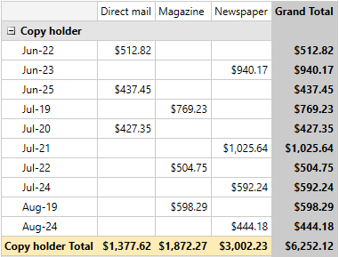
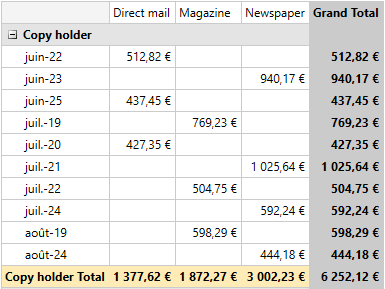

# Culture Support


With the Q2 2014 release version of UI for WPFSilverlight, the __LocalDataSourceProvider__ provides a brand new __Culture__ support option. Now it is possible to localize the underlying data using the CurrentCulture of the user or any other Culture. For example, this will allow you to display the names of the Months in the desired language, use the currency symbol from the specified culture and format the values with the correct separator.      

## Setting LocalDataSourceProvider Culture

You can easily apply the required culture by setting the __Culture__ property of the __LocalDataSourceProvider__ as shown below:        


```XAML
	<pivot:LocalDataSourceProvider x:Key="LocalDataProvider" Culture="en-US">
		...
	</pivot:LocalDataSourceProvider>
```


```C#
	var dataProvider = new LocalDataSourceProvider { Culture = new CultureInfo("en-US") };
```

#### __VB__

```VB
	Dim dataProvider = New LocalDataSourceProvider With {.Culture = New CultureInfo("en-US")}
```

>By default when there isn't any Culture set the __LocalDataSourceProvider__ will use __InvariantCulture__ to display the data. In this case as a currency symbol will be displayed the one from the CurrentCulture.         

On the following screenshots you can see how setting different cultures will affect the displayed data.

Figure 1: Culture="en-US"


Figure 2: Culture="fr-FR"


Figure 3: Without any Culture set (using the CurrentCulture for the currency symbol)


## Changing LocalDataSourceProvider Culture at Runtime

If you would like to change the Culture at runtime you will need to manualy reset the ItemsSource of the __LocalDataSourceProvider__ and set the new Culture. For example, if the __LocalDataSourceProvider__ is defined in XAML you will be able to easily change the Culture as shown below:        


```C#
	var provider = this.Resources["LocalDataProvider"] as LocalDataSourceProvider;
	var itemsSource = provider.ItemsSource;
	provider.ItemsSource = null;
	provider.Culture = new CultureInfo("fr-FR");
	provider.ItemsSource = itemsSource;
```

#### __VB__

```VB
	Dim provider = TryCast(Me.Resources("LocalDataProvider"), LocalDataSourceProvider)
	Dim itemsSource = provider.ItemsSource
	provider.ItemsSource = Nothing
	provider.Culture = New CultureInfo("fr-FR")
	provider.ItemsSource = itemsSource
```

## See Also

 * [Localization]()
