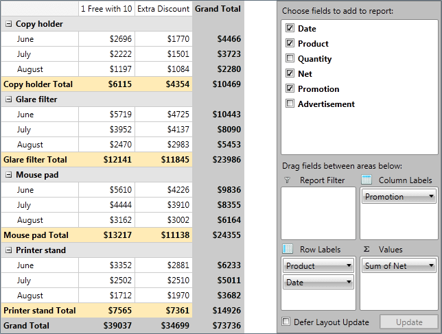
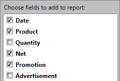
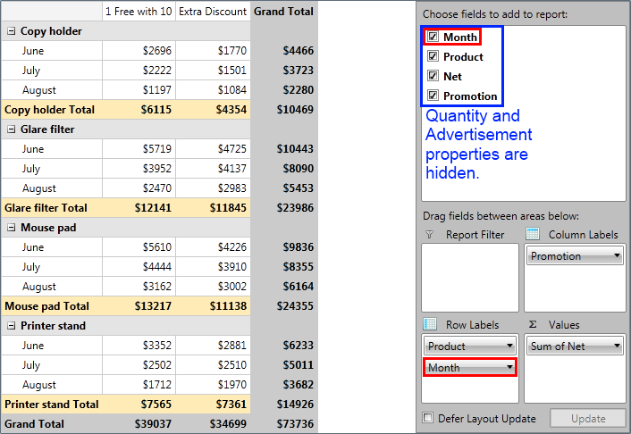
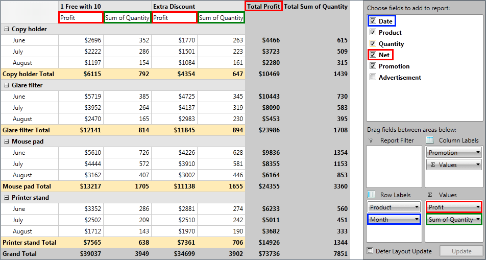

# Data Annotations

In this article we will show you how to use Data Annotations with __RadPivotGrid__. Data Annotations are used to specify validation rules, specify how the data is displayed, and set relationships between classes. More information about Data Annotation can be found [here](http://msdn.microsoft.com/en-us/library/dd901590(v=vs.95).aspx).      

## RadPivotGrid application

Let's create a simple application that will show data for different orders. Each order has the following descriptions: Date, Product, Quantity, Net, Promotion and Advertisement. So the class that will represent one Order will look this way:        


```C#
	public class Order
	{
	    public DateTime Date { get; set; }
	    public string Product { get; set; }
	    public int Quantity { get; set; }
	    public double Net { get; set; }
	    public string Promotion { get; set; }
	    public string Advertisement { get; set; }
	}
```
```VB.NET
	Public Class Order
		Public Property [Date]() As Date
		Public Property Product() As String
		Public Property Quantity() As Integer
		Public Property Net() As Double
		Public Property Promotion() As String
		Public Property Advertisement() As String
	End Class
```

And here is how __RadPivotGrid__ and __RadPivotFieldList__ will look like after we have added some sample data and group descriptions:



LocalDataSourceProvider automatically creates a new group for each of the public properties in Order class. This can be easily seen with __RadPivotFieldList__:



But what if you want to hide the "Advertisement" property or show different name for it? In this case __RadPivotGrid__ has an easy solution for you - Data Annotations.

## Data Annotations with RadPivotGrid

>important If you want to use Data Annotations in your application, you have to add a reference to System.ComponentModel.DataAnnotations assembly.          

With Data Annotations you can apply attributes to the members of the class that specify how the data is displayed. __RadPivotGrid__ supports twothree different Data Annotations:


* __Display__ - this is recommended attribute type to use. You can use two properties - Name and AutoGenerateField. The value of Name will be used in __RadPivotGrid__ and __RadPivotFieldList__ instead of the PropertyName. When you set AutoGenerateField to false, the property will not show up in __RadPivotFieldList__ and you will not be able to use it in your __RadPivotGrid__. Here is a sample how to set DataAnnotation with Display attribute:              


```C#
	//Rename the Date property to Month in the UI
	[Display (Name="Month")]
	public DateTime Date { get; set; }
	
	//Hide Product from the UI
	[Display (AutoGenerateField=false)]
	public string Product { get; set; }
```
```VB.NET
	<Display(Name:="Month")> _
	Public Property [Date]() As Date
	
	'Hide Product from the UI
	<Display(AutoGenerateField:=False)> _
	Public Property Product() As String
```

* __Browsable__ - with this attribute you can define whether an item should be visible or not. There's no difference between setting browsable value to false or AutoGenerateField of Display attribute to false.             


```C#
	//Hide Product from the UI
	[Browsable (false) ]
	public string Product { get; set; }
```
```VB.NET
	'Hide Product from the UI
	<Browsable(False)> _
	Public Property Product() As String
```

* __DisplayName__ - the value of the attribute will be shown in __RadPivotGrid__ and __RadPivotFieldList__ instead of PropertyName. There is no difference in the final result when you use DisplayName and Display attribute (setting Name property). This is an oboslete attribute and we suggest you to use Display instead of it.


```C#
	//Rename the Date property to Month in the UI
	[DisplayName ("Month")]
	public DateTime Date { get; set; }
```
```VB.NET
	'Rename the Date property to Month in the UI
	<DisplayName("Month")> _
	Public Property [Date]() As Date
```



* __Display__ - this is recommended attribute type to use. You can use two properties - Name and AutoGenerateField. The value of Name will be used in __RadPivotGrid__ and __RadPivotFieldList__ instead of the PropertyName. When you set AutoGenerateField to false, the property will not show up in __RadPivotFieldList__. Here is a sample how to set DataAnnotation with Display attribute:              


```C#
	//Rename the Date property to Month in the UI
	[Display (Name="Month")]
	public DateTime Date { get; set; }
	
	//Hide Product from the UI
	[Display (AutoGenerateField=false)]
	public string Product { get; set; }
```
```VB.NET
	<Display(Name:="Month")> _
	Public Property [Date]() As Date
	
	'Hide Product from the UI
	<Display(AutoGenerateField:=False)> _
	Public Property Product() As String
```

* __Browsable__ - with this attribute you can define wheather a property will be visible or not. There's no difference between setting browsable value to false or AutoGenerateField of Display attribute to false.             


```C#
	//Hide Product from the UI
	[Browsable (false) ]
	public string Product { get; set; }
```
```VB.NET
	'Hide Product from the UI
	<Browsable(False)> _
	Public Property Product() As String
```


So let's modify our simple Order class and see the result in __RadPivotGrid__ and __RadPivotFieldList__.        


```C#
	public class Order
	{
	    //Rename the Date property to Month in the UI
	    [Display (Name="Month")]
	    public DateTime Date { get; set; }
	
	    public string Product { get; set; }
	
	    //Hide Quantiy from the UI
	    [Display (AutoGenerateField=false)]
	    public int Quantity { get; set; }
	
	    public double Net { get; set; }
	
	    public string Promotion { get; set; }
	
	    //Hide Product from the UI
	    [Browsable(false)]
	    public string Advertisement { get; set; }
	}
```
```VB.NET
	Public Class Order
		'Rename the Date property to Month in the UI
		<Display(Name:="Month")> _
		Public Property [Date]() As Date
	
		Public Property Product() As String
	
		'Hide Quantiy from the UI
		<Display(AutoGenerateField:=False)> _
		Public Property Quantity() As Integer
	
		Public Property Net() As Double
	
		Public Property Promotion() As String
	
		'Hide Product from the UI
		<Browsable(False)> _
		Public Property Advertisement() As String
	End Class
```

And here is the new result:



## Data Annotations and CustomName

Each group description has CustomName property. When it is set __RadPivotGrid__ uses it instead of PropertyName in the UI. __RadPivotFieldList__ also shows CustomName value, but only in the groups which are currently in use. Here is a snapshot in which we have set CustomName for our Date group description to "Month" and CustomName for the "Net" aggregate description to "Profit": 



You can see how in the top part of __RadPivotFieldList__ the CustomName is not applied. So if you want to show the same name you have to use Data Annotations. CustomName is suitable in scenarios when you are using only __RadPivotGrid__ or when you want to change the default "Sum of " value which is used for the aggregate descriptions (in green above).        

>If you use Data Annotations and CustomName for the same property, CustomName will be used as it has higher priority.          

## See Also

 * [RadPivotGrid Getting Started]()

 * [RadPivotFieldList]()

 * [Features]()
