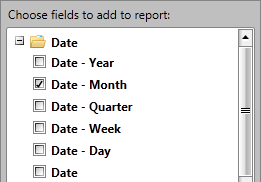

# DateTimeGroupDescription

In this article we will show you how to use DateTimeGroupDescription with your DateTime and DateTimeOffset data.

## DateTimeGroupDescription

When using LocalDataSourceProvider you can choose between three types of group description - *PropertyGroupDescription, DoubleGroupDescription* and *DateTimeGroupDescription* (or implement your own group description, which inherits PropertyGroupDescriptionBase).        

__DateTimeGroupDescription__ is used when you want to group your data by property of type *DateTime* or *DateTimeOffset*. __DateTimeGroupDescription__ has the following properties:      

* __PropertyName__ - defines the name of the property by which the data will be grouped. It is mandatory to set a value.            

* __Step__ - defines the grouping interval. Default value is Year, but you can change it to one of the following: Quarter, Month, Week, Day, Hour, Minute, Second. If you have the following dates: 01-01-2013 and 20-02-2013 and you set Step to Year, the two values will be in one group - 2013. But if you change the step to Month, the values will be in two different groups - January and February.            

When you have a property of type DateTime (DateTimeOffset), you can create several DateTimeGroupDescriptions with different steps. You may also create a PropertyGroupDescription - this way the DateTime will be treated as a string and grouped as such. All of them can be used simultaneously. You can add the description in RowGroupDescriptions or ColumnGroupDescriptions collections of LocalDataSourceProvider.        

<snippet id='radpivotgrid-features-localdatasourceprovider-datetimegroupdescription-block_1-xaml' />

<snippet id='radpivotgrid-features-localdatasourceprovider-datetimegroupdescription-block_2-cs' />
<snippet id='radpivotgrid-features-localdatasourceprovider-datetimegroupdescription-block_2-vb' />

__RadPivotFieldList__ automatically detects properties of type DateTime (DateTimeOffset) and creates a special folder in the FieldTree for each of the properties. The name of the folder is the name of the property. By default inside the folder you will find out the following structure:

As you can see, the folder gives you the ability to select different steps for your DateTimeGroupDescription at runtime and use them simultaneously. The names of the items are a combination of the property name and a step. Only the last item in the folder has different name - it contains only the property name. When you drag it, you will add the data as PropertyGroupDescription.        

## Modify FieldTree of RadPivotFieldList

By default __RadPivotFieldList__ will show the following steps in its FieldTree for each DateTimeGroupDescription: Year, Month, Quarter, Week, Day (you will also see additional item, which will create PropertyGroupDescription instead of DateTimeGroupDescription). But you can set three more steps - Hour, Minute, Second. So how to show them in __RadPivotFieldList__?        

The solution of this problem is to use AddingContainerNode event of LocalDataSourceFieldDescriptionsProvider. In this event you will receive all items from the FieldTree and you will be able to modify which of them to be visible. In order to use this event you have to create a new instance of LocalDataSourceFieldDescriptionsProvider and set LocalDataSourceProvider's FieldDescriptionProvider to this instance. You can do this in XAML or in code behind:        

<snippet id='radpivotgrid-features-localdatasourceprovider-datetimegroupdescription-block_3-xaml' />

<snippet id='radpivotgrid-features-localdatasourceprovider-datetimegroupdescription-block_4-cs' />
<snippet id='radpivotgrid-features-localdatasourceprovider-datetimegroupdescription-block_4-vb' />

By using the ContainerNodeEventArgs you are able to access the information foreach ContainerNode in the FieldTree, its children. You can decide whether to include each of the children by using AutoGenerateField property. If you want you can remove the whole container (the folder) from the UI, by setting e.Cancel = true:       

* __Add children to the container node (folder)__ - for example you may add Hour Step to the FieldTree:            

<snippet id='radpivotgrid-features-localdatasourceprovider-datetimegroupdescription-block_5-cs' />
<snippet id='radpivotgrid-features-localdatasourceprovider-datetimegroupdescription-block_5-vb' />

* __Remove children from the container node (folder)__ - for example you may remove Year Step to the FieldTree:            

<snippet id='radpivotgrid-features-localdatasourceprovider-datetimegroupdescription-block_6-cs' />
<snippet id='radpivotgrid-features-localdatasourceprovider-datetimegroupdescription-block_6-vb' />

* __Remove the whole container node (folder) from the FieldTree__:            

<snippet id='radpivotgrid-features-localdatasourceprovider-datetimegroupdescription-block_7-cs' />
<snippet id='radpivotgrid-features-localdatasourceprovider-datetimegroupdescription-block_7-vb' />

* __Remove the whole container node (folder) from the FieldTree and show a single DateTime with chosen Step:__:            

<snippet id='radpivotgrid-features-localdatasourceprovider-datetimegroupdescription-block_8-cs' />
<snippet id='radpivotgrid-features-localdatasourceprovider-datetimegroupdescription-block_8-vb' />

## See Also

 * [Getting Started]()

 * [RadPivotFieldList]()

 * [LocalDataSourceProvider]()

 * [Features]()