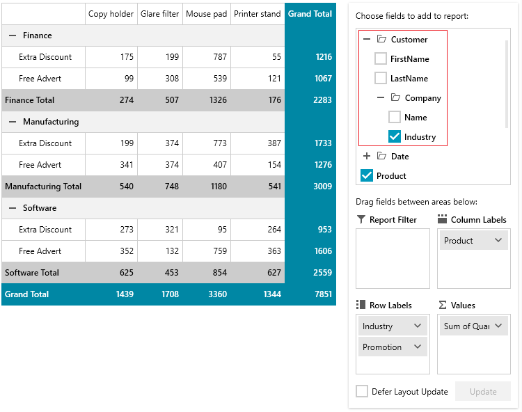

# Enable Hierarchical Property Paths

The default behavior of the `PropertyGroupDescription` in `LocalDataSourceProvider` is to allow providing a property path that points to a direct property of the underlying data item.

The `LocalDataSourceProvider` supports also hierarchical (or chained) property paths. To enable this, set the `EnableHierarchy` property of `LocalDataSourceProvider` to `True`.

__Defining a basic model to illustrate how the PropertyName relates to the underlying data item__
```C#
	public class Order
    {
        public Customer Customer { get; set; }        
        public string Product { get; set; }
        public int Quantity { get; set; }        
        public string Promotion { get; set; }        
        public DateTime Date { get; set; }        
    }
	
	public class Customer
    {
        public string FirstName { get; set; }
        public string LastName { get; set; }
        public Company Company { get; set; }
    }
	
	public class Company
    {
        public string Name { get; set; }
        public string Industry { get; set; }
    }
```

__Enabling hierarchical property paths and using nested property path__
```XAML
	<UserControl.Resources>
		<!-- we can assume that the data source provider in this example is populated with a collection of Order objects -->
		<pivot:LocalDataSourceProvider x:Key="dataProvider" EnableHierarchy="True">         
			<pivot:LocalDataSourceProvider.RowGroupDescriptions>
				
				<!-- hierarchical property path -->
				<pivot:PropertyGroupDescription PropertyName="Customer.Company.Industry" />
				
				<!-- standard/direct property path -->
				<pivot:PropertyGroupDescription PropertyName="Promotion" />
			</pivot:LocalDataSourceProvider.RowGroupDescriptions>
			<pivot:LocalDataSourceProvider.ColumnGroupDescriptions>
                <pivot:PropertyGroupDescription PropertyName="Product" />
            </pivot:LocalDataSourceProvider.ColumnGroupDescriptions>
            <pivot:LocalDataSourceProvider.AggregateDescriptions>
                <pivot:PropertyAggregateDescription PropertyName="Quantity" />
            </pivot:LocalDataSourceProvider.AggregateDescriptions>
		</pivot:LocalDataSourceProvider>
	</UserControl.Resources>
```

When `LocalDataSourceProvider` is linked to a [RadPivotFieldList](), the corresponding properties hierarchy for the `PropertyGroupDescription` will be displayed in the fields list.



## See Also  
 * [Getting Started]()
 * [LocalDataSourceProvider]()
 * [Features]()
 * [DateTimeGroupDescription]()