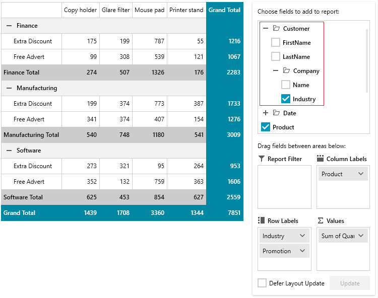

# Enable Hierarchical Property Paths

The default behavior of the `PropertyGroupDescription` in `LocalDataSourceProvider` is to allow providing a property path that points to a direct property of the underlying data item.

The `LocalDataSourceProvider` supports also hierarchical (or chained) property paths. To enable this, set the `EnableHierarchy` property of `LocalDataSourceProvider` to `True`.

__Defining a basic model to illustrate how the PropertyName relates to the underlying data item__
<snippet id='radpivotgrid-features-localdatasourceprovider-hierarchical-group-description-block_1-cs' />

__Enabling hierarchical property paths and using nested property path__
<snippet id='radpivotgrid-features-localdatasourceprovider-hierarchical-group-description-block_2-xaml' />

When `LocalDataSourceProvider` is linked to a [RadPivotFieldList](), the corresponding properties hierarchy for the `PropertyGroupDescription` will be displayed in the fields list.

## See Also  
 * [Getting Started]()
 * [LocalDataSourceProvider]()
 * [Features]()
 * [DateTimeGroupDescription]()