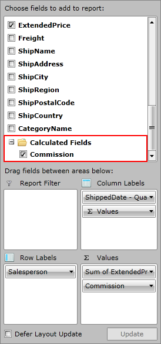
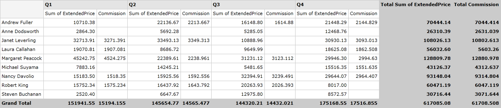

# Calculated Fields

In this article you will find out how to extend __RadPivotGrid's__ generated report by adding Calculated Fields.      

## Calculated Fields Description

If your data analysis requires results that are not available using just the data source fields and __RadPivotGrid's__ built-in calculations, you can insert a calculated field that uses a custom formula to derive the results you need. A calculated field is a new data field in which the values are the result of a custom calculation formula. You can display the calculated field along with another data field or on its own. A calculated field is really a custom summary calculation, so in almost all cases, the calculated field references one or more fields in the source data.        

## Define Calculated Field

All Calculated Fields that you have added to your LocalDataSourceProvider will be visible in __RadPivotFieldList__, so the user will be able to add and remove them at runtime. In order to add a calculated field to LocalDataSourceProvider you have to add it to its CalculatedFields collection. So first you have to create a concrete class that implements the abstract class *CalculatedField*. This requires the implementation of two methods - CalculatedValue and RequiredFields. CalculateValue is the method in which you have to define your calculation formula and create a new AggregateValue that will be shown in __RadPivotGrid__. In common scenario a Calculated Field reference one or more fields in the data source. The RequiredFields method should return IEnumerable of the required fields. That's why we have added a new class called RequiredField. It's purpose is to describe a field, required for a calculated field. RequiredField can be created for property from the data object or for another calculated field. Name property of CalculatedField class identifies its unique name that will be shown in the UI.         

The first task is to decide what is the calculation formula that you want to use. For example, you can show the commission that will be paid to all salespeople. Commission will be paid only to those who have more sold for more than $15 000. The price of the sold items is kept by the ExtendedPrice property from the source. So the new class will look like this:        

<snippet id='radpivotgrid-features-localdatasourceprovider-local-calc-fields-block_1-cs' />
<snippet id='radpivotgrid-features-localdatasourceprovider-local-calc-fields-block_1-vb' />

Now it is time to add a new instance of this class to the CalculatedFields collection of LocalDataSourceProvider:        

<snippet id='radpivotgrid-features-localdatasourceprovider-local-calc-fields-block_2-xaml' />

<snippet id='radpivotgrid-features-localdatasourceprovider-local-calc-fields-block_3-cs' />
<snippet id='radpivotgrid-features-localdatasourceprovider-local-calc-fields-block_3-vb' />

>important If you add caculated fields in code behind, you have to set the ItemsSource of LocalDataSourceProvider after you have added all calculated fields or to wrap the code between *BeginInit() - EndInit()* methods (or inside *using DeferRefresh() { ... } section* ).          

This way the Commission field will be visible in a special folder inside __RadPivotFieldList__ called Calculated Fields.

In order to use the calculated field in the generated report, you have to add it to LocalDataSourceProvider's AggregateDescriptions collection:        

<snippet id='radpivotgrid-features-localdatasourceprovider-local-calc-fields-block_4-xaml' />

<snippet id='radpivotgrid-features-localdatasourceprovider-local-calc-fields-block_5-cs' />
<snippet id='radpivotgrid-features-localdatasourceprovider-local-calc-fields-block_5-vb' />

The result will look like this:

## See Also

 * [Getting Started]()

 * [RadPivotFieldList]()

 * [LocalDataSourceProvider]()

 * [Features]()