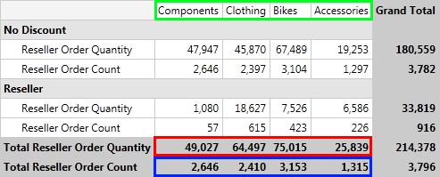
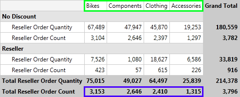
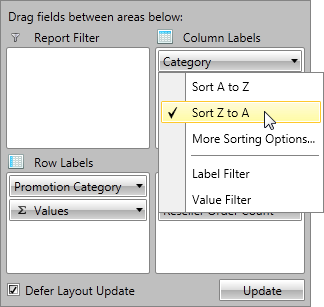
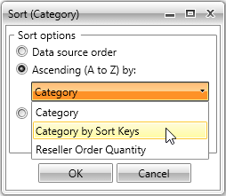

# Sorting

In this article we will explain how to use sorting when your data is from OLAP Cube.

## Understanding Sorting Mechanism

__RadPivotGrid__ provides different sorting capabilities. You can sort your *RowGroupDescriptions* and *ColumnGroupDescriptions* ascending (from A to Z) and descending (from Z to A) based on the names of the properties they are showing or based on the aggregated description.        

With the __Q1 2014 SP1__ version of __Telerik UI for__ __RadPivotGrid__ provides two additional sorting options. The data can be sorted by the Olap SortKeys using the new __OlapGroupComparer__ or can be shown the way it has been received from the data source using the __SortOrder__ property set to __None__.        

We will explain this with a simple __RadPivotGrid__:


The __ColumnGroupDescription__ in this __RadPivotGrid__ is *Category*. By default the sorting of the columns is ascending (from A to Z) based on the headers: *Accessories*, *Bikes*, *Clothing*, *Components*. You can easily change the sorting of the *Category* ColumnGroupDescription and set it to descending (from Z to A). This will lead to the following result:



The columns are reordered based on their names (check the green rectangle on the top of the image). You can apply sorting based on some of the __measures__ you are using. In the example above you can apply sorting of the *Category* ColumnGroupDescription in ascending (from A to Z) or descending (from Z to A) format based on the *Total Reseller Order Quantity* (red rectangle) or *Total Reseller Order Count* (blue rectangle). Here is the new view of __RadPivotGrid__ when the *Category* ColumnGroupDescription is sorted in descending format based on the *Total Reseller Order Count*:



>importantThe sorting is set on the __ColumnGroupDescriptions__ or __RowGroupDescriptions__. You cannot set sorting on the __AggregateDescriptions__, but you can sort the columns or rows based on the aggregated values.          

## Sort the data

The sorting can be applied in the __XAML__, in code behind or even at runtime with the help of __RadPivotFieldList__.        

* Sorting based on the GroupName (header) can be *Ascending (from A to Z)* or *Descending (from Z to A)*. The default value is *Ascending*, but you can change it by using __SortOrder__ property:            


```XAML
	<pivot:XmlaGroupDescription MemberName="[Product].[Category]" SortOrder="Ascending">
	<pivot:XmlaGroupDescription MemberName="[Product].[Category]" SortOrder="Descending">
```


```C#
	XmlaGroupDescription groupDescription = new XmlaGroupDescription();
	groupDescription.MemberName = "[Product].[Category]";
	groupDescription.SortOrder = Telerik.Pivot.Core.SortOrder.Descending;
```
```VB.NET
	Dim groupDescription As New XmlaGroupDescription()
	groupDescription.MemberName = "[Product].[Category]"
	groupDescription.SortOrder = Telerik.Pivot.Core.SortOrder.Descending
```




```XAML
	<pivot:AdomdGroupDescription MemberName="[Product].[Category]" SortOrder="Ascending"/>
	<pivot:AdomdGroupDescription MemberName="[Product].[Category]" SortOrder="Descending"/>
```


```C#
	AdomdGroupDescription groupDescription = new AdomdGroupDescription();
	groupDescription.MemberName = "[Product].[Category]";
	groupDescription.SortOrder = Telerik.Pivot.Core.SortOrder.Descending;
```
```VB.NET
	Dim groupDescription As New AdomdGroupDescription()
	groupDescription.MemberName = "[Product].[Category]"
	groupDescription.SortOrder = Telerik.Pivot.Core.SortOrder.Descending
```


* If you need to avoid the data to be sorted anyhow, you can set the __SortOrder__ property to __None__. This way the data will appear the way it is was received from the data source:            


```XAML
	<pivot:XmlaGroupDescription MemberName="[Product].[Category]" SortOrder="None">
```


```C#
	XmlaGroupDescription groupDescription = new XmlaGroupDescription();
	groupDescription.MemberName = "[Product].[Category]";
	groupDescription.SortOrder = Telerik.Pivot.Core.SortOrder.None;
```
```VB.NET
	Dim groupDescription As New XmlaGroupDescription()
	groupDescription.MemberName = "[Product].[Category]"
	groupDescription.SortOrder = Telerik.Pivot.Core.SortOrder.None
```




```XAML
	<pivot:AdomdGroupDescription MemberName="[Product].[Category]" SortOrder="None"/>
```


```C#
	AdomdGroupDescription groupDescription = new AdomdGroupDescription();
	groupDescription.MemberName = "[Product].[Category]";
	groupDescription.SortOrder = Telerik.Pivot.Core.SortOrder.None;
```
```VB.NET
	Dim groupDescription As New AdomdGroupDescription()
	groupDescription.MemberName = "[Product].[Category]"
	groupDescription.SortOrder = Telerik.Pivot.Core.SortOrder.None
```


>Note that the __SortOrder None__ property is available with the __Q1 2014 SP1__ version of Telerik UI for WPFSilverlight.              

* Sorting based on the GrandTotals (measures) can be *Ascending* or *Descending*. To set such sort mechanism you have to use the __SortOrder__ and __GroupComparer__ properties:            


```XAML
	<pivot:XmlaGroupDescription MemberName="[Product].[Category]" SortOrder="Descending">
	    <pivot:XmlaGroupDescription.GroupComparer>
	        <pivot:GrandTotalComparer AggregateIndex="1"/>
	    </pivot:XmlaGroupDescription.GroupComparer>
	</pivot:XmlaGroupDescription>
```


```C#
	XmlaGroupDescription groupDescription = new XmlaGroupDescription();
	groupDescription.MemberName = "[Product].[Category]";
	groupDescription.SortOrder = Telerik.Pivot.Core.SortOrder.Ascending;
	groupDescription.GroupComparer = new GrandTotalComparer() { AggregateIndex = 1 };
```
```VB.NET
	Dim groupDescription As New XmlaGroupDescription()
	groupDescription.MemberName = "[Product].[Category]"
	groupDescription.SortOrder = Telerik.Pivot.Core.SortOrder.Ascending
	groupDescription.GroupComparer = New GrandTotalComparer() With {.AggregateIndex = 1}
```




```XAML
	<pivot:AdomdGroupDescription MemberName="[Product].[Category]" SortOrder="Descending">
	    <pivot:AdomdGroupDescription.GroupComparer>
	        <pivot:GrandTotalComparer AggregateIndex="1"/>
	    </pivot:AdomdGroupDescription.GroupComparer>
	</pivot:AdomdGroupDescription>
```


```C#
	AdomdGroupDescription groupDescription = new AdomdGroupDescription();
	groupDescription.MemberName = "[Product].[Category]";
	groupDescription.SortOrder = Telerik.Pivot.Core.SortOrder.Descending;
	groupDescription.GroupComparer = new GrandTotalComparer() { AggregateIndex = 1 };
```
```VB.NET
	Dim groupDescription As New AdomdGroupDescription()
	groupDescription.MemberName = "[Product].[Category]"
	groupDescription.SortOrder = Telerik.Pivot.Core.SortOrder.Descending
	groupDescription.GroupComparer = New GrandTotalComparer() With {.AggregateIndex = 1}
```


>The __AggregateIndex__ property is set based on the count of your aggregate descriptions. If you have two aggregates the first one will have __AggregateIndex = 0__ and the second - __AggregateIndex = 1__.              

* Sorting based on the Olap SortKeys can be *Ascending* or *Descending*. To set such sort mechanism you have to use the __SortOrder__ and __GroupComparer__ properties:            


```XAML
	<pivot:XmlaGroupDescription MemberName="[Product].[Category]" SortOrder="Descending">
	    <pivot:XmlaGroupDescription.GroupComparer>
	        <pivot:OlapGroupComparer />
	    </pivot:XmlaGroupDescription.GroupComparer>
	</pivot:XmlaGroupDescription>
```


```C#
	XmlaGroupDescription groupDescription = new XmlaGroupDescription();
	groupDescription.MemberName = "[Product].[Category]";
	groupDescription.SortOrder = Telerik.Pivot.Core.SortOrder.Ascending;
	groupDescription.GroupComparer = new OlapGroupComparer();
```
```VB.NET
	Dim groupDescription As New XmlaGroupDescription()
	groupDescription.MemberName = "[Product].[Category]"
	groupDescription.SortOrder = Telerik.Pivot.Core.SortOrder.Ascending
	groupDescription.GroupComparer = New OlapGroupComparer()
```




```XAML
	<pivot:AdomdGroupDescription MemberName="[Product].[Category]" SortOrder="Descending">
	    <pivot:AdomdGroupDescription.GroupComparer>
	        <pivot:OlapGroupComparer />
	    </pivot:AdomdGroupDescription.GroupComparer>
	</pivot:AdomdGroupDescription>
```


```C#
	AdomdGroupDescription groupDescription = new AdomdGroupDescription();
	groupDescription.MemberName = "[Product].[Category]";
	groupDescription.SortOrder = Telerik.Pivot.Core.SortOrder.Descending;
	groupDescription.GroupComparer = new OlapGroupComparer();
```
```VB.NET
	Dim groupDescription As New AdomdGroupDescription()
	groupDescription.MemberName = "[Product].[Category]"
	groupDescription.SortOrder = Telerik.Pivot.Core.SortOrder.Descending
	groupDescription.GroupComparer = New OlapGroupComparer()
```


>Note that the __OlapGroupComparer__ is available with the __Q1 2014 SP1__ version of Telerik UI for WPFSilverlight. 

### Sorting User-defined Hierarchies

OLAP dimensions consist of attribute hierarchies and user-defined hierarchies. User-defined hierarchies have different levels and with __RadPivotGrid__ you can sort each of the levels. To do this you should use *Levels* property of __XmlaGroupDescription__ / __AdomdGroupDescription__. *Levels* property is collection of __XmlaLevelGroupDescriptions__ / __AdomdGroupDescription__. Each of the LevelGroupDescriptions has its own *MemberName* and SortOrder properties:             


```XAML
	<pivot:XmlaDataProvider.RowGroupDescriptions>
	    <pivot:XmlaGroupDescription MemberName="[Date].[Calendar]">
	        <pivot:XmlaGroupDescription.Levels>
	            <pivot:XmlaLevelGroupDescription MemberName="[Date].[Calendar].[Calendar Year]" SortOrder="Descending"/>
	        </pivot:XmlaGroupDescription.Levels>
	    </pivot:XmlaGroupDescription>
	</pivot:XmlaDataProvider.RowGroupDescriptions>
```


```C#
	XmlaGroupDescription topGroupDescription = new XmlaGroupDescription();
	topGroupDescription.MemberName = "[Date].[Calendar]";
	XmlaLevelGroupDescription levelGroupDescription1 = new XmlaLevelGroupDescription();
	levelGroupDescription1.MemberName = "[Date].[Calendar].[Calendar Year]";
	levelGroupDescription1.SortOrder = Telerik.Pivot.Core.SortOrder.Descending;
	topGroupDescription.Levels.Add(levelGroupDescription1);
```
```VB.NET
	Dim topGroupDescription As New XmlaGroupDescription()
	topGroupDescription.MemberName = "[Date].[Calendar]"
	Dim levelGroupDescription1 As New XmlaLevelGroupDescription()
	levelGroupDescription1.MemberName = "[Date].[Calendar].[Calendar Year]"
	levelGroupDescription1.SortOrder = Telerik.Pivot.Core.SortOrder.Descending
	topGroupDescription.Levels.Add(levelGroupDescription1)
```




```XAML
	<pivot:AdomdDataProvider.RowGroupDescriptions>
	    <pivot:AdomdGroupDescription MemberName="[Date].[Calendar]">
	        <pivot:AdomdGroupDescription.Levels>
	            <pivot:AdomdLevelGroupDescription MemberName="[Date].[Calendar].[Calendar Year]" SortOrder="Descending"/>
	        </pivot:AdomdGroupDescription.Levels>
	    </pivot:AdomdGroupDescription>
	</pivot:AdomdDataProvider.RowGroupDescriptions>            
```


```C#
	AdomdGroupDescription topGroupDescription = new AdomdGroupDescription();
	topGroupDescription.MemberName = "[Date].[Calendar]";
	AdomdLevelGroupDescription levelGroupDescription1 = new AdomdLevelGroupDescription();
	levelGroupDescription1.MemberName = "[Date].[Calendar].[Calendar Year]";
	levelGroupDescription1.SortOrder = Telerik.Pivot.Core.SortOrder.Descending;
	topGroupDescription.Levels.Add(levelGroupDescription1);
```
```VB.NET
	Dim topGroupDescription As New AdomdGroupDescription()
	topGroupDescription.MemberName = "[Date].[Calendar]"
	Dim levelGroupDescription1 As New AdomdLevelGroupDescription()
	levelGroupDescription1.MemberName = "[Date].[Calendar].[Calendar Year]"
	levelGroupDescription1.SortOrder = Telerik.Pivot.Core.SortOrder.Descending
	topGroupDescription.Levels.Add(levelGroupDescription1)
```


## Changing the Sorting at runtime

__RadPivotFieldList__ gives you the ability to change the sorting of a description at runtime. When you click on RowGroupDescription or ColumnGroupDescription a new popup opens with several sorting options. If you want to save the current sorting, but only change its order (for example the above __RadPivotGrid__ is sorted based on the Total Reseller Order Count in Descending order, and you want to change it to Ascending) you can use the first two options which are doing exactly this - just changing the __SortOrder__:



If you want to change the property based on which the sort is applied, then you can use the third option - More Sorting Options. A new RadWindow will be opened in which you can choose Ascending or Descending order of the sort. When you click the dropdown button you'll see a full list of the possible sorting basis:



## See Also

 * [LocalDataSourceProvider]()

 * [RadPivotFieldList]()

 * [Features]()

 * [Filtering]()
