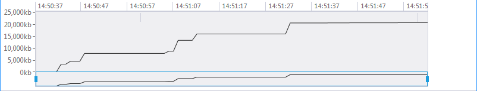

# QueryableDataProvider

In this article you will find the main advantages and limitaions of __QueryableDataProvider__ and a comparison between __LocalDataSourceProvider__
      and __QueryableDataProvider__.
    

## Overview

QueryableDataProvider is created to get the data from any collection that implements IQueryable interface. The main idea for creating this provider is to be used when the data source for
          __RadPivotGrid__ is in database. With QueryableDataProvider all calculations and aggregations are executed on the database server. This way the whole collection of items is
          saved only on the server and not in the memory of the application. This makes QueryableDataProvider the preferred provider when you have a huge database with several thousands or millions of records.
          As the aggregation of data and the calculations are performed on the server, there are some limitations for the functions that you can use.
        

>In order to use QueryableDataProvider in your application you have to add reference to Telerik.Pivot.DataProviders.Queryable.dll assembly.
          

## Comparison with LocalDataSourceProvider

In order to compare LocalDataSourceProvider and QueryableDataProvider we have created a new DataBase with over 1 million of records in a table called Orders. Each record has seven fields:
          OrderID (bigint, primary key), Product (nvarchar(MAX)), Promotion (nvarchar(MAX)), Advertisement (nvarchar(MAX)), Quantity (int), Net (float), Date (date). We'll use exactly the same group and aggregate
          descriptions for both of the providers. Here are snapshots of the used memory for LocalDataSourceProvider and for QueryableDataProvider:
        

Used memory with LocalDataSourceProvider

Used memory with QueryableDataProvider

>We have used JustTrace for our comparison tests. It profiles your application, providing vital data to avert problems before they occur. 
            If a memory leak or performance issue is discovered, JustTrace will help you disable it quickly and easily. With its friendly UX, intuitive work-flow and rich data visualization, it's easy to identify and disable problems fast.
          

It's easy to see that with LocalDataSourceProvider the application consumes much more memory. The reason is very simple - LocalDataSourceProvider needs all items in the source to be in the memory, so it first downloads all 1 000 000 items
          and after that the aggregation begins. QueryableDataProvider does all of this on the server, so it doesn't need the items in the memory.
        

## Advantages of QueryableDataProvider

Here are the main advantages of __QueryableDataProvider__:
        

* __Low memory consumption__ - the items source is not saved in the memory - it remains on the server.
            

* __All aggregations and calculations are performed on the server__ - as the calculations are not performed locally, there's no need of powerful machine where to start the application.
            

* __Multiple network requests instead of one huge one__ - with LocalDataSourceProvider you have to download all items at a single time - this way if you have huge data you may face network issues.
              With QueryableDataProvider only the grouped data is sent from the server to your application.
            

## Limitations of QueryableDataProvider

* __Doesn't work in Partial Trust__

* __TotalFormats limitations__ - you are unable to use all Total Formats that are available in LocalDataSourceProvider.
            

* __DateTime steps limitations__ - the available steps for DateTimeGroupDescriptions are only Year, Quarter, Month, Day.
            

* __Aggregate functions limitations__ - you can use only Average, Count, Max, Min and Sum functions.
            

* __Case-sensitivity of filters depends on database__ - if you are using case-sensitive filter, it may not be applied correctly if the column in the table
              with data is not with correct collation.
            

# See Also

 * [Getting Started]()

 * [RadPivotFieldList]()

 * [QueryableDataProvider]()

 * [Populating with Data]()
