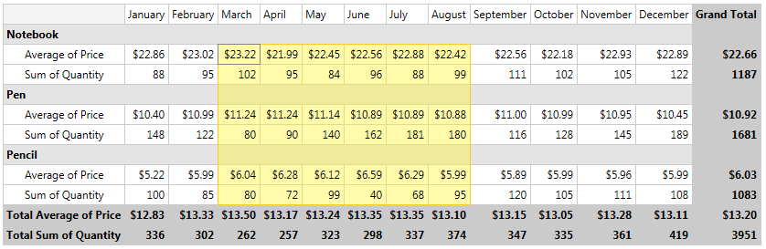
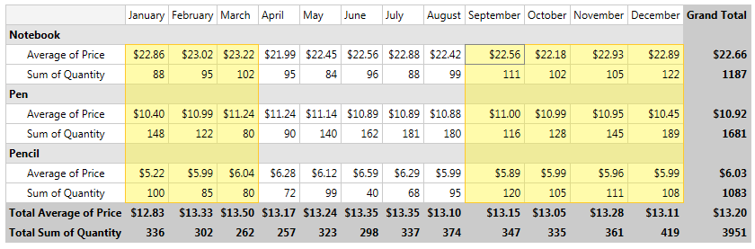
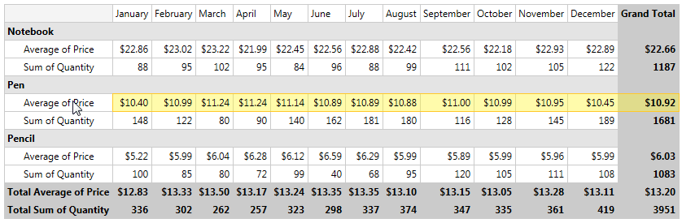
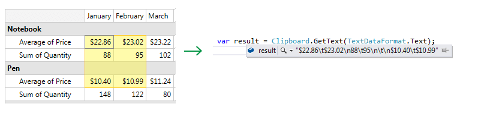
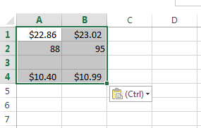

# Selection

As of R3 2016 __RadPivotGrid__ provides the option to select multiple or individual cells, rows and columns using the mouse.    

In this topic we will go through the following sections:

* [Enabling Selection](#enabling-selection)
* [Selection Commands] (#selection-commands)
* [Selection Events] (#selection-events)
* [Styling Selection Overlay] (#styling-selection-overlay)

## Enabling Selection

By default the selection functionality is disabled and to turn it on you have to set __AllowSelection__ property of the __PivotGrid__ to true as in __Example 1__.

__Example 1: Enabling selection__

```XAML
	<pivot:RadPivotGrid Name="radPivotGrid1" DataProvider="{StaticResource LocalDataProvider}" AllowSelection="True">
	</pivot:RadPivotGrid>
```

#### __Figure 1: RadPivotGrid with enabled cell selection__


Additionally, you will be able to select separate blocks of cells by pressing Ctrl key or extend the current selection by pressing Shift key.

#### __Figure 2: RadPivotGrid with separate blocks of cells selected__


Clicking on any of the headers will select the corresponding row/column as shown in the next figures.

#### __Figure 3: RadPivotGrid with selected row by clicking on the header__


#### __Figure 4: RadPivotGrid with a few rows selected by clicking on the headers and pressing Ctrl key__


## Selection Commands

__RadPivotGrid__ provides the following commands through its __PivotGridCommands__ static class for handling the cells selection:

* CopySelection – used to copy the selected cells data into the clipboard.
* ClearSelection – clears the current selection.

__Example 2__ demonstrates how you could use CopySelection and ClearSelection commands together with a button.

__Example 2: Using PivotGrid Commands__

```XAML
	<Button Content="Copy Selected Cells" 
        Command="{x:Static pivot:PivotGridCommands.CopySelection}" 
        CommandTarget="{Binding ElementName=radPivotGrid1}" />
    <Button Content="Clear Selected Cells" 
        Command="{x:Static pivot:PivotGridCommands.ClearSelection}" 
        CommandTarget="{Binding ElementName=radPivotGrid1}" />
```

After copying the selected cells, you could easily get that data from the clipboard with code as shown in __Example 3__.

__Example 3: Getting selected cells from the clipboard__

```XAML
	var result = Clipboard.GetText(TextDataFormat.Text);
```

__Figure 5__ shows the result after copying certain cells selection.

#### __Figure 5: Getting the selected cells from the clipboard__


You could also directly paste the clipboard data into Excel, for example, as illustrated in __Figure 6__.

#### __Figure 6: Pasting the selected cells data into Excel__


## Selection Events

* __SelectionChanged__ - this event occurs when the current selection of RadPivotGrid has changed. The passed event argument is of type __System.EventArgs__.

## Styling Selection Overlay

Any changes in the appearance of the selection overlay should be made inside the __SelectionOverlayStyle__. __Example 4__ shows the SelectionOverlayStyle with the provided properties.

__Example 4: SelectionOverlayStyle__

```XAML
	<Style x:Key="SelectionOverlayStyle" TargetType="pivot:SelectionOverlay">
		<Setter Property="SelectionFill" Value="{StaticResource SelectionFill}"/>
		<Setter Property="SelectionStroke" Value="{StaticResource SelectionStroke}"/>
		<Setter Property="SelectionStrokeThickness" Value="1"/>
		<Setter Property="SelectionPadding" Value="0"/>
		<Setter Property="SelectionCellFill" Value="{StaticResource SelectionCellFill}"/>
		<Setter Property="SelectionCellStroke" Value="{StaticResource SelectionCellStroke}"/>
		<Setter Property="SelectionCellPadding" Value="0"/>
		<Setter Property="SelectionCellStrokeThickness" Value="1"/>
		<Setter Property="DrawSelectionCell" Value="True"/>
    </Style>
```

SelectionFill/SelectionStroke/SelectionStrokeThickness and SelectionPadding properties refer to the whole selection blocks, while the SelectionCell properties refer to the current selection cell. 

You could easily disable marking the current selection cell by setting DrawSelectionCell to False as in __Example 5__.

__Example 5: Disable marking the current selection cell__

```XAML
	<Style x:Key="SelectionOverlayStyle1" TargetType="pivot:SelectionOverlay">           
		<Setter Property="DrawSelectionCell" Value="False"/>
	</Style>
	<Style TargetType="pivot:SelectionOverlay" BasedOn="{StaticResource SelectionOverlayStyle1}"/>
```

__Figure 7__ shows how the selection looks before and after applying the Style from __Example 5__.

#### __Figure 7: Selection with DrawSelectionCell set to both true and false__
