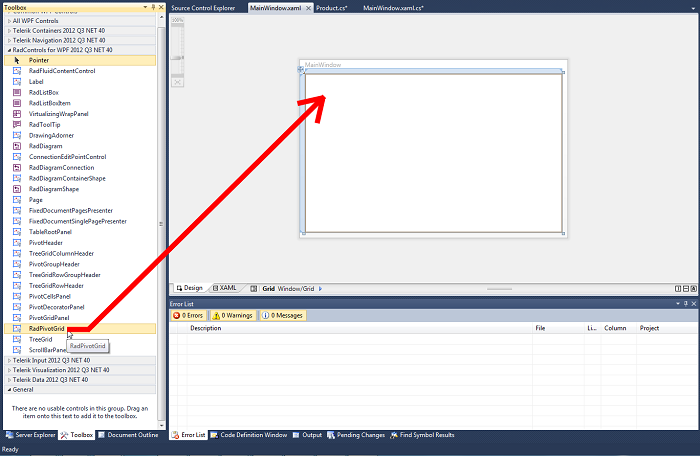
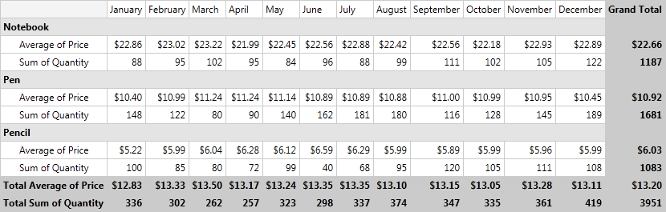

# Getting Started

This article will explain a basic implementation of __RadPivotGrid__ using LocalDataSourceProvider.
      

## Adding RadPivotGrid to your application.
        

>important__RadPivotGrid__ can be used after adding reference to the following assemblies:
          

* Telerik.Pivot.Core

* Telerik.Windows.Controls.Pivot

* Telerik.Windows.Controls

* Telerik.Pivot.Core

* Telerik.Windows.Controls.Pivot

* Telerik.Windows.Controls

* System.Runtime.Serialization

There are two ways to add __RadPivotGrid__ to your application:
        

* Drag __RadPivotGrid__ from the *Toolbox*. It can be found under
              __RadControls for WPF____RadControls for SilverLight__
              but only if you have installed __Telerik__ controls.
            

* Create it in the __XAML__ directly:
            

#### __XAML__

{{region radpivotgrid-getting-started_1}}
	<pivot:RadPivotGrid Name="radPivotGrid1">            
	</pivot:RadPivotGrid>
	{{endregion}}

>importantYou will have to define the pivot namespace in your __XAML__:
                __xmlns:pivot="http://schemas.telerik.com/2008/xaml/presentation/pivot"__

## Create Data to Show in RadPivotGrid

In our application we will show data for some office materials - their quantity, price through the year, etc. So our first task is to create a class that will
          present one product.
        

#### __C#__

{{region radpivotgrid-getting-started_1}}
	public class Product
	{
	    public string Name { get; set; }
	    public int Quantity { get; set; }
	    public double Price { get; set; }
	    public DateTime Date { get; set; }
	}
	{{endregion}}

#### __VB.NET__

{{region radpivotgrid-getting-started_1}}
	Public Class Product
	    Public Property Name() As String
	        Get
	            Return m_Name
	        End Get
	        Set(value As String)
	            m_Name = value
	        End Set
	    End Property
	    Private m_Name As String
	    Public Property Quantity() As Integer
	        Get
	            Return m_Quantity
	        End Get
	        Set(value As Integer)
	            m_Quantity = value
	        End Set
	    End Property
	    Private m_Quantity As Integer
	    Public Property Price() As Double
	        Get
	            Return m_Price
	        End Get
	        Set(value As Double)
	            m_Price = value
	        End Set
	    End Property
	    Private m_Price As Double
	    Public Property [Date]() As DateTime
	        Get
	            Return m_Date
	        End Get
	        Set(value As DateTime)
	            m_Date = value
	        End Set
	    End Property
	    Private m_Date As DateTime
	End Class
	{{endregion}}

Now we'll add a method that will create a sample data for our application:

#### __C#__

{{region radpivotgrid-getting-started_2}}
	private static IList<Product> GeneratePivotData()
	{
	    IList<Product> PivotData = new List<Product>()
	    {
	        new Product() { Name = "Pen", Date = new DateTime(2012,1,1,0,0,0), Price = 10.40, Quantity = 148 },
	        new Product() { Name = "Pen", Date = new DateTime(2012,2,1,0,0,0), Price = 10.99, Quantity = 122 },
	        new Product() { Name = "Pen", Date = new DateTime(2012,3,1,0,0,0), Price = 11.24, Quantity = 80 },
	        new Product() { Name = "Pen", Date = new DateTime(2012,4,1,0,0,0), Price = 11.24, Quantity = 90 },
	        new Product() { Name = "Pen", Date = new DateTime(2012,5,1,0,0,0), Price = 11.14, Quantity = 140 },
	        new Product() { Name = "Pen", Date = new DateTime(2012,6,1,0,0,0), Price = 10.89, Quantity = 162 },
	        new Product() { Name = "Pen", Date = new DateTime(2012,7,1,0,0,0), Price = 10.89, Quantity = 181 },
	        new Product() { Name = "Pen", Date = new DateTime(2012,8,1,0,0,0), Price = 10.88, Quantity = 180 },
	        new Product() { Name = "Pen", Date = new DateTime(2012,9,1,0,0,0), Price = 11.00, Quantity = 116 },
	        new Product() { Name = "Pen", Date = new DateTime(2012,10,1,0,0,0), Price = 10.99, Quantity = 128 },
	        new Product() { Name = "Pen", Date = new DateTime(2012,11,1,0,0,0), Price = 10.95, Quantity = 145 },
	        new Product() { Name = "Pen", Date = new DateTime(2012,12,1,0,0,0), Price = 10.45, Quantity = 189 },
	        new Product() { Name = "Pencil", Date = new DateTime(2012,1,1,0,0,0), Price = 5.22, Quantity = 100 },
	        new Product() { Name = "Pencil", Date = new DateTime(2012,2,1,0,0,0), Price = 5.99, Quantity = 85 },
	        new Product() { Name = "Pencil", Date = new DateTime(2012,3,1,0,0,0), Price = 6.04, Quantity = 80 },
	        new Product() { Name = "Pencil", Date = new DateTime(2012,4,1,0,0,0), Price = 6.28, Quantity = 72 },
	        new Product() { Name = "Pencil", Date = new DateTime(2012,5,1,0,0,0), Price = 6.12, Quantity = 99 },
	        new Product() { Name = "Pencil", Date = new DateTime(2012,6,1,0,0,0), Price = 6.59, Quantity = 40 },
	        new Product() { Name = "Pencil", Date = new DateTime(2012,7,1,0,0,0), Price = 6.29, Quantity = 68 },
	        new Product() { Name = "Pencil", Date = new DateTime(2012,8,1,0,0,0), Price = 5.99, Quantity = 95 },
	        new Product() { Name = "Pencil", Date = new DateTime(2012,9,1,0,0,0), Price = 5.89, Quantity = 120 },
	        new Product() { Name = "Pencil", Date = new DateTime(2012,10,1,0,0,0), Price = 5.99, Quantity = 105 },
	        new Product() { Name = "Pencil", Date = new DateTime(2012,11,1,0,0,0), Price = 5.96, Quantity = 111 },
	        new Product() { Name = "Pencil", Date = new DateTime(2012,12,1,0,0,0), Price = 5.99, Quantity = 108 },
	        new Product() { Name = "Notebook", Date = new DateTime(2012,1,1,0,0,0), Price = 22.86, Quantity = 88 },
	        new Product() { Name = "Notebook", Date = new DateTime(2012,2,1,0,0,0), Price = 23.02, Quantity = 95},
	        new Product() { Name = "Notebook", Date = new DateTime(2012,3,1,0,0,0), Price = 23.22, Quantity = 102 },
	        new Product() { Name = "Notebook", Date = new DateTime(2012,4,1,0,0,0), Price = 21.99, Quantity = 95},
	        new Product() { Name = "Notebook", Date = new DateTime(2012,5,1,0,0,0), Price = 22.45, Quantity = 84},
	        new Product() { Name = "Notebook", Date = new DateTime(2012,6,1,0,0,0), Price = 22.56, Quantity = 96 },
	        new Product() { Name = "Notebook", Date = new DateTime(2012,7,1,0,0,0), Price = 22.88, Quantity = 88},
	        new Product() { Name = "Notebook", Date = new DateTime(2012,8,1,0,0,0), Price = 22.42, Quantity = 99},
	        new Product() { Name = "Notebook", Date = new DateTime(2012,9,1,0,0,0), Price = 22.56, Quantity = 111},
	        new Product() { Name = "Notebook", Date = new DateTime(2012,10,1,0,0,0), Price = 22.18, Quantity = 102 },
	        new Product() { Name = "Notebook", Date = new DateTime(2012,11,1,0,0,0), Price = 22.93, Quantity = 105 },
	        new Product() { Name = "Notebook", Date = new DateTime(2012,12,1,0,0,0), Price = 22.89, Quantity = 122 },
	    };
	
	    return PivotData;
	}
	{{endregion}}

#### __VB.NET__

{{region radpivotgrid-getting-started_2}}
	Private Shared Function GeneratePivotData() As IList(Of Product)
	    Dim PivotData As IList(Of Product) = New List(Of Product)() From { _
	New Product() With { _
	 .Name = "Pen", _
	 .[Date] = New DateTime(2012, 1, 1, 0, 0, 0), _
	 .Price = 10.4, _
	 .Quantity = 148 _
	}, _
	New Product() With { _
	 .Name = "Pen", _
	 .[Date] = New DateTime(2012, 2, 1, 0, 0, 0), _
	 .Price = 10.99, _
	 .Quantity = 122 _
	}, _
	New Product() With { _
	 .Name = "Pen", _
	 .[Date] = New DateTime(2012, 3, 1, 0, 0, 0), _
	 .Price = 11.24, _
	 .Quantity = 80 _
	}, _
	New Product() With { _
	 .Name = "Pen", _
	 .[Date] = New DateTime(2012, 4, 1, 0, 0, 0), _
	 .Price = 11.24, _
	 .Quantity = 90 _
	}, _
	New Product() With { _
	 .Name = "Pen", _
	 .[Date] = New DateTime(2012, 5, 1, 0, 0, 0), _
	 .Price = 11.14, _
	 .Quantity = 140 _
	}, _
	New Product() With { _
	 .Name = "Pen", _
	 .[Date] = New DateTime(2012, 6, 1, 0, 0, 0), _
	 .Price = 10.89, _
	 .Quantity = 162 _
	}, _
	New Product() With { _
	 .Name = "Pen", _
	 .[Date] = New DateTime(2012, 7, 1, 0, 0, 0), _
	 .Price = 10.89, _
	 .Quantity = 181 _
	}, _
	New Product() With { _
	 .Name = "Pen", _
	 .[Date] = New DateTime(2012, 8, 1, 0, 0, 0), _
	 .Price = 10.88, _
	 .Quantity = 180 _
	}, _
	New Product() With { _
	 .Name = "Pen", _
	 .[Date] = New DateTime(2012, 9, 1, 0, 0, 0), _
	 .Price = 11.0, _
	 .Quantity = 116 _
	}, _
	New Product() With { _
	 .Name = "Pen", _
	 .[Date] = New DateTime(2012, 10, 1, 0, 0, 0), _
	 .Price = 10.99, _
	 .Quantity = 128 _
	}, _
	New Product() With { _
	 .Name = "Pen", _
	 .[Date] = New DateTime(2012, 11, 1, 0, 0, 0), _
	 .Price = 10.95, _
	 .Quantity = 145 _
	}, _
	New Product() With { _
	 .Name = "Pen", _
	 .[Date] = New DateTime(2012, 12, 1, 0, 0, 0), _
	 .Price = 10.45, _
	 .Quantity = 189 _
	}, _
	New Product() With { _
	 .Name = "Pencil", _
	 .[Date] = New DateTime(2012, 1, 1, 0, 0, 0), _
	 .Price = 5.22, _
	 .Quantity = 100 _
	}, _
	New Product() With { _
	 .Name = "Pencil", _
	 .[Date] = New DateTime(2012, 2, 1, 0, 0, 0), _
	 .Price = 5.99, _
	 .Quantity = 85 _
	}, _
	New Product() With { _
	 .Name = "Pencil", _
	 .[Date] = New DateTime(2012, 3, 1, 0, 0, 0), _
	 .Price = 6.04, _
	 .Quantity = 80 _
	}, _
	New Product() With { _
	 .Name = "Pencil", _
	 .[Date] = New DateTime(2012, 4, 1, 0, 0, 0), _
	 .Price = 6.28, _
	 .Quantity = 72 _
	}, _
	New Product() With { _
	 .Name = "Pencil", _
	 .[Date] = New DateTime(2012, 5, 1, 0, 0, 0), _
	 .Price = 6.12, _
	 .Quantity = 99 _
	}, _
	New Product() With { _
	 .Name = "Pencil", _
	 .[Date] = New DateTime(2012, 6, 1, 0, 0, 0), _
	 .Price = 6.59, _
	 .Quantity = 40 _
	}, _
	New Product() With { _
	 .Name = "Pencil", _
	 .[Date] = New DateTime(2012, 7, 1, 0, 0, 0), _
	 .Price = 6.29, _
	 .Quantity = 68 _
	}, _
	New Product() With { _
	 .Name = "Pencil", _
	 .[Date] = New DateTime(2012, 8, 1, 0, 0, 0), _
	 .Price = 5.99, _
	 .Quantity = 95 _
	}, _
	New Product() With { _
	 .Name = "Pencil", _
	 .[Date] = New DateTime(2012, 9, 1, 0, 0, 0), _
	 .Price = 5.89, _
	 .Quantity = 120 _
	}, _
	New Product() With { _
	 .Name = "Pencil", _
	 .[Date] = New DateTime(2012, 10, 1, 0, 0, 0), _
	 .Price = 5.99, _
	 .Quantity = 105 _
	}, _
	New Product() With { _
	 .Name = "Pencil", _
	 .[Date] = New DateTime(2012, 11, 1, 0, 0, 0), _
	 .Price = 5.96, _
	 .Quantity = 111 _
	}, _
	New Product() With { _
	 .Name = "Pencil", _
	 .[Date] = New DateTime(2012, 12, 1, 0, 0, 0), _
	 .Price = 5.99, _
	 .Quantity = 108 _
	}, _
	New Product() With { _
	 .Name = "Notebook", _
	 .[Date] = New DateTime(2012, 1, 1, 0, 0, 0), _
	 .Price = 22.86, _
	 .Quantity = 88 _
	}, _
	New Product() With { _
	 .Name = "Notebook", _
	 .[Date] = New DateTime(2012, 2, 1, 0, 0, 0), _
	 .Price = 23.02, _
	 .Quantity = 95 _
	}, _
	New Product() With { _
	 .Name = "Notebook", _
	 .[Date] = New DateTime(2012, 3, 1, 0, 0, 0), _
	 .Price = 23.22, _
	 .Quantity = 102 _
	}, _
	New Product() With { _
	 .Name = "Notebook", _
	 .[Date] = New DateTime(2012, 4, 1, 0, 0, 0), _
	 .Price = 21.99, _
	 .Quantity = 95 _
	}, _
	New Product() With { _
	 .Name = "Notebook", _
	 .[Date] = New DateTime(2012, 5, 1, 0, 0, 0), _
	 .Price = 22.45, _
	 .Quantity = 84 _
	}, _
	New Product() With { _
	 .Name = "Notebook", _
	 .[Date] = New DateTime(2012, 6, 1, 0, 0, 0), _
	 .Price = 22.56, _
	 .Quantity = 96 _
	}, _
	New Product() With { _
	 .Name = "Notebook", _
	 .[Date] = New DateTime(2012, 7, 1, 0, 0, 0), _
	 .Price = 22.88, _
	 .Quantity = 88 _
	}, _
	New Product() With { _
	 .Name = "Notebook", _
	 .[Date] = New DateTime(2012, 8, 1, 0, 0, 0), _
	 .Price = 22.42, _
	 .Quantity = 99 _
	}, _
	New Product() With { _
	 .Name = "Notebook", _
	 .[Date] = New DateTime(2012, 9, 1, 0, 0, 0), _
	 .Price = 22.56, _
	 .Quantity = 111 _
	}, _
	New Product() With { _
	 .Name = "Notebook", _
	 .[Date] = New DateTime(2012, 10, 1, 0, 0, 0), _
	 .Price = 22.18, _
	 .Quantity = 102 _
	}, _
	New Product() With { _
	 .Name = "Notebook", _
	 .[Date] = New DateTime(2012, 11, 1, 0, 0, 0), _
	 .Price = 22.93, _
	 .Quantity = 105 _
	}, _
	New Product() With { _
	 .Name = "Notebook", _
	 .[Date] = New DateTime(2012, 12, 1, 0, 0, 0), _
	 .Price = 22.89, _
	 .Quantity = 122 _
	} _
	}
	
	    Return PivotData
	End Function
	{{endregion}}

## Create the RadPivotGrid LocalDataSourceProvider

It is time to define the DataSource for our __RadPivotGrid__. We'll do it in the resources in our __XAML__. The idea of the DataSourceProvider is to define
    			which properties will be shown as a Columns, Rows and Aggregates. For our example we'll use *Name* as a Row, *Date* as a Column,
    			*Price* and *Quantity* as Aggregates.
    		

#### __XAML__

{{region radpivotgrid-getting-started_2}}
	<pivot:LocalDataSourceProvider x:Key="LocalDataProvider" AggregatesPosition="Rows">
	    <pivot:LocalDataSourceProvider.RowGroupDescriptions>
	        <pivot:PropertyGroupDescription PropertyName="Name" />
	    </pivot:LocalDataSourceProvider.RowGroupDescriptions>
	    <pivot:LocalDataSourceProvider.ColumnGroupDescriptions>
	        <pivot:DateTimeGroupDescription PropertyName="Date" Step="Month" />
	    </pivot:LocalDataSourceProvider.ColumnGroupDescriptions>
	    <pivot:LocalDataSourceProvider.AggregateDescriptions>
	        <pivot:PropertyAggregateDescription PropertyName="Price" StringFormat="C" AggregateFunction="Average" />
	        <pivot:PropertyAggregateDescription PropertyName="Quantity"/>
	    </pivot:LocalDataSourceProvider.AggregateDescriptions>
	</pivot:LocalDataSourceProvider>
	{{endregion}}

In the definition of the __RadPivotGrid__ you'll have to set the DataProvider property to the LocalDataSourceProvider we've just created.
    		

#### __XAML__

{{region radpivotgrid-getting-started_3}}
	<pivot:RadPivotGrid Name="radPivotGrid1" DataProvider="{StaticResource LocalDataProvider}" >            
	</pivot:RadPivotGrid>
	{{endregion}}

The DataProvider is set, but it still doesn't have any data in it. It's time to use our *GenerateData* method. Add the following code to your code behind:
    		

#### __C#__

{{region radpivotgrid-getting-started_3}}
	InitializeComponent();
	(this.Resources["LocalDataProvider"] as LocalDataSourceProvider).ItemsSource = GeneratePivotData();
	{{endregion}}

#### __VB.NET__

{{region radpivotgrid-getting-started_3}}
	InitializeComponent()
	TryCast(Me.Resources("LocalDataProvider"), LocalDataSourceProvider).ItemsSource = GeneratePivotData()
	{{endregion}}

## Final Result and Full Project

Let's start our application. Here's the result:

Here's the full implementation of our project:

* 

#### __XAML__

{{region radpivotgrid-getting-started_4}}
	<Window x:Class="RadPivotGrid_GettingStarted.MainWindow"
					xmlns="http://schemas.microsoft.com/winfx/2006/xaml/presentation"
					xmlns:x="http://schemas.microsoft.com/winfx/2006/xaml"
					xmlns:telerik="http://schemas.telerik.com/2008/xaml/presentation"
	                xmlns:local="clr-namespace:RadPivotGrid_GettingStarted"
	                xmlns:pivot="http://schemas.telerik.com/2008/xaml/presentation/pivot"
					Title="MainWindow" Height="350" Width="525" >
	    <Window.Resources>
	        <pivot:LocalDataSourceProvider x:Key="LocalDataProvider" AggregatesPosition="Rows">
	            <pivot:LocalDataSourceProvider.RowGroupDescriptions>
	                <pivot:PropertyGroupDescription PropertyName="Name" />
	            </pivot:LocalDataSourceProvider.RowGroupDescriptions>
	            <pivot:LocalDataSourceProvider.ColumnGroupDescriptions>
	                <pivot:DateTimeGroupDescription PropertyName="Date" Step="Month" />
	            </pivot:LocalDataSourceProvider.ColumnGroupDescriptions>
	            <pivot:LocalDataSourceProvider.AggregateDescriptions>
	                <pivot:PropertyAggregateDescription PropertyName="Price" StringFormat="C" AggregateFunction="Average" />
	                <pivot:PropertyAggregateDescription PropertyName="Quantity"/>
	            </pivot:LocalDataSourceProvider.AggregateDescriptions>
	        </pivot:LocalDataSourceProvider>
	    </Window.Resources>
			<Grid>
	        <pivot:RadPivotGrid Name="radPivotGrid1" DataProvider="{StaticResource LocalDataProvider}" >            
	        </pivot:RadPivotGrid>
	    </Grid>
	</Window>
	{{endregion}}

* 

#### __C#__

{{region radpivotgrid-getting-started_4}}
	using System;
	using System.Collections.Generic;
	using System.Windows;
	using Telerik.Pivot.Core;
	
	namespace RadPivotGrid_GettingStarted
	{
	    public class Product
	    {
	        public string Name { get; set; }
	        public int Quantity { get; set; }
	        public double Price { get; set; }
	        public DateTime Date { get; set; }
	    }
	
	    public partial class MainWindow : Window
	    {
	        public MainWindow()
	        {
	            InitializeComponent();
	            (this.Resources["LocalDataProvider"] as LocalDataSourceProvider).ItemsSource = GeneratePivotData();
	        }
	
	        private static IList<Product> GeneratePivotData()
	        {
	            IList<Product> PivotData = new List<Product>()
	            {
	                new Product() { Name = "Pen", Date = new DateTime(2012,1,1,0,0,0), Price = 10.40, Quantity = 148 },
	                new Product() { Name = "Pen", Date = new DateTime(2012,2,1,0,0,0), Price = 10.99, Quantity = 122 },
	                new Product() { Name = "Pen", Date = new DateTime(2012,3,1,0,0,0), Price = 11.24, Quantity = 80 },
	                new Product() { Name = "Pen", Date = new DateTime(2012,4,1,0,0,0), Price = 11.24, Quantity = 90 },
	                new Product() { Name = "Pen", Date = new DateTime(2012,5,1,0,0,0), Price = 11.14, Quantity = 140 },
	                new Product() { Name = "Pen", Date = new DateTime(2012,6,1,0,0,0), Price = 10.89, Quantity = 162 },
	                new Product() { Name = "Pen", Date = new DateTime(2012,7,1,0,0,0), Price = 10.89, Quantity = 181 },
	                new Product() { Name = "Pen", Date = new DateTime(2012,8,1,0,0,0), Price = 10.88, Quantity = 180 },
	                new Product() { Name = "Pen", Date = new DateTime(2012,9,1,0,0,0), Price = 11.00, Quantity = 116 },
	                new Product() { Name = "Pen", Date = new DateTime(2012,10,1,0,0,0), Price = 10.99, Quantity = 128 },
	                new Product() { Name = "Pen", Date = new DateTime(2012,11,1,0,0,0), Price = 10.95, Quantity = 145 },
	                new Product() { Name = "Pen", Date = new DateTime(2012,12,1,0,0,0), Price = 10.45, Quantity = 189 },
	                new Product() { Name = "Pencil", Date = new DateTime(2012,1,1,0,0,0), Price = 5.22, Quantity = 100 },
	                new Product() { Name = "Pencil", Date = new DateTime(2012,2,1,0,0,0), Price = 5.99, Quantity = 85 },
	                new Product() { Name = "Pencil", Date = new DateTime(2012,3,1,0,0,0), Price = 6.04, Quantity = 80 },
	                new Product() { Name = "Pencil", Date = new DateTime(2012,4,1,0,0,0), Price = 6.28, Quantity = 72 },
	                new Product() { Name = "Pencil", Date = new DateTime(2012,5,1,0,0,0), Price = 6.12, Quantity = 99 },
	                new Product() { Name = "Pencil", Date = new DateTime(2012,6,1,0,0,0), Price = 6.59, Quantity = 40 },
	                new Product() { Name = "Pencil", Date = new DateTime(2012,7,1,0,0,0), Price = 6.29, Quantity = 68 },
	                new Product() { Name = "Pencil", Date = new DateTime(2012,8,1,0,0,0), Price = 5.99, Quantity = 95 },
	                new Product() { Name = "Pencil", Date = new DateTime(2012,9,1,0,0,0), Price = 5.89, Quantity = 120 },
	                new Product() { Name = "Pencil", Date = new DateTime(2012,10,1,0,0,0), Price = 5.99, Quantity = 105 },
	                new Product() { Name = "Pencil", Date = new DateTime(2012,11,1,0,0,0), Price = 5.96, Quantity = 111 },
	                new Product() { Name = "Pencil", Date = new DateTime(2012,12,1,0,0,0), Price = 5.99, Quantity = 108 },
	                new Product() { Name = "Notebook", Date = new DateTime(2012,1,1,0,0,0), Price = 22.86, Quantity = 88 },
	                new Product() { Name = "Notebook", Date = new DateTime(2012,2,1,0,0,0), Price = 23.02, Quantity = 95},
	                new Product() { Name = "Notebook", Date = new DateTime(2012,3,1,0,0,0), Price = 23.22, Quantity = 102 },
	                new Product() { Name = "Notebook", Date = new DateTime(2012,4,1,0,0,0), Price = 21.99, Quantity = 95},
	                new Product() { Name = "Notebook", Date = new DateTime(2012,5,1,0,0,0), Price = 22.45, Quantity = 84},
	                new Product() { Name = "Notebook", Date = new DateTime(2012,6,1,0,0,0), Price = 22.56, Quantity = 96 },
	                new Product() { Name = "Notebook", Date = new DateTime(2012,7,1,0,0,0), Price = 22.88, Quantity = 88},
	                new Product() { Name = "Notebook", Date = new DateTime(2012,8,1,0,0,0), Price = 22.42, Quantity = 99},
	                new Product() { Name = "Notebook", Date = new DateTime(2012,9,1,0,0,0), Price = 22.56, Quantity = 111},
	                new Product() { Name = "Notebook", Date = new DateTime(2012,10,1,0,0,0), Price = 22.18, Quantity = 102 },
	                new Product() { Name = "Notebook", Date = new DateTime(2012,11,1,0,0,0), Price = 22.93, Quantity = 105 },
	                new Product() { Name = "Notebook", Date = new DateTime(2012,12,1,0,0,0), Price = 22.89, Quantity = 122 },
	            };
	
	            return PivotData;
	        }
	    }
	}
	{{endregion}}

#### __VB.NET__

{{region radpivotgrid-getting-started_4}}
	Imports System
	Imports System.Collections.Generic
	Imports System.Windows
	Imports Telerik.Pivot.Core
	
	Public Class Product
	    Public Property Name() As String
	        Get
	            Return m_Name
	        End Get
	        Set(value As String)
	            m_Name = value
	        End Set
	    End Property
	    Private m_Name As String
	    Public Property Quantity() As Integer
	        Get
	            Return m_Quantity
	        End Get
	        Set(value As Integer)
	            m_Quantity = value
	        End Set
	    End Property
	    Private m_Quantity As Integer
	    Public Property Price() As Double
	        Get
	            Return m_Price
	        End Get
	        Set(value As Double)
	            m_Price = value
	        End Set
	    End Property
	    Private m_Price As Double
	    Public Property [Date]() As DateTime
	        Get
	            Return m_Date
	        End Get
	        Set(value As DateTime)
	            m_Date = value
	        End Set
	    End Property
	    Private m_Date As DateTime
	End Class
	
	Partial Public Class MainWindow
	    Public Sub New()
	        InitializeComponent()
	        TryCast(Me.Resources("LocalDataProvider"), LocalDataSourceProvider).ItemsSource = GeneratePivotData()
	    End Sub
	
	    Private Shared Function GeneratePivotData() As IList(Of Product)
	        Dim PivotData As IList(Of Product) = New List(Of Product)() From { _
	    New Product() With { _
	     .Name = "Pen", _
	     .[Date] = New DateTime(2012, 1, 1, 0, 0, 0), _
	     .Price = 10.4, _
	     .Quantity = 148 _
	    }, _
	    New Product() With { _
	     .Name = "Pen", _
	     .[Date] = New DateTime(2012, 2, 1, 0, 0, 0), _
	     .Price = 10.99, _
	     .Quantity = 122 _
	    }, _
	    New Product() With { _
	     .Name = "Pen", _
	     .[Date] = New DateTime(2012, 3, 1, 0, 0, 0), _
	     .Price = 11.24, _
	     .Quantity = 80 _
	    }, _
	    New Product() With { _
	     .Name = "Pen", _
	     .[Date] = New DateTime(2012, 4, 1, 0, 0, 0), _
	     .Price = 11.24, _
	     .Quantity = 90 _
	    }, _
	    New Product() With { _
	     .Name = "Pen", _
	     .[Date] = New DateTime(2012, 5, 1, 0, 0, 0), _
	     .Price = 11.14, _
	     .Quantity = 140 _
	    }, _
	    New Product() With { _
	     .Name = "Pen", _
	     .[Date] = New DateTime(2012, 6, 1, 0, 0, 0), _
	     .Price = 10.89, _
	     .Quantity = 162 _
	    }, _
	    New Product() With { _
	     .Name = "Pen", _
	     .[Date] = New DateTime(2012, 7, 1, 0, 0, 0), _
	     .Price = 10.89, _
	     .Quantity = 181 _
	    }, _
	    New Product() With { _
	     .Name = "Pen", _
	     .[Date] = New DateTime(2012, 8, 1, 0, 0, 0), _
	     .Price = 10.88, _
	     .Quantity = 180 _
	    }, _
	    New Product() With { _
	     .Name = "Pen", _
	     .[Date] = New DateTime(2012, 9, 1, 0, 0, 0), _
	     .Price = 11.0, _
	     .Quantity = 116 _
	    }, _
	    New Product() With { _
	     .Name = "Pen", _
	     .[Date] = New DateTime(2012, 10, 1, 0, 0, 0), _
	     .Price = 10.99, _
	     .Quantity = 128 _
	    }, _
	    New Product() With { _
	     .Name = "Pen", _
	     .[Date] = New DateTime(2012, 11, 1, 0, 0, 0), _
	     .Price = 10.95, _
	     .Quantity = 145 _
	    }, _
	    New Product() With { _
	     .Name = "Pen", _
	     .[Date] = New DateTime(2012, 12, 1, 0, 0, 0), _
	     .Price = 10.45, _
	     .Quantity = 189 _
	    }, _
	    New Product() With { _
	     .Name = "Pencil", _
	     .[Date] = New DateTime(2012, 1, 1, 0, 0, 0), _
	     .Price = 5.22, _
	     .Quantity = 100 _
	    }, _
	    New Product() With { _
	     .Name = "Pencil", _
	     .[Date] = New DateTime(2012, 2, 1, 0, 0, 0), _
	     .Price = 5.99, _
	     .Quantity = 85 _
	    }, _
	    New Product() With { _
	     .Name = "Pencil", _
	     .[Date] = New DateTime(2012, 3, 1, 0, 0, 0), _
	     .Price = 6.04, _
	     .Quantity = 80 _
	    }, _
	    New Product() With { _
	     .Name = "Pencil", _
	     .[Date] = New DateTime(2012, 4, 1, 0, 0, 0), _
	     .Price = 6.28, _
	     .Quantity = 72 _
	    }, _
	    New Product() With { _
	     .Name = "Pencil", _
	     .[Date] = New DateTime(2012, 5, 1, 0, 0, 0), _
	     .Price = 6.12, _
	     .Quantity = 99 _
	    }, _
	    New Product() With { _
	     .Name = "Pencil", _
	     .[Date] = New DateTime(2012, 6, 1, 0, 0, 0), _
	     .Price = 6.59, _
	     .Quantity = 40 _
	    }, _
	    New Product() With { _
	     .Name = "Pencil", _
	     .[Date] = New DateTime(2012, 7, 1, 0, 0, 0), _
	     .Price = 6.29, _
	     .Quantity = 68 _
	    }, _
	    New Product() With { _
	     .Name = "Pencil", _
	     .[Date] = New DateTime(2012, 8, 1, 0, 0, 0), _
	     .Price = 5.99, _
	     .Quantity = 95 _
	    }, _
	    New Product() With { _
	     .Name = "Pencil", _
	     .[Date] = New DateTime(2012, 9, 1, 0, 0, 0), _
	     .Price = 5.89, _
	     .Quantity = 120 _
	    }, _
	    New Product() With { _
	     .Name = "Pencil", _
	     .[Date] = New DateTime(2012, 10, 1, 0, 0, 0), _
	     .Price = 5.99, _
	     .Quantity = 105 _
	    }, _
	    New Product() With { _
	     .Name = "Pencil", _
	     .[Date] = New DateTime(2012, 11, 1, 0, 0, 0), _
	     .Price = 5.96, _
	     .Quantity = 111 _
	    }, _
	    New Product() With { _
	     .Name = "Pencil", _
	     .[Date] = New DateTime(2012, 12, 1, 0, 0, 0), _
	     .Price = 5.99, _
	     .Quantity = 108 _
	    }, _
	    New Product() With { _
	     .Name = "Notebook", _
	     .[Date] = New DateTime(2012, 1, 1, 0, 0, 0), _
	     .Price = 22.86, _
	     .Quantity = 88 _
	    }, _
	    New Product() With { _
	     .Name = "Notebook", _
	     .[Date] = New DateTime(2012, 2, 1, 0, 0, 0), _
	     .Price = 23.02, _
	     .Quantity = 95 _
	    }, _
	    New Product() With { _
	     .Name = "Notebook", _
	     .[Date] = New DateTime(2012, 3, 1, 0, 0, 0), _
	     .Price = 23.22, _
	     .Quantity = 102 _
	    }, _
	    New Product() With { _
	     .Name = "Notebook", _
	     .[Date] = New DateTime(2012, 4, 1, 0, 0, 0), _
	     .Price = 21.99, _
	     .Quantity = 95 _
	    }, _
	    New Product() With { _
	     .Name = "Notebook", _
	     .[Date] = New DateTime(2012, 5, 1, 0, 0, 0), _
	     .Price = 22.45, _
	     .Quantity = 84 _
	    }, _
	    New Product() With { _
	     .Name = "Notebook", _
	     .[Date] = New DateTime(2012, 6, 1, 0, 0, 0), _
	     .Price = 22.56, _
	     .Quantity = 96 _
	    }, _
	    New Product() With { _
	     .Name = "Notebook", _
	     .[Date] = New DateTime(2012, 7, 1, 0, 0, 0), _
	     .Price = 22.88, _
	     .Quantity = 88 _
	    }, _
	    New Product() With { _
	     .Name = "Notebook", _
	     .[Date] = New DateTime(2012, 8, 1, 0, 0, 0), _
	     .Price = 22.42, _
	     .Quantity = 99 _
	    }, _
	    New Product() With { _
	     .Name = "Notebook", _
	     .[Date] = New DateTime(2012, 9, 1, 0, 0, 0), _
	     .Price = 22.56, _
	     .Quantity = 111 _
	    }, _
	    New Product() With { _
	     .Name = "Notebook", _
	     .[Date] = New DateTime(2012, 10, 1, 0, 0, 0), _
	     .Price = 22.18, _
	     .Quantity = 102 _
	    }, _
	    New Product() With { _
	     .Name = "Notebook", _
	     .[Date] = New DateTime(2012, 11, 1, 0, 0, 0), _
	     .Price = 22.93, _
	     .Quantity = 105 _
	    }, _
	    New Product() With { _
	     .Name = "Notebook", _
	     .[Date] = New DateTime(2012, 12, 1, 0, 0, 0), _
	     .Price = 22.89, _
	     .Quantity = 122 _
	    } _
	   }
	
	        Return PivotData
	    End Function
	End Class
	{{endregion}}



* 

#### __XAML__

{{region radpivotgrid-getting-started_5}}
	<UserControl x:Class="RadPivotGrid_GettingStarted.MainPage"
			xmlns="http://schemas.microsoft.com/winfx/2006/xaml/presentation" 
			xmlns:x="http://schemas.microsoft.com/winfx/2006/xaml"
			xmlns:d="http://schemas.microsoft.com/expression/blend/2008" 
			xmlns:mc="http://schemas.openxmlformats.org/markup-compatibility/2006"
			xmlns:telerik="http://schemas.telerik.com/2008/xaml/presentation"
	        xmlns:pivot="http://schemas.telerik.com/2008/xaml/presentation/pivot"
			mc:Ignorable="d" d:DesignWidth="640" d:DesignHeight="480">
	    <UserControl.Resources>
	        <pivot:LocalDataSourceProvider x:Key="LocalDataProvider" AggregatesPosition="Rows">
	            <pivot:LocalDataSourceProvider.RowGroupDescriptions>
	                <pivot:PropertyGroupDescription PropertyName="Name" />
	            </pivot:LocalDataSourceProvider.RowGroupDescriptions>
	            <pivot:LocalDataSourceProvider.ColumnGroupDescriptions>
	                <pivot:DateTimeGroupDescription PropertyName="Date" Step="Month" />
	            </pivot:LocalDataSourceProvider.ColumnGroupDescriptions>
	            <pivot:LocalDataSourceProvider.AggregateDescriptions>
	                <pivot:PropertyAggregateDescription PropertyName="Price" StringFormat="C" AggregateFunction="Average" />
	                <pivot:PropertyAggregateDescription PropertyName="Quantity"/>
	            </pivot:LocalDataSourceProvider.AggregateDescriptions>
	        </pivot:LocalDataSourceProvider>
	    </UserControl.Resources>
		<Grid x:Name="LayoutRoot">
	        <pivot:RadPivotGrid Name="radPivotGrid1" DataProvider="{StaticResource LocalDataProvider}" >
	        </pivot:RadPivotGrid>
	    </Grid>
	</UserControl>
	{{endregion}}

* 

#### __C#__

{{region radpivotgrid-getting-started_5}}
	using System;
	using System.Collections.Generic;
	using System.Windows.Controls;
	using Telerik.Pivot.Core;
	
	namespace RadPivotGrid_GettingStarted
	{
	    public class Product
	    {
	        public string Name { get; set; }
	        public int Quantity { get; set; }
	        public double Price { get; set; }
	        public DateTime Date { get; set; }
	    }
	
	    public partial class MainPage : UserControl
	    {
	        public MainPage()
	        {
	            InitializeComponent();
	            (this.Resources["LocalDataProvider"] as LocalDataSourceProvider).ItemsSource = GeneratePivotData();
	        }
	
	        private static IList<Product> GeneratePivotData()
	        {
	            IList<Product> PivotData = new List<Product>()
	            {
	                new Product() { Name = "Pen", Date = new DateTime(2012,1,1,0,0,0), Price = 10.40, Quantity = 148 },
	                new Product() { Name = "Pen", Date = new DateTime(2012,2,1,0,0,0), Price = 10.99, Quantity = 122 },
	                new Product() { Name = "Pen", Date = new DateTime(2012,3,1,0,0,0), Price = 11.24, Quantity = 80 },
	                new Product() { Name = "Pen", Date = new DateTime(2012,4,1,0,0,0), Price = 11.24, Quantity = 90 },
	                new Product() { Name = "Pen", Date = new DateTime(2012,5,1,0,0,0), Price = 11.14, Quantity = 140 },
	                new Product() { Name = "Pen", Date = new DateTime(2012,6,1,0,0,0), Price = 10.89, Quantity = 162 },
	                new Product() { Name = "Pen", Date = new DateTime(2012,7,1,0,0,0), Price = 10.89, Quantity = 181 },
	                new Product() { Name = "Pen", Date = new DateTime(2012,8,1,0,0,0), Price = 10.88, Quantity = 180 },
	                new Product() { Name = "Pen", Date = new DateTime(2012,9,1,0,0,0), Price = 11.00, Quantity = 116 },
	                new Product() { Name = "Pen", Date = new DateTime(2012,10,1,0,0,0), Price = 10.99, Quantity = 128 },
	                new Product() { Name = "Pen", Date = new DateTime(2012,11,1,0,0,0), Price = 10.95, Quantity = 145 },
	                new Product() { Name = "Pen", Date = new DateTime(2012,12,1,0,0,0), Price = 10.45, Quantity = 189 },
	                new Product() { Name = "Pencil", Date = new DateTime(2012,1,1,0,0,0), Price = 5.22, Quantity = 100 },
	                new Product() { Name = "Pencil", Date = new DateTime(2012,2,1,0,0,0), Price = 5.99, Quantity = 85 },
	                new Product() { Name = "Pencil", Date = new DateTime(2012,3,1,0,0,0), Price = 6.04, Quantity = 80 },
	                new Product() { Name = "Pencil", Date = new DateTime(2012,4,1,0,0,0), Price = 6.28, Quantity = 72 },
	                new Product() { Name = "Pencil", Date = new DateTime(2012,5,1,0,0,0), Price = 6.12, Quantity = 99 },
	                new Product() { Name = "Pencil", Date = new DateTime(2012,6,1,0,0,0), Price = 6.59, Quantity = 40 },
	                new Product() { Name = "Pencil", Date = new DateTime(2012,7,1,0,0,0), Price = 6.29, Quantity = 68 },
	                new Product() { Name = "Pencil", Date = new DateTime(2012,8,1,0,0,0), Price = 5.99, Quantity = 95 },
	                new Product() { Name = "Pencil", Date = new DateTime(2012,9,1,0,0,0), Price = 5.89, Quantity = 120 },
	                new Product() { Name = "Pencil", Date = new DateTime(2012,10,1,0,0,0), Price = 5.99, Quantity = 105 },
	                new Product() { Name = "Pencil", Date = new DateTime(2012,11,1,0,0,0), Price = 5.96, Quantity = 111 },
	                new Product() { Name = "Pencil", Date = new DateTime(2012,12,1,0,0,0), Price = 5.99, Quantity = 108 },
	                new Product() { Name = "Notebook", Date = new DateTime(2012,1,1,0,0,0), Price = 22.86, Quantity = 88 },
	                new Product() { Name = "Notebook", Date = new DateTime(2012,2,1,0,0,0), Price = 23.02, Quantity = 95},
	                new Product() { Name = "Notebook", Date = new DateTime(2012,3,1,0,0,0), Price = 23.22, Quantity = 102 },
	                new Product() { Name = "Notebook", Date = new DateTime(2012,4,1,0,0,0), Price = 21.99, Quantity = 95},
	                new Product() { Name = "Notebook", Date = new DateTime(2012,5,1,0,0,0), Price = 22.45, Quantity = 84},
	                new Product() { Name = "Notebook", Date = new DateTime(2012,6,1,0,0,0), Price = 22.56, Quantity = 96 },
	                new Product() { Name = "Notebook", Date = new DateTime(2012,7,1,0,0,0), Price = 22.88, Quantity = 88},
	                new Product() { Name = "Notebook", Date = new DateTime(2012,8,1,0,0,0), Price = 22.42, Quantity = 99},
	                new Product() { Name = "Notebook", Date = new DateTime(2012,9,1,0,0,0), Price = 22.56, Quantity = 111},
	                new Product() { Name = "Notebook", Date = new DateTime(2012,10,1,0,0,0), Price = 22.18, Quantity = 102 },
	                new Product() { Name = "Notebook", Date = new DateTime(2012,11,1,0,0,0), Price = 22.93, Quantity = 105 },
	                new Product() { Name = "Notebook", Date = new DateTime(2012,12,1,0,0,0), Price = 22.89, Quantity = 122 },
	            };
	
	            return PivotData;
	        }
	    }
	}
	{{endregion}}

#### __VB.NET__

{{region radpivotgrid-getting-started_5}}
	Imports System
	Imports System.Collections.Generic
	Imports System.Windows.Controls
	Imports Telerik.Pivot.Core
	
	Public Class Product
	    Public Property Name() As String
	        Get
	            Return m_Name
	        End Get
	        Set(value As String)
	            m_Name = value
	        End Set
	    End Property
	    Private m_Name As String
	    Public Property Quantity() As Integer
	        Get
	            Return m_Quantity
	        End Get
	        Set(value As Integer)
	            m_Quantity = value
	        End Set
	    End Property
	    Private m_Quantity As Integer
	    Public Property Price() As Double
	        Get
	            Return m_Price
	        End Get
	        Set(value As Double)
	            m_Price = value
	        End Set
	    End Property
	    Private m_Price As Double
	    Public Property [Date]() As DateTime
	        Get
	            Return m_Date
	        End Get
	        Set(value As DateTime)
	            m_Date = value
	        End Set
	    End Property
	    Private m_Date As DateTime
	End Class
	
	Partial Public Class MainPage
	    Inherits UserControl
	    Public Sub New()
	        InitializeComponent()
	        TryCast(Me.Resources("LocalDataProvider"), LocalDataSourceProvider).ItemsSource = GeneratePivotData()
	    End Sub
	
	    Private Shared Function GeneratePivotData() As IList(Of Product)
	        Dim PivotData As IList(Of Product) = New List(Of Product)() From { _
	    New Product() With { _
	     .Name = "Pen", _
	     .[Date] = New DateTime(2012, 1, 1, 0, 0, 0), _
	     .Price = 10.4, _
	     .Quantity = 148 _
	    }, _
	    New Product() With { _
	     .Name = "Pen", _
	     .[Date] = New DateTime(2012, 2, 1, 0, 0, 0), _
	     .Price = 10.99, _
	     .Quantity = 122 _
	    }, _
	    New Product() With { _
	     .Name = "Pen", _
	     .[Date] = New DateTime(2012, 3, 1, 0, 0, 0), _
	     .Price = 11.24, _
	     .Quantity = 80 _
	    }, _
	    New Product() With { _
	     .Name = "Pen", _
	     .[Date] = New DateTime(2012, 4, 1, 0, 0, 0), _
	     .Price = 11.24, _
	     .Quantity = 90 _
	    }, _
	    New Product() With { _
	     .Name = "Pen", _
	     .[Date] = New DateTime(2012, 5, 1, 0, 0, 0), _
	     .Price = 11.14, _
	     .Quantity = 140 _
	    }, _
	    New Product() With { _
	     .Name = "Pen", _
	     .[Date] = New DateTime(2012, 6, 1, 0, 0, 0), _
	     .Price = 10.89, _
	     .Quantity = 162 _
	    }, _
	    New Product() With { _
	     .Name = "Pen", _
	     .[Date] = New DateTime(2012, 7, 1, 0, 0, 0), _
	     .Price = 10.89, _
	     .Quantity = 181 _
	    }, _
	    New Product() With { _
	     .Name = "Pen", _
	     .[Date] = New DateTime(2012, 8, 1, 0, 0, 0), _
	     .Price = 10.88, _
	     .Quantity = 180 _
	    }, _
	    New Product() With { _
	     .Name = "Pen", _
	     .[Date] = New DateTime(2012, 9, 1, 0, 0, 0), _
	     .Price = 11.0, _
	     .Quantity = 116 _
	    }, _
	    New Product() With { _
	     .Name = "Pen", _
	     .[Date] = New DateTime(2012, 10, 1, 0, 0, 0), _
	     .Price = 10.99, _
	     .Quantity = 128 _
	    }, _
	    New Product() With { _
	     .Name = "Pen", _
	     .[Date] = New DateTime(2012, 11, 1, 0, 0, 0), _
	     .Price = 10.95, _
	     .Quantity = 145 _
	    }, _
	    New Product() With { _
	     .Name = "Pen", _
	     .[Date] = New DateTime(2012, 12, 1, 0, 0, 0), _
	     .Price = 10.45, _
	     .Quantity = 189 _
	    }, _
	    New Product() With { _
	     .Name = "Pencil", _
	     .[Date] = New DateTime(2012, 1, 1, 0, 0, 0), _
	     .Price = 5.22, _
	     .Quantity = 100 _
	    }, _
	    New Product() With { _
	     .Name = "Pencil", _
	     .[Date] = New DateTime(2012, 2, 1, 0, 0, 0), _
	     .Price = 5.99, _
	     .Quantity = 85 _
	    }, _
	    New Product() With { _
	     .Name = "Pencil", _
	     .[Date] = New DateTime(2012, 3, 1, 0, 0, 0), _
	     .Price = 6.04, _
	     .Quantity = 80 _
	    }, _
	    New Product() With { _
	     .Name = "Pencil", _
	     .[Date] = New DateTime(2012, 4, 1, 0, 0, 0), _
	     .Price = 6.28, _
	     .Quantity = 72 _
	    }, _
	    New Product() With { _
	     .Name = "Pencil", _
	     .[Date] = New DateTime(2012, 5, 1, 0, 0, 0), _
	     .Price = 6.12, _
	     .Quantity = 99 _
	    }, _
	    New Product() With { _
	     .Name = "Pencil", _
	     .[Date] = New DateTime(2012, 6, 1, 0, 0, 0), _
	     .Price = 6.59, _
	     .Quantity = 40 _
	    }, _
	    New Product() With { _
	     .Name = "Pencil", _
	     .[Date] = New DateTime(2012, 7, 1, 0, 0, 0), _
	     .Price = 6.29, _
	     .Quantity = 68 _
	    }, _
	    New Product() With { _
	     .Name = "Pencil", _
	     .[Date] = New DateTime(2012, 8, 1, 0, 0, 0), _
	     .Price = 5.99, _
	     .Quantity = 95 _
	    }, _
	    New Product() With { _
	     .Name = "Pencil", _
	     .[Date] = New DateTime(2012, 9, 1, 0, 0, 0), _
	     .Price = 5.89, _
	     .Quantity = 120 _
	    }, _
	    New Product() With { _
	     .Name = "Pencil", _
	     .[Date] = New DateTime(2012, 10, 1, 0, 0, 0), _
	     .Price = 5.99, _
	     .Quantity = 105 _
	    }, _
	    New Product() With { _
	     .Name = "Pencil", _
	     .[Date] = New DateTime(2012, 11, 1, 0, 0, 0), _
	     .Price = 5.96, _
	     .Quantity = 111 _
	    }, _
	    New Product() With { _
	     .Name = "Pencil", _
	     .[Date] = New DateTime(2012, 12, 1, 0, 0, 0), _
	     .Price = 5.99, _
	     .Quantity = 108 _
	    }, _
	    New Product() With { _
	     .Name = "Notebook", _
	     .[Date] = New DateTime(2012, 1, 1, 0, 0, 0), _
	     .Price = 22.86, _
	     .Quantity = 88 _
	    }, _
	    New Product() With { _
	     .Name = "Notebook", _
	     .[Date] = New DateTime(2012, 2, 1, 0, 0, 0), _
	     .Price = 23.02, _
	     .Quantity = 95 _
	    }, _
	    New Product() With { _
	     .Name = "Notebook", _
	     .[Date] = New DateTime(2012, 3, 1, 0, 0, 0), _
	     .Price = 23.22, _
	     .Quantity = 102 _
	    }, _
	    New Product() With { _
	     .Name = "Notebook", _
	     .[Date] = New DateTime(2012, 4, 1, 0, 0, 0), _
	     .Price = 21.99, _
	     .Quantity = 95 _
	    }, _
	    New Product() With { _
	     .Name = "Notebook", _
	     .[Date] = New DateTime(2012, 5, 1, 0, 0, 0), _
	     .Price = 22.45, _
	     .Quantity = 84 _
	    }, _
	    New Product() With { _
	     .Name = "Notebook", _
	     .[Date] = New DateTime(2012, 6, 1, 0, 0, 0), _
	     .Price = 22.56, _
	     .Quantity = 96 _
	    }, _
	    New Product() With { _
	     .Name = "Notebook", _
	     .[Date] = New DateTime(2012, 7, 1, 0, 0, 0), _
	     .Price = 22.88, _
	     .Quantity = 88 _
	    }, _
	    New Product() With { _
	     .Name = "Notebook", _
	     .[Date] = New DateTime(2012, 8, 1, 0, 0, 0), _
	     .Price = 22.42, _
	     .Quantity = 99 _
	    }, _
	    New Product() With { _
	     .Name = "Notebook", _
	     .[Date] = New DateTime(2012, 9, 1, 0, 0, 0), _
	     .Price = 22.56, _
	     .Quantity = 111 _
	    }, _
	    New Product() With { _
	     .Name = "Notebook", _
	     .[Date] = New DateTime(2012, 10, 1, 0, 0, 0), _
	     .Price = 22.18, _
	     .Quantity = 102 _
	    }, _
	    New Product() With { _
	     .Name = "Notebook", _
	     .[Date] = New DateTime(2012, 11, 1, 0, 0, 0), _
	     .Price = 22.93, _
	     .Quantity = 105 _
	    }, _
	    New Product() With { _
	     .Name = "Notebook", _
	     .[Date] = New DateTime(2012, 12, 1, 0, 0, 0), _
	     .Price = 22.89, _
	     .Quantity = 122 _
	    } _
	   }
	
	        Return PivotData
	    End Function
	End Class
	{{endregion}}



# See Also

 * [RadPivotFieldList]()

 * [Populating with Data]()
