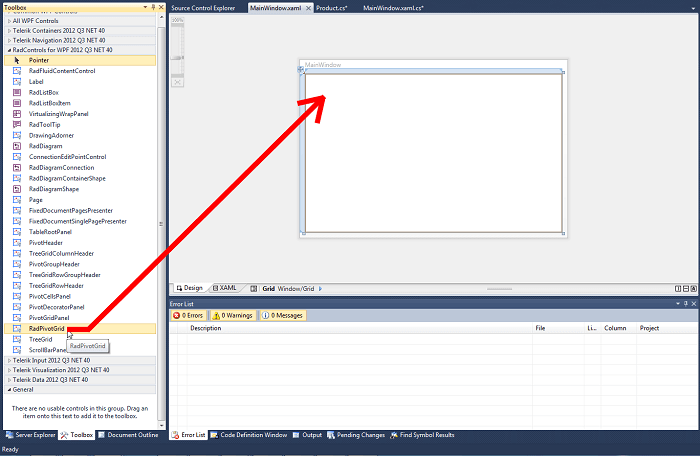
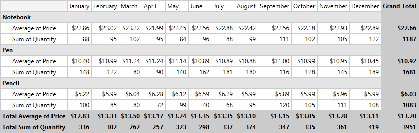

# Getting Started with {{ site.framework_name }} PivotGrid

This article will explain a basic implementation of __RadPivotGrid__ using LocalDataSourceProvider.

## Adding Telerik Assemblies Using NuGet

To use __RadPivotGrid__ when working with NuGet packages, install the `Telerik.Windows.Controls.Pivot.for.Wpf.Xaml` package. The [package name may vary]() slightly based on the Telerik dlls set - [Xaml or NoXaml]()

Read more about NuGet installation in the [Installing UI for WPF from NuGet Package]() article.

>tip With the 2025 Q1 release, the Telerik UI for WPF has a new licensing mechanism. You can learn more about it [here]().

## Adding Assembly References Manually

If you are not using NuGet packages, you can add a reference to the following assemblies:

* __Telerik.Licensing.Runtime__
* __Telerik.Pivot.Core__
* __Telerik.Windows.Controls__
* __Telerik.Windows.Controls.Pivot__
* __Telerik.Windows.Controls.Input__

You can find the required assemblies for each control from the suite in the [Controls Dependencies]()[Controls Dependencies]() help article.

## Adding RadPivotGrid to your application.        

There are two ways to add __RadPivotGrid__ to your application:        

* Drag __RadPivotGrid__ from the *Toolbox*. It can be found under __UI for WPF____UI for SilverLight__ but only if you have installed __Telerik__ controls.

* Create it in the __XAML__ directly:            

<snippet id='radpivotgrid-getting-started-getting-started-block_1-xaml' />

>important You will have to define the pivot namespace in your __XAML__: __xmlns:pivot="http://schemas.telerik.com/2008/xaml/presentation/pivot"__

## Create Data to Show in RadPivotGrid

In our application we will show data for some office materials - their quantity, price through the year, etc. So our first task is to create a class that will present one product.        

<snippet id='radpivotgrid-getting-started-getting-started-block_2-cs' />
<snippet id='radpivotgrid-getting-started-getting-started-block_2-vb' />

Now we'll add a method that will create a sample data for our application:

<snippet id='radpivotgrid-getting-started-getting-started-block_3-cs' />
<snippet id='radpivotgrid-getting-started-getting-started-block_3-vb' />

## Create the RadPivotGrid LocalDataSourceProvider

It is time to define the DataSource for our __RadPivotGrid__. We'll do it in the resources in our __XAML__. The idea of the DataSourceProvider is to define which properties will be shown as a Columns, Rows and Aggregates. For our example we'll use *Name* as a Row, *Date* as a Column, *Price* and *Quantity* as Aggregates.    		

<snippet id='radpivotgrid-getting-started-getting-started-block_4-xaml' />

In the definition of the __RadPivotGrid__ you'll have to set the DataProvider property to the LocalDataSourceProvider we've just created.    		

<snippet id='radpivotgrid-getting-started-getting-started-block_5-xaml' />

The DataProvider is set, but it still doesn't have any data in it. It's time to use our *GenerateData* method. Add the following code to your code behind:    		

<snippet id='radpivotgrid-getting-started-getting-started-block_6-cs' />
<snippet id='radpivotgrid-getting-started-getting-started-block_6-vb' />

## Final Result and Full Project

Let's start our application. Here's the result:

Here's the full implementation of our project:



<snippet id='radpivotgrid-getting-started-getting-started-block_7-xaml' />

<snippet id='radpivotgrid-getting-started-getting-started-block_8-cs' />
<snippet id='radpivotgrid-getting-started-getting-started-block_8-vb' />




<snippet id='radpivotgrid-getting-started-getting-started-block_9-xaml' />

<snippet id='radpivotgrid-getting-started-getting-started-block_10-cs' />
<snippet id='radpivotgrid-getting-started-getting-started-block_10-vb' />


## Setting a Theme

The controls from our suite support different themes. You can see how to apply a theme different than the default one in the [Setting a Theme]() help article.

>important Changing the theme using implicit styles will affect all controls that have styles defined in the merged resource dictionaries. This is applicable only for the controls in the scope in which the resources are merged. 

To change the theme, you can follow the steps below:

* Choose between the themes and add reference to the corresponding theme assembly (ex: **Telerik.Windows.Themes.Windows8.dll**). You can see the different themes applied in the **Theming** examples from our [WPF Controls Examples](https://demos.telerik.com/wpf/)[Silverlight Controls Examples](https://demos.telerik.com/silverlight/#PanelBar/Theming) application.

* Merge the ResourceDictionaries with the namespace required for the controls that you are using from the theme assembly. For the RadPivotGrid, you will need to merge the following resources:

	* __Telerik.Windows.Controls__
	* __Telerik.Windows.Controls.Pivot__

__Example 1__ demonstrates how to merge the ResourceDictionaries so that they are applied globally for the entire application.

__Example 1: Merge the ResourceDictionaries__  
<snippet id='radpivotgrid-getting-started-getting-started-block_11-xaml' />

>Alternatively, you can use the theme of the control via the [StyleManager](https://docs.telerik.com/devtools/wpf/styling-and-appearance/stylemanager/common-styling-apperance-setting-theme-wpf)[StyleManager](https://docs.telerik.com/devtools/silverlight/styling-and-appearance/stylemanager/common-styling-apperance-setting-theme).

__Figure 1__ shows a RadPivotGrid with the **Windows8** theme applied.

#### __Figure 1: RadPivotGrid with the Windows8 theme__


## Telerik UI for WPF Learning Resources

* [Telerik UI for WPF PivotGrid Component](https://www.telerik.com/products/wpf/pivotgrid.aspx)
* [Getting Started with Telerik UI for WPF Components]()
* [Telerik UI for WPF Installation]()
* [Telerik UI for WPF and WinForms Integration]()
* [Telerik UI for WPF Visual Studio Templates]()
* [Setting a Theme with Telerik UI for WPF]()
* [Telerik UI for WPF Virtual Classroom (Training Courses for Registered Users)](https://learn.telerik.com/learn/course/external/view/elearning/16/telerik-ui-for-wpf) 
* [Telerik UI for WPF License Agreement](https://www.telerik.com/purchase/license-agreement/wpf-dlw-s)


## See Also

 * [RadPivotFieldList]()

 * [Populating with Data]()