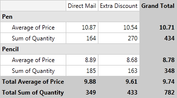
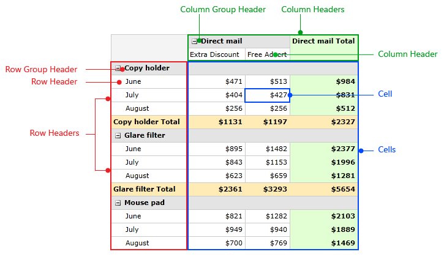
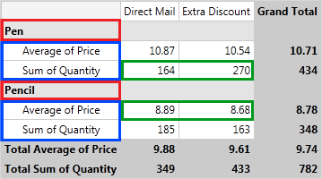
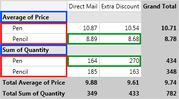
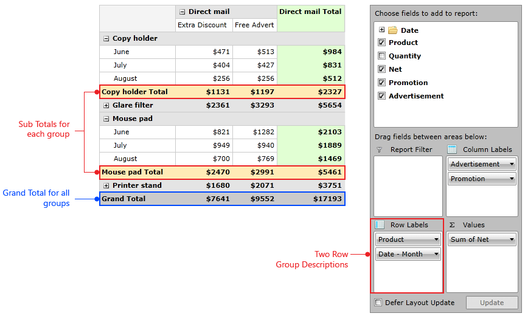
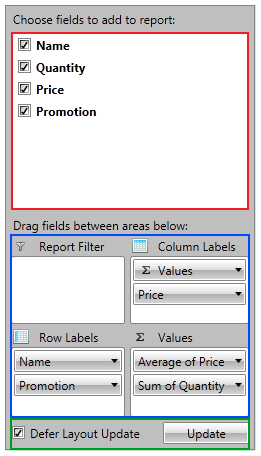
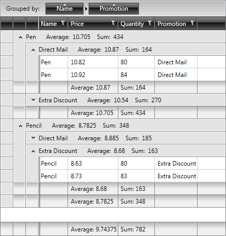

# Understanding {{ site.framework_name }} RadPivotGrid

In this article we will explain the concept of __RadPivotGrid__ and __RadPivotFieldList__ - we will explain the basic terms, when you should use RadPivotGrid and when not, we will explain the idea of aggregations and calculations and how important they are, we make a comparison between RadPivotGrid and RadGridView to help you in your decision which of the two controls to choose.      

## Items Source

This is the Items Source that we will use through the whole article to explain what is __RadPivotGrid__ and how does it work.

Name	|	Promotion	|	Price	|	Quantity
---	|	---	|	---	|	---
Pen	|	Extra Discount	|	10.47	|	148
Pen	|	Extra Discount	|	10.61	|	122
Pen	|	Direct Mail	|	10.82	|	80
Pen	|	Direct Mail	|	10.92	|	84
Pencil	|	Extra Discount	|	8.63	|	80
Pencil	|	Extra Discount	|	8.73	|	83
Pencil	|	Direct Mail	|	8.82	|	100
Pencil	|	Direct Mail	|	8.95	|	85

In the DataProvider that we will use the definitions will be:

Property Name	|	Type Definition	|	Collection
---	|	---	|	---
Name	|	PropertyGroupDescription	|	RowGroupDescription
Promotion	|	PropertyGroupDescription	|	ColumnGroupDescriptions
Average of Price	|	PropertyAggregateDescription	|	AggregateDescriptions
Sum of Quantity	|	PropertyAggregateDescription	|	AggregateDescriptions

## Basic Terminology

Before starting with __RadPivotGrid__ you have to take a closer look at the terms that we are using in all of the articles:        

* __DataProvider__ - this is the object that holds the data for __RadPivotGrid__ and __RadPivotFieldList__ controls. There are three predefined data providers - LocalDataSourceProvider, XmlaDataProvider and AdomdDataProvider which can be used in different cases. Each *DataProvider* has four important collections that are used by __RadPivotGrid__ and __RadPivotFieldList__ to visualize the data: RowGroupDescriptions, ColumnGroupDescriptions, AggregateDescriptions and FilterDescriptions. More information for *DataProvider* is available in our Populating with Data article.            

* __Rows, RowGroupDescriptions and Row Headers__ - these terms are inseparable. *RowGroupDescriptions* is one of the collections in the *DataProvider* which is used to populate __RadPivotGrid__ and __RadPivotFieldList__ with data. For our ItemsSource *RowGroupDescriptions* can be Name, Promotion, Price and Quantity defined as PropertyGroupDescription or DoubleGroupDescription. *RowHeaders* are the values of the properties defined in the RowGroupDescriptions collection. For our example RowHeaders will be "Pen" and "Pencil".

* __Columns, ColumnGroupDescriptions and Column Headers__ - these terms are also inseparable and are following the same logic as Rows. *ColumnGroupDescriptions* is a collection of the *DataProvider* which holds data that will show up in the Columns of __RadPivotGrid__. *Column Headers* are all values of the properties added in *ColumnGroupDescriptions* collection. In our example the only property added as ColumnGroupDescription is "Promotion". Column Headers will be "Direct Mail" and "Extra Discount".            

* __AggregateDescriptions, Aggregates and Cells__ - each Cell of __RadPivotGrid__ shows data. This data is in numeric format and is aggregated based on some description. The aggregated value is shown in the exact location where the column and row intersect each other for a particular object. As we have defined Average Aggregate for Price property using PropertyAggregateDescription __RadPivotGrid__ will calculate the average value of the Price for each of the GroupDescriptions. So the average price of "Pen" which is in "Promotion" "Extra Discount" will show in the exact place where these two groups intersect each other. 



In the explanations of the above terms we used RowHeaders, ColumnHeaders and Cells. It is essential to understand what stays behind these terms. You can take a look at the image below which describes best these three terms:



* __AggregatesLevel__ and __AggregatesPosition__ - these two properties of the DataProvider are valid only when you have more than one aggregate in your application. As you can see in the images __RadPivotGrid__ shows GrandTotals for each row and for each column, based on the aggregate function. When you have more than one aggregates instead of showing Grand Totals, RadPivotGrid visualizes Totals for each of the aggregates. The __AggregatesPosition__ property defines where to place these Totals - if you choose Rows(this is the default position), than the GrandTotal there will be replaced by several rows which will show the Total for each of the AggregatesDescriptions: 



__AggregatesLevel__ property can be used in combination with AggregatesPosition property. Its purpose is to define on which step of the hierarchy in the RowGroupDescription/ColumnGroupDescription to place the aggregate headers. For example in the image above AggregatesLevel has value 1. If we change it to 0, here is the new view of __RadPivotGrid__: 



You can see how the items in red and blue rectangles have changed their positions and how the values (in green) have changed.           

* __GrandTotals__ and __SubTotals__ - by default __RadPivotGrid__ shows GrandTotals and SubTotals for each of the rows/columns. GrandTotals show aggregated data for all groups. SubTotals appear when you have more than one item defined in your RowGroupDescriptions/ColumnGroupDescriptions. SubTotals will appear for each group which has SubGroups in the hierarchy of Group Descriptions. 



As you can see we have two PropertyGroupDescriptions defined as RowGroupDescriptions and the first one is for property Name. Each group in __RadPivotGrid__ has totals, but the groups on the BottomLevel (which do not have children) show their totals right next to them("Direct Mail" and "Extra Discount" totals are on the same row), while the TopLevelGroups("Pen" and "Pencil") can show their totals at the Top, Bottom, Inline position or even can hide them. The position depends on the used Layout and the value of SubTotalsPosition property. You can find examples demonstrating how to set the __AggregatesLevel__ and __AggregatesPosition__ properties below:


```XAML
	<pivot:LocalDataSourceProvider AggregatesLevel="0" AggregatesPosition="Rows" />
```


```C#
	var dataProvider = new LocalDataSourceProvider();
	dataProvider.AggregatesLevel = 0;
	dataProvider.AggregatesPosition = PivotAxis.Rows;
```
```VB.NET
	Dim dataProvider = New LocalDataSourceProvider()
	dataProvider.AggregatesLevel = 0
	dataProvider.AggregatesPosition = PivotAxis.Rows
```

* __RadPivotFieldList__ - a powerful control for applying modifications on the DataProvider at runtime. If you have __RadPivotGrid__ and __RadPivotFieldList__ and they are using the same DataProvider, you can modify your pivot at runtime with __RadPivotFieldList__. Combination of these two controls is a very powerful business intelligence tool.



The red rectangle on the image shows all public properties from the DataProvider - you can use them as group descriptions or aggregate descriptions. The blue area shows each of the four collections of the DataProvider (RowGroupDescriptions, ColumnGroupDescriptions, AggregateDescriptions, FilterDescriptions). The green area is used to define if your changes should apply immediately (when Defer Layout Update checkbox is not checked) or when you click the Update button (you are able to do it only when the checbox is checked). You can use the checkboxes in the red area to add items in your collections or you can do it by using drag-drop. You can apply runtime modifications (filters, sorting, etc.) by clicking on an item in a group description (Promotion for example) - this will show you menu with modifications you can use. You can do the same for the aggregates by clicking on them (Average of Price for example) and modify the aggregate function that is applied or the type of calculation. In "Row Labels" you can see a special group description named "Values" and a special symbol in front of it. This is indicator for the AggregatesPosition - as it is in the "Row Labels" it means, that our AggregatesPosition is Rows. You can notice that it is after the "Name" group description, which indicates that the AggregatesLevel has value 1. You can easily modify these two properties by dragging the "Values" to the desired place (for example if you want to set AggregatesLevel to 0, just drag "Values" to be above "Name" in "Row Labels").            

## When to Use RadPivotGrid

__RadPivotGrid__ is very powerful control that provides different aggregation functions, calculations and grouping mechanism for your data. But how to decide if this control is exactly what you need? Well, here is a short list that should give you the answer of this question.       

When to use __RadPivotGrid__:        

1. You have data that needs grouping. For example you have a hundred items with ProductName = "Pen" and you want to show a single entry for them.

1. You need aggregation. If you don't want to show only the values that you have defined, but you need to apply an aggregate function for them.

1. You want to do some calculations - for example "Difference From", "% of GrandTotal", etc.

1. You want to be able to modify generated report at runtime - combine __RadPivotGrid__ with __RadPivotFieldList__ and generate totally different reports at runtime. 

__RadPivotGrid or RadGridView__

In some cases you may get confused which control to use - __RadPivotGrid__ or __RadGridView__. The main difference between the two of them is the view of the data - if you want to show all of your items - you need __RadGridView__. If you want to show only grouped data and different aggregates you need __RadPivotGrid__.              

>important If you want to show your data items then use __RadGridView__. __RadPivotGrid__ shows only groups and aggregates (without data items behind these groups).               

Here is __RadPivotGrid__ with two groupings and two aggregate descriptions applied:


And here is __RadGridView__ with the same grouping and aggregate descriptions applied:



The differences are obvious - __RadPivotGrid__ is grouping data in Rows and Columns and shows only grouped values, while with __RadGridView__ you are able to expand/collapse all groups and you can see each data item.              

## See Also

 * [RadPivotGrid Getting Started]()

 * [RadPivotFieldList]()
