# Set HTTP access to SQL Server

In this article we will show you how to setup HTTP access to your Microsoft SQL Analysis Service which is needed if you intend to use XmlaDataProvider.

>As a prerequisite you must have installed Microsoft SQL Server and at least one OLAP Cube to be deployed there.

## Communication between client and server

__RadPivotGrid__ can communicate with OLAP Cube by using Extensible Markup Language for Analysis (XMLA). XMLA communication is over HTTP protocol where __RadPivotGrid__ is the client and SQL Analysis Service is the server. Analysis Service provides an XMLA listener compontent that handles all XMLA communications between Analysis Services and its clients. Analysis Service uses Internet Information Services (IIS) as a middleware component to enable access to data via HTTP. The communication is executed as follows:        

1. RadPivotGrid sends an HTTP post request to IIS using the IIS servername and path to service component (msmdpump.dll) as url.            

1. IIS receives the request, authenticates the sender, and creates a security context in which the pump will be executed.            

1. IIS starts pump and uses Internet Server Application Programming Interface ([ISAPI](http://en.wikipedia.org/wiki/Internet_Server_Application_Programming_Interface)) to communicate with pump.            

1. The pump connects to Analysis Service via TCP/IP and sends data received from RadPivotGrid without any change.            

1. Analysis Service executes the request and sends response to pump which passes response to __RadPivotGrid__.            

## Configuring Internet Information Services (IIS)

If you have not installed Internet Information Services(IIS) you can do it as described below:        

* Open "Control Panel" and select "Programs".            

* From "Programs and Features" menu choose "Turn Windows features on or off":

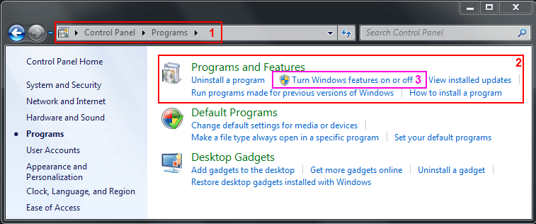

* In the opened window find the folder Internet Information Services where you can find the features we need. The easiest and most suitable solution is to install everything and this way get things out of trouble, but the only mandatory things are: Web Management Tools, .NET Extensibility, ASP.NET, ISAPI Extensions, Basic Authentication and Windows Authentication.

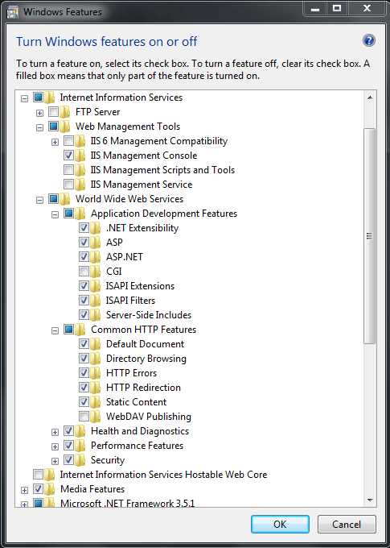

* When you click OK, IIS will be installed.            

It is time to configure our Internet Information Service (IIS). To do it start Internet Information Services Manager (just write IIS in the Start menu search and you will find it).        

1. In the IIS Manager right-click on Application Pools and click on Add New Application Pool. In the new window set this configuration:

	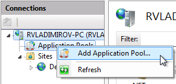

	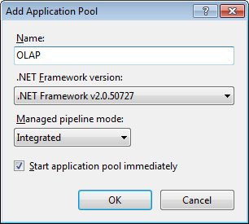

1. Create folder called OLAP under C:\inetpub\wwwRoot.       

1. Copy the files msmdpump.dll, msmdpump.ini from "*Installation Folder*\Microsoft SQL Server\MSAS10_50.MSSQLSERVER\OLAP\bin\isapi to C:\inetpub\wwwRoot\OLAP folder.

	>The path may be slightly different based on the installed version of MS SQL Server.

1. Go to IIS and find OLAP folder under Default Web Site. Right Click on it and choose Convert to Application. Click OK to complete the operation.

1. Go to Handler Mappings option and double-click it (or use the "Open Feature" Action in the top right corner) then select "Edit Feature Permission" and make sure the directoy has "Read" and "Script" permissions.

	

	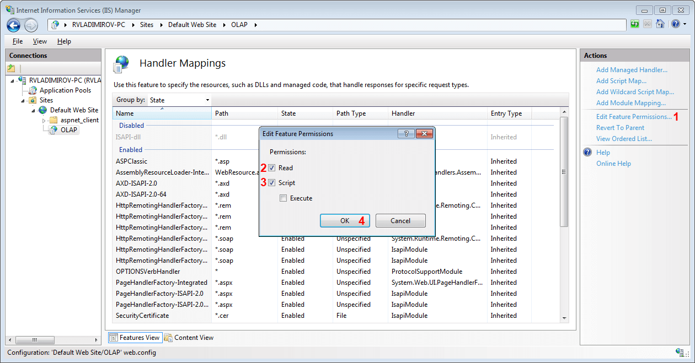

1. In the top right coner of the "Handler Mappings" screen, click "Add Script Map...". And add following information.

	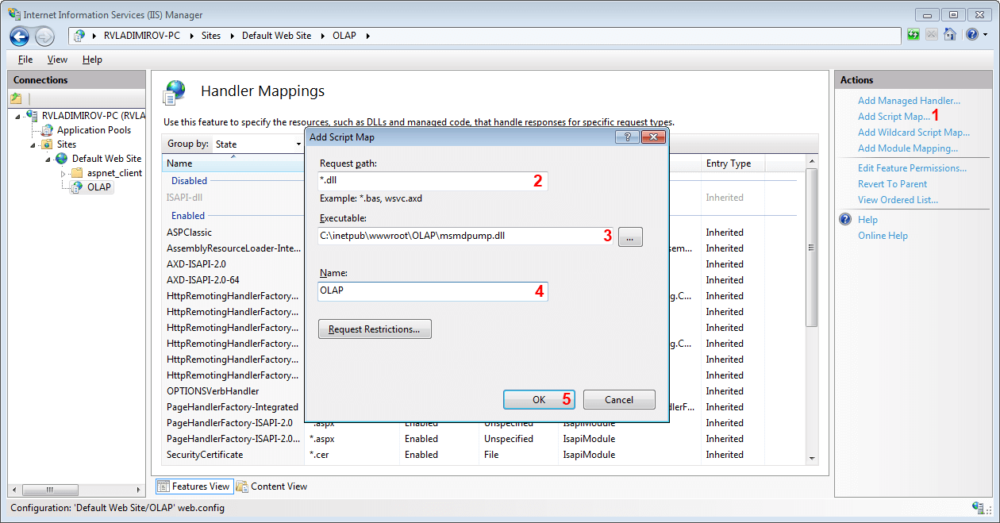

1. When you click OK a warning message will be raised - click yes to confirm that you want to allow ISAPI extension.

	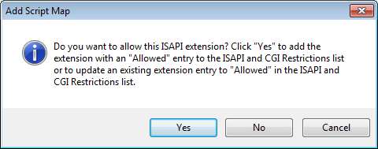

1. After that on IIS go to "Application Pool" and select "ISAPI and CGI Restrictions" under security.

	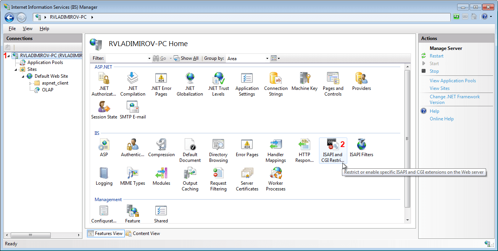

1. Find the item with the Path to your OLAP application (msmdpump.dll) and double-click it to add a description:

	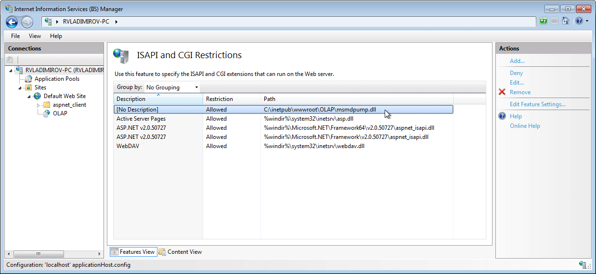

	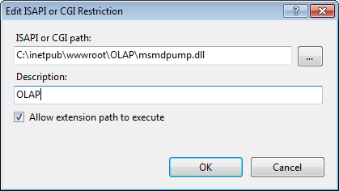

1. The last thing we have to set is the Authentication mode. From the OLAP virtual directory choose "Authentication". There are several different modes that you may use. More information about them can be found [here](http://msdn.microsoft.com/en-us/library/aa292114(v=vs.71).aspx). There most important thing that you have to remember is that the default user used by IIS is __IUSR__. There are two common problems you may face:            

	* Change the authentication mode in IIS and give access to other users instead of IUSR - this is okay for your security restrictions, but you have to apply your changes in the Analysis Services as well.                

	* Use the default authentication mode - this way IUSR user will be used to connect to Analysis Service. It is mandatory to give this user privileges in the Analysis Service. 

	To grant access to a specific user in your Analysis Service open a connection to your cube with Microsoft SQL Server Management Studio and add a new Role:

	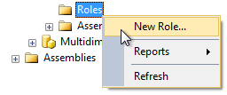

	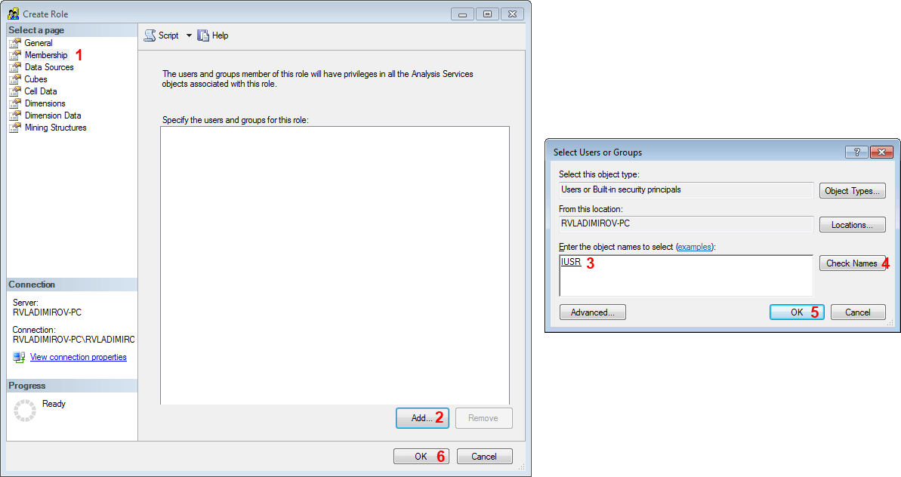

	>importantIn the General Tab above you can set database permissions for this role. Your users will need at least Read permissions.                

	After applying this you should be able to use XmlaDataProvider in your __RadPivotGrid__ to access the data from your Cube.	

## See Also

 * [Getting Started]()

 * [RadPivotFieldList]()

 * [Using XmlaDataProvider]()
