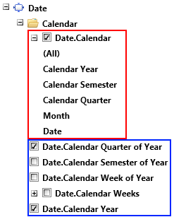

# Using XmlaDataProvider

In this article we will show how to set __XmlaDataProvider__ to __RadPivotGrid__ and __RadPivotFieldList__.

## XMLA description

Extensible Markup Language for Analysis (XMLA) is a standard that allows client applications to talk to multi-dimensional or Online Analytical Processing (OLAP) data sources. The communication of messages back and forth is done using web standards – HTTP, SOAP, and XML. The query language used is MDX, which is the most commonly used multi-dimensional expression language today. Oracle's Essbase, Microsoft's Analysis Services, and SAP's NetWeaver all support the MDX language and the XMLA spec.  

> RadPivotGrid supports both multidimensional and tabular OLAP Cubes (except the __DirectQuery__ mode of the Tabular cubes).

## XmlaDataProvider Properties

__RadPivotGrid__ provides XMLA access to OLAP data sources. You can use the __XmlaDataProvider__ in your application to connect to your OLAP data source.   

>caution You have to add reference to the following __Telerik__ assembly to be able to use __XmlaDataProvider__ in your application: Telerik.Pivot.DataProviders.Xmla 		

__XmlaDataProvider__ has several important properties that have to be defined:    		

* __ConnectionSettings__ - this property is of type *XmlaConnectionSettings*. It is used to define all needed connection settings through the *XmlaConnectionSettings* properties:

	* __Cube__ - string property defining the exact name of the Cube.

	* __Database__ - string property defining the exact name of the Database.

	* __ServerAddress__ - string property defining the exact address(with protocol used) of the server.

	* __Credentials__ - this property is of type *XmlaNetworkCredential* and it is used to define the authentication details for the server(if it has any kind of authentication).

You can extend the parameters passed to the OLAP cube by using *QueryProperties* property of __XmlaConnectionSettings__. *QueryProperties* is a collection of *XmlaQueryProperty* items. Each *XmlaQueryProperty* must have Name and Value set. Name is the parameter which you want to pass to the cube, while value is its current value. This can be used if you want to take localized data from your cube, for which you have to pass LocalIdentifier parameter and as value you have to set the value of the language:            


```XAML
	<pivot:XmlaConnectionSettings Cube="LocalizedCube" Database="OrdersCube" ServerAddress="http://localhost/olap/msmdpump.dll">
	    <pivot:XmlaConnectionSettings.QueryProperties>
	        <pivot:XmlaQueryProperty Name="LocaleIdentifier" Value="1036"/>
	    </pivot:XmlaConnectionSettings.QueryProperties>
	</pivot:XmlaConnectionSettings>
```


```C#
	XmlaConnectionSettings cubeConnectionDetails = new XmlaConnectionSettings();
	cubeConnectionDetails.Cube = "LocalizedCube";
	cubeConnectionDetails.Database = "OrdersCube";
	cubeConnectionDetails.ServerAddress = "http://localhost/olap/msmdpump.dll";
	
	XmlaQueryProperty localization = new XmlaQueryProperty();
	localization.Name = "LocaleIdentifier";
	localization.Value = "1036";
	
	cubeConnectionDetails.QueryProperties.Add(localization);
```
```VB.NET
	Dim cubeConnectionDetails As New XmlaConnectionSettings()
	cubeConnectionDetails.Cube = "LocalizedCube"
	cubeConnectionDetails.Database = "OrdersCube"
	cubeConnectionDetails.ServerAddress = "http://localhost/olap/msmdpump.dll"
	
	Dim localization As New XmlaQueryProperty()
	localization.Name = "LocaleIdentifier"
	localization.Value = "1036"
	
	cubeConnectionDetails.QueryProperties.Add(localization)
```

* __AggregatesLevel__ - set the position where groups for the aggregates should be placed.

* __AggregatesPosition__ - defines whether the positon of the Aggregates will be Columns or Rows.

__XmlaDataProvider__ uses four different collections to design the view of __RadPivotGrid__ report and __RadPivotFieldList__: *RowGroupDescriptions, ColumnGroupDescriptions, AggregateDescriptions, FilterDesciptions*.    		

## Defining XmlaDataProvider

__XmlaDataProvider__ can be defined in the __XAML__ as a *StaticResource* and used by both __RadPivotGrid__ and __RadPivotFieldList__.

>important The __pivot__ namespace is URI namespace: __xmlns:pivot="http://schemas.telerik.com/2008/xaml/presentation/pivot"__. It is mandatory to define it if you are using the __XmlaDataProvider__ in your XAML.				


```XAML
	<Grid>
	    <Grid.ColumnDefinitions>
	        <ColumnDefinition Width="3*" />
	        <ColumnDefinition Width="*" />
	    </Grid.ColumnDefinitions>
	    <Grid.Resources>
	        <pivot:XmlaDataProvider x:Key="XMLADataProvider"/>
	    </Grid.Resources>
	    <pivot:RadGridView x:Name="radPivotGrid" DataProvider="{StaticResource XMLADataProvider}" />
	    <pivot:RadGridView x:Name="radPivotFieldList" Grid.Column="1" DataProvider="{StaticResource XMLADataProvider}" />
	</Grid>
```

You can also create an object of type __XmlaDataProvider__ in the code behind and set it for your controls:


```C#
	XmlaDataProvider xmlaDataProvider = new XmlaDataProvider();
	this.radPivotGrid.DataProvider = xmlaDataProvider;
	this.radPivotFieldList.DataProvider = xmlaDataProvider;
```
```VB.NET
	Dim xmlaDataProvider As New XmlaDataProvider()
	Me.radPivotGrid.DataProvider = xmlaDataProvider
	Me.radPivotFieldList.DataProvider = xmlaDataProvider
```

## Connection to OLAP Cube

To show data in __RadPivotGrid__ and __RadPivotFieldList__ we have to connect to OLAP Cube. For this purpose we will set the *ConnectionSettings* property of the __XmlaDataProvider__. This can be done directly in the __XAML__ or in the code behind:    		


```XAML
	<pivot:XmlaDataProvider.ConnectionSettings>
	    <pivot:XmlaConnectionSettings 
	        Cube="Adventure Works" 
	        Database="Adventure Works DW 2008R2" 
	        ServerAddress="https://demos.telerik.com/olap/msmdpump.dll">
	    </pivot:XmlaConnectionSettings>
	</pivot:XmlaDataProvider.ConnectionSettings>
```


```C#
	XmlaConnectionSettings cubeConnectionDetails = new XmlaConnectionSettings();
	cubeConnectionDetails.Cube = "Adventure Works";
	cubeConnectionDetails.Database = "Adventure Works DW 2008R2";
	cubeConnectionDetails.ServerAddress = "https://demos.telerik.com/olap/msmdpump.dll";
	
	XmlaDataProvider xmlaDataProvider = new XmlaDataProvider();
	xmlaDataProvider.ConnectionSettings = cubeConnectionDetails;
```
```VB.NET
	Dim cubeConnectionDetails As New XmlaConnectionSettings()
	cubeConnectionDetails.Cube = "Adventure Works"
	cubeConnectionDetails.Database = "Adventure Works DW 2008R2"
	cubeConnectionDetails.ServerAddress = "https://demos.telerik.com/olap/msmdpump.dll"
	
	Dim xmlaDataProvider As New XmlaDataProvider()
	xmlaDataProvider.ConnectionSettings = cubeConnectionDetails
```

>You can set credentials if your connection requires username and password. The *Credentials* property of __XmlaDataProvider__ expects object of type *XmlaNetworkCredential* which gives you properties for *UserName*, *Password*, *SecurePassword* and *Domain*.    			

## Defining Group Descriptions

>caution When initializing the __XmlaDataProvider__ in the code behind it is a good idea to wrap all modifications in __BeginInit() - EndInit()__ section. This will cause only one refresh of the DataProvider and it will be when the EndInit() is reached. If you are applying only modifications (more than one) on already initialized __XmlaDataProvider__ you should use the DeferRefresh() method which will cause delay of the Refresh and this way all your changes will be applied simultaneously. More information for these methods is available in our [Populating with Data - Overview]() article.

The __XmlaDataProvider__ is using four collections that are reflecting the visual representation of __RadPivotGrid__ and __RadPivotFieldList__:    		

* __RowGroupDescriptions__ - the data added to this collection will show as Row Headers in __RadPivotGrid__. There is only one type of description that can be added to this collection - __XmlaGroupDescription__.    				

* __ColumnGroupDescriptions__ - the data added to this collection will show as Column Headers in __RadPivotGrid__. There is only one type of description that can be added to this collection - __XmlaGroupDescription__.    				

* __AggregateDescriptions__ - the data added to this description will be aggregated and included in __RadPivotGrid__ as Cells. There is only one type of description that can be added to this collection - __XmlaAggregateDescription__.    				

* __FilterDescriptions__ - the data added to this collection will be filtered based on a particular condition. __RadPivotGrid__ will show only items that pass the filter condition. There is only one type that can be added to this collection - __XmlaFilterDescription__. You can define a single filter condition or set up filtering for different levels of the selected member.            

The __XmlaGroupDescription__ is used to define the data that will show as Rows and Columns in __RadPivotGrid__. When defining __XmlaGroupDescription__ you must set the *MemberName* property. The *MemberName* property is of type string and you should define it based on your Cube. But it should have specific syntax to access Cube's data.    		

The __XmlaAggregateDescription__ is used to define data that has to be aggregated and that will show as Cells in __RadPivotGrid__. You should set the *MemberName* property.    		

>The *MemberName* property must have the following syntax:
>	* For __XmlaAggregateDescription__: __"[Measures].[MEASURE_NAME]"__.
>	* For __XmlaGroupDescription__ there are two ways (based on the data that will be used): __"[DIMENSION].[HIERARCHY]"__ or __"[SET_NAME]"__.Note that the brackets are mandatory.

Here is how to define row, column group descriptions and aggregate descriptions:        


```XAML
	<pivot:XmlaDataProvider.RowGroupDescriptions>
	    <pivot:XmlaGroupDescription MemberName="[Date].[Calendar Year]"/>
	</pivot:XmlaDataProvider.RowGroupDescriptions>
	
	<pivot:XmlaDataProvider.ColumnGroupDescriptions>
	    <pivot:XmlaGroupDescription MemberName="[Promotion].[Promotion Category]"/>
	</pivot:XmlaDataProvider.ColumnGroupDescriptions>
	
	<pivot:XmlaDataProvider.AggregateDescriptions>
	    <pivot:XmlaAggregateDescription MemberName="[Measures].[Internet Order Quantity]" />
	</pivot:XmlaDataProvider.AggregateDescriptions>
```


```C#
	XmlaGroupDescription rowGroupDescription1 = new XmlaGroupDescription();
	rowGroupDescription1.MemberName = "[Date].[Calendar Year]";
	
	XmlaGroupDescription columnGroupDescription1 = new XmlaGroupDescription();
	columnGroupDescription1.MemberName = "[Promotion].[Promotion Category]";
	
	XmlaAggregateDescription aggregateDescription1 = new XmlaAggregateDescription();
	aggregateDescription1.MemberName = "[Measures].[Internet Order Quantity]";
	
	XmlaDataProvider xmlaDataProvider = new XmlaDataProvider();
	xmlaDataProvider.BeginInit();
	xmlaDataProvider.RowGroupDescriptions.Add(rowGroupDescription1);
	xmlaDataProvider.ColumnGroupDescriptions.Add(columnGroupDescription1);
	xmlaDataProvider.AggregateDescriptions.Add(aggregateDescription1);
	xmlaDataProvider.EndInit();
```
```VB.NET
	Dim rowGroupDescription1 As New XmlaGroupDescription()
	rowGroupDescription1.MemberName = "[Date].[Calendar Year]"
	
	Dim columnGroupDescription1 As New XmlaGroupDescription()
	columnGroupDescription1.MemberName = "[Promotion].[Promotion Category]"
	
	Dim aggregateDescription1 As New XmlaAggregateDescription()
	aggregateDescription1.MemberName = "[Measures].[Internet Order Quantity]"
	
	Dim xmlaDataProvider As New XmlaDataProvider()
	xmlaDataProvider.BeginInit()
	xmlaDataProvider.RowGroupDescriptions.Add(rowGroupDescription1)
	xmlaDataProvider.ColumnGroupDescriptions.Add(columnGroupDescription1)
	xmlaDataProvider.AggregateDescriptions.Add(aggregateDescription1)
	xmlaDataProvider.EndInit()
```

The __XmlaFilterDescription__ is used to filter the data that will be included in the report. Filtering is applied for a specific member defined in *MemberName* property. *Condition* property defines the way to filter the items. Only the ones that pass the filter will be shown in __RadPivotGrid__. The filtering is based on the Unique Name of the members. For example, if you want to show only data for year 2005, you can define it like this:        


```XAML
	<pivot:XmlaDataProvider.FilterDescriptions>
	    <pivot:XmlaFilterDescription MemberName="[Date].[Calendar Year]">
	        <pivot:XmlaFilterDescription.Condition>
	            <pivot:OlapSetCondition Comparison="Includes">
	                <pivot:OlapSetCondition.Items>
	                    <sys:String>[Date].[Calendar Year].&amp;[2005]</sys:String>
	                </pivot:OlapSetCondition.Items>
	            </pivot:OlapSetCondition>
	        </pivot:XmlaFilterDescription.Condition>
	    </pivot:XmlaFilterDescription>
	</pivot:XmlaDataProvider.FilterDescriptions>
```


```C#
	XmlaFilterDescription filterDescription = new XmlaFilterDescription();
	filterDescription.MemberName = "[Date].[Calendar Year]";
	OlapSetCondition condition = new OlapSetCondition();
	condition.Comparison = SetComparison.Includes;
	condition.Items.Add("[Date].[Calendar Year].&[2005]");
	filterDescription.Condition = condition;
```
```VB.NET
	Dim filterDescription As New XmlaFilterDescription()
	filterDescription.MemberName = "[Date].[Calendar Year]"
	Dim condition As New OlapSetCondition()
	condition.Comparison = SetComparison.Includes
	condition.Items.Add("[Date].[Calendar Year].&[2005]")
	filterDescription.Condition = condition
```

As you can see, __XmlaFilterDescription__ Condition expects object of type *OlapSetCondition*. *Items* property of the *OlapSetCondition* object is a collection of all objects that each item must match. In our case we are using string objects as the member names in OLAP Cubes are strings.        

As OLAP dimensions are hierarchical, you can use filters for each of the levels by using *"Levels"* property of __XmlaFilterDescription__. *Levels* is a collection of __XmlaLevelFilterDescriptions__ which are members of the user-defined hierarchy of the dimension:



In the blue rectangle are all attribute hierarchies - you can use them as a filter by adding them as a new __FilterGroupDescription__. In the red rectangle you can see the user-defined hierarchy of Date.Calendar dimension. You can filter your data by each of the members by adding it to the *Levels* property of __XmlaFilterDescription__:        


```XAML
	<pivot:XmlaFilterDescription MemberName="[Date].[Calendar]">
	    <pivot:XmlaFilterDescription.Levels>
	        <pivot:XmlaLevelFilterDescription MemberName="[Date].[Calendar].[Calendar Year]">
	            <pivot:XmlaLevelFilterDescription.Condition>
	                <pivot:OlapSetCondition Comparison="Includes">
	                    <pivot:OlapSetCondition.Items>
	                        <sys:String>[Date].[Calendar].[Calendar Year].&amp;[2007]</sys:String>
	                    </pivot:OlapSetCondition.Items>
	                </pivot:OlapSetCondition>
	            </pivot:XmlaLevelFilterDescription.Condition>
	        </pivot:XmlaLevelFilterDescription>
	        <pivot:XmlaLevelFilterDescription MemberName="[Date].[Calendar].[Calendar Semester]">
	                <pivot:XmlaLevelFilterDescription.Condition>
	                    <pivot:OlapSetCondition Comparison="Includes">
	                        <pivot:OlapSetCondition.Items>
	                            <sys:String>[Date].[Calendar].[Calendar Semester].&amp;[2007]&amp;[2]</sys:String>
	                        </pivot:OlapSetCondition.Items>
	                    </pivot:OlapSetCondition>
	                </pivot:XmlaLevelFilterDescription.Condition>
	            </pivot:XmlaLevelFilterDescription>
	    </pivot:XmlaFilterDescription.Levels>
	</pivot:XmlaFilterDescription>
```


```C#
	XmlaFilterDescription topFilterDescription = new XmlaFilterDescription();
	topFilterDescription.MemberName = "[Date].[Calendar]";
	
	OlapSetCondition condition1 = new OlapSetCondition();
	condition1.Comparison = SetComparison.Includes;
	condition1.Items.Add("[Date].[Calendar].[Calendar Year].&[2007]");
	XmlaLevelFilterDescription levelFilterDescription1 = new XmlaLevelFilterDescription();
	levelFilterDescription1.MemberName = "[Date].[Calendar].[Calendar Year]";
	levelFilterDescription1.Condition = condition1;
	
	OlapSetCondition condition2 = new OlapSetCondition();
	condition2.Comparison = SetComparison.Includes;
	condition2.Items.Add("[Date].[Calendar].[Calendar Semester].&[2007]&[2]");
	XmlaLevelFilterDescription levelFilterDescription2 = new XmlaLevelFilterDescription();
	levelFilterDescription2.MemberName = "[Date].[Calendar].[Calendar Semester]";
	levelFilterDescription2.Condition = condition2;
	
	topFilterDescription.Levels.Add(levelFilterDescription1);
	topFilterDescription.Levels.Add(levelFilterDescription2);
```
```VB.NET
	Dim topFilterDescription As New XmlaFilterDescription()
	topFilterDescription.MemberName = "[Date].[Calendar]"
	
	Dim condition1 As New OlapSetCondition()
	condition1.Comparison = SetComparison.Includes
	condition1.Items.Add("[Date].[Calendar].[Calendar Year].&[2007]")
	Dim levelFilterDescription1 As New XmlaLevelFilterDescription()
	levelFilterDescription1.MemberName = "[Date].[Calendar].[Calendar Year]"
	levelFilterDescription1.Condition = condition1
	
	Dim condition2 As New OlapSetCondition()
	condition2.Comparison = SetComparison.Includes
	condition2.Items.Add("[Date].[Calendar].[Calendar Semester].&[2007]&[2]")
	Dim levelFilterDescription2 As New XmlaLevelFilterDescription()
	levelFilterDescription2.MemberName = "[Date].[Calendar].[Calendar Semester]"
	levelFilterDescription2.Condition = condition2
	
	topFilterDescription.Levels.Add(levelFilterDescription1)
	topFilterDescription.Levels.Add(levelFilterDescription2)
```

## See Also
 * [RadPivotGrid Getting Started]()
 * [Adding RadPivotFieldList to your project]()
 * [Populating with Data]()
