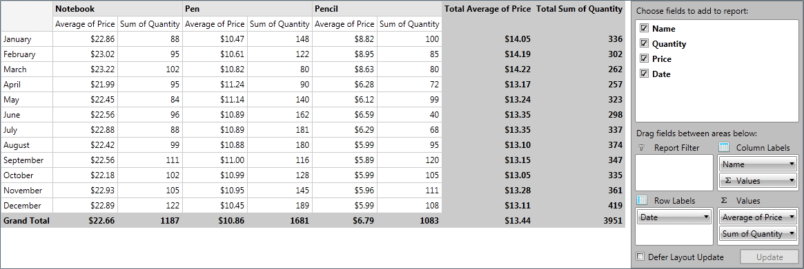

# Adding RadPivotFieldList to your project

In this article we will show how to integrate __RadPivotFieldList__ with __RadPivotGrid__. We will extend our project from the [Getting Started]() article for __RadPivotGrid__.

## Adding RadPivotFieldList

>__RadPivotFieldList__ can be used after adding reference to the following assemblies:

>	* Telerik.Windows.Controls
>	* Telerik.Windows.Controls.PivotFieldList
>	* Telerik.Windows.Controls.Navigation
>	* Telerik.Windows.Controls.Input
>	* Telerik.Windows.Controls.Data
>	* Telerik.Windows.Controls.Pivot
>	* Telerik.Pivot.Core


>	* Telerik.Windows.Controls
>	* Telerik.Windows.Controls.PivotFieldList
>	* Telerik.Windows.Controls.Navigation
>	* Telerik.Windows.Controls.Input
>	* Telerik.Windows.Controls.Pivot
>	* Telerik.Pivot.Core
>	* System.Runtime.Serialization


You can add your __RadPivotFieldList__ directly in the XAML. First step is to define __pivot__ namespace: __xmlns:pivot="http://schemas.telerik.com/2008/xaml/presentation/pivot"__. After that add the code below:        	

#### __XAML__

{{region radpivotgrid-fieldlist-getting-started_1}}
	<pivot:RadPivotFieldList Name="radPivotFieldList1" Grid.Column="1" />
{{endregion}}

Now the only thing you have to set is the DataProvider:        	

#### __XAML__

{{region radpivotgrid-fieldlist-getting-started_2}}
	<pivot:RadPivotFieldList Name="radPivotFieldList1" Grid.Column="1"  DataProvider="{StaticResource LocalDataProvider}"/>
{{endregion}}

Here's the result of the modified application from [Getting Started]() article:

Now by using __RadPivotFieldList__ you are able to modify __RadPivotGrid__ at runtime and to generate reports with entire new structure and information. For example:

# See Also

 * [RadPivotFieldList]()

 * [RadPivotGrid Getting Started]()

 * [Populating with Data]()
