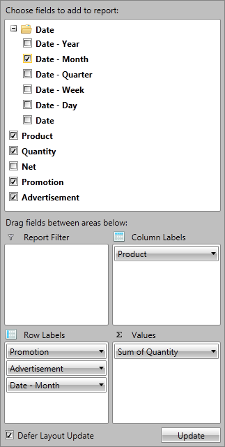

# RadPivotFieldList

__RadPivotFieldList__ is an integral part of __RadPivotGrid__. It gives the users the power to modify __RadPivotGrid__ and generate many different reports with the current data.

__Key Features:__

* Automatically change __RadPivotGrid__ generated report when the "Defer Layout Update" is unchecked.

* Using CheckBoxes to mark the data you want to include in the __RadPivotGrid__.

* Using __RadContextMenu__ to apply modifications on __RadPivotGrid__ runtime:

* Sorting ascending and descending

* Apply Number Format from the predefined formats or create your own

* Change currently used Aggregate function

* Applying different filters - Label, Value, Top10 filter

* Using different Calculations for GrandTotals

* Using percent of GrandTotal instead showing the whole number.

# See Also

 * [Adding RadPivotFieldList to your project]()

 * [RadPivotGrid Getting Started]()

 * [Populating with Data]()
