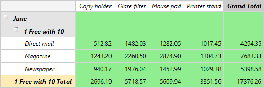
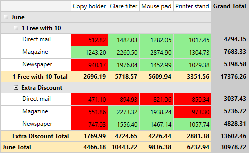
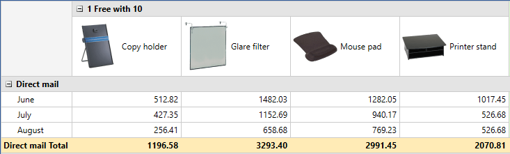

# Templating Headers and Cells

__RadPivotGrid__ provides few options to template its cells and headers out of the box. You can either apply one template to all of them using the __CellTemplate__, __RowHeaderTemplate__ and __ColumnHeaderTemplate__ properties of __RadPivotGrid__. Or you can use the __CellTemplateSelector__, __RowHeaderTemplateSelector__ and __ColumnHeaderTemplateSelector__ properties in order to implement custom TemplateSelector and template the headers and cells per condition. This article will show you how to improve the __RadPivotGrid__ appearance by applying custom Templates and implementing custom TemplateSelectors.      

## Using Custom Cell and Header Templates

The __CellTemplate__, __RowHeaderTemplate__ and __ColumnHeaderTemplate__ properties of __RadPivotGrid__ will help you to easily apply a custom template to all of the cells or to all of the column and row headers. You would simply need to define the needed DataTemplates and apply them to __RadPivotGrid__. For example if you need to have green cells and headers with Italic FontStyle you will need to define the following templates:        


```XAML
	<UserControl.Resources>     
		<DataTemplate x:Key="CellTemplate">
			<Border BorderThickness="1 1 0 0" BorderBrush="LightGray">
				<Grid Background="LightGreen">
					<TextBlock Text="{Binding Data, Mode=OneWay}" Margin="4" VerticalAlignment="Center" HorizontalAlignment="Right"/>
				</Grid>
			</Border>
		</DataTemplate>
		<DataTemplate x:Key="HeaderTemplate">
			<TextBlock Text="{Binding Data, Mode=OneWay}" FontStyle="Italic" Margin="4 0 0 0"  VerticalAlignment="Center" />
		</DataTemplate>
	</UserControl.Resources>  
```

And apply them as shown below:


```XAML
	<pivot:RadPivotGrid CellTemplate="{StaticResource CellTemplate}" 
						RowHeaderTemplate="{StaticResource HeaderTemplate}" 
						ColumnHeaderTemplate="{StaticResource HeaderTemplate}" />
```

__Figure 1__ demonstrates the final result.

Figure 1: Custom cell and header templates.



## Using Custom CellTemplateSelector

Implementing a custom __CellTemplateSelector__ allows you to apply different templates per a condition. For example depending on the cell value you can change its Background in order to indicate lower or higher value than a certain one. To get it started you would need to create a new class inheriting from the __DataTemplateSelector__ class and define the two Templates - one for the lower values and one for the higher ones. Afterwards you have to override the __SelectTemplate__ and implement the needed custom logic. So finally the custom __CellTemplateSelector__ should look the following way:        


```C#
	public class CellTemplateSelector : DataTemplateSelector
	{
	    public DataTemplate RedTemplate { get; set; }
	    public DataTemplate GreenTemplate { get; set; }
	
	    public override DataTemplate SelectTemplate(object item, DependencyObject container)
	    {
	        var cellAggregate = item as CellAggregateValue;
	
	        if (cellAggregate != null)
	        {
	            var description = cellAggregate.Description as PropertyAggregateDescription;
	
	            if (description.PropertyName == "Net" && cellAggregate.RowGroup.Type == GroupType.BottomLevel && cellAggregate.ColumnGroup.Type == GroupType.BottomLevel)
	            {
	                if (Convert.ToDouble(cellAggregate.Value) > 1000d)
	                {
	                    return this.GreenTemplate;
	                }
	                else
	                {
	                    return this.RedTemplate;
	                }
	            }
	        }
	
	        return base.SelectTemplate(item, container);
	    }
	}
```

#### __VB__

```VB
	Public Class CellTemplateSelector
	    Inherits DataTemplateSelector
	
	    Public Property RedTemplate() As DataTemplate
	    Public Property GreenTemplate() As DataTemplate
	
	    Public Overrides Function SelectTemplate(ByVal item As Object, ByVal container As DependencyObject) As DataTemplate
	        Dim cellAggregate = TryCast(item, CellAggregateValue)
	
	        If cellAggregate IsNot Nothing Then
	            Dim description = TryCast(cellAggregate.Description, PropertyAggregateDescription)
	
	            If description.PropertyName = "Net" AndAlso cellAggregate.RowGroup.Type = GroupType.BottomLevel AndAlso cellAggregate.ColumnGroup.Type = GroupType.BottomLevel Then
	                If Convert.ToDouble(cellAggregate.Value) > 1000.0R Then
	                    Return Me.GreenTemplate
	                Else
	                    Return Me.RedTemplate
	                End If
	            End If
	        End If
	
	        Return MyBase.SelectTemplate(item, container)
	    End Function
	End Class
```

Next thing to do is to define the required templates in the XAML as shown below:        


```XAML
	<UserControl.Resources>        
	    <local:CellTemplateSelector x:Key="CellTemplateSelector">
	        <local:CellTemplateSelector.GreenTemplate>
	            <DataTemplate>
	                <Border BorderThickness="1 1 0 0" BorderBrush="LightGray">
	                    <Grid Background="LightGreen">
	                        <TextBlock Text="{Binding Data, Mode=OneWay}" Margin="4" VerticalAlignment="Center" HorizontalAlignment="Right"/>
	                    </Grid>
	                </Border>
	            </DataTemplate>
	        </local:CellTemplateSelector.GreenTemplate>
	        <local:CellTemplateSelector.RedTemplate>
	            <DataTemplate>
	                <Border BorderThickness="1 1 0 0" BorderBrush="LightGray">
	                    <Grid Background="Red">
	                        <TextBlock Text="{Binding Data, Mode=OneWay}" Margin="4" VerticalAlignment="Center" HorizontalAlignment="Right"/>
	                    </Grid>
	                </Border>
	            </DataTemplate>
	        </local:CellTemplateSelector.RedTemplate>
	    </local:CellTemplateSelector>
	</UserControl.Resources>  
```

And the last step would be to assign the __CellTemplateSelector__ to __RadPivotGrid__:        


```XAML
	<pivot:RadPivotGrid x:Name="pivotGrid" CellTemplateSelector="{StaticResource CellTemplateSelector}"/>
```

You can see the final result on __Figure 2__.

Figure 2: Cells with values below 1000 are colored in red and the other cells in green using CellTemplateSelector.


>tip Find a runnable project of the previous example in the [WPF Samples GitHub repository](https://github.com/telerik/xaml-sdk/tree/master/PivotGrid/CustomCellTemplate).          

## Using Custom HeaderTemplateSelectors

By implementing a custom __HeaderTemplateSelector__ you are able to modify the templates only of the column header cells or row header cells. In this section you will see how to add images in the different header cells. Firstly you will need to create custom __HeaderTemplateSelector__ that inherits from __DataTemplateSelector__ and define a DataTemplate which will be used for the Product header cells. The selector should look as shown below:        


```C#
	public class HeaderTemplateSelector : DataTemplateSelector
	{
	    public DataTemplate ProductTemplate { get; set; }
	
	    public override DataTemplate SelectTemplate(object item, System.Windows.DependencyObject container)
	    {
	        FrameworkElement element = container as FrameworkElement;
	        GroupData data = element.DataContext as GroupData;
	        PropertyGroupDescriptionBase pgd = data.GroupDescription as PropertyGroupDescriptionBase;
	
	        if (pgd != null && pgd.PropertyName == "Product")
	        {
	            return this.ProductTemplate;
	        }
	
	        return base.SelectTemplate(item, container);
	    }
	}
```

#### __VB__

```VB
	Public Class HeaderTemplateSelector
		Inherits DataTemplateSelector
	
		Public Property ProductTemplate() As DataTemplate
	
		Public Overrides Function SelectTemplate(ByVal item As Object, ByVal container As System.Windows.DependencyObject) As DataTemplate
			Dim element As FrameworkElement = TryCast(container, FrameworkElement)
			Dim data As GroupData = TryCast(element.DataContext, GroupData)
			Dim pgd As PropertyGroupDescriptionBase = TryCast(data.GroupDescription, PropertyGroupDescriptionBase)
	
			If pgd IsNot Nothing AndAlso pgd.PropertyName = "Product" Then
				Return Me.ProductTemplate
			End If
	
			Return MyBase.SelectTemplate(item, container)
		End Function
	End Class
```

Next thing to do is to define the required templates in the XAML the following way:        


```XAML
	<local:ProductToImageConverter x:Key="ProductToImageConverter"/>        
	<local:HeaderTemplateSelector x:Key="HeaderTemplateSelector">
	    <local:HeaderTemplateSelector.ProductTemplate>
	        <DataTemplate>
	            <Grid Height="80">
	                <Grid.ColumnDefinitions>
	                    <ColumnDefinition Width="64"/>
	                    <ColumnDefinition Width="85"/>
	                </Grid.ColumnDefinitions>
	                <Image Source="{Binding Data, Converter={StaticResource ProductToImageConverter}}"  Stretch="None"/>
	                <TextBlock Grid.Column="1" Text="{Binding Data, Mode=OneWay}" Margin="4 0 0 0"  VerticalAlignment="Center"/>
	            </Grid>
	        </DataTemplate>
	    </local:HeaderTemplateSelector.ProductTemplate>
	</local:HeaderTemplateSelector>
```

Using an IValueConverter you will be able to return the path for the needed image depending content of the header cell:        


```C#
	public class ProductToImageConverter : IValueConverter
	{
	    public object Convert(object value, Type targetType, object parameter, System.Globalization.CultureInfo culture)
	    {
	        string product = System.Convert.ToString(value);
	        return string.Format("/CustomHeaderTemplate;component/ProductImages/{0}.png", product);
	    }
	
	    public object ConvertBack(object value, Type targetType, object parameter, System.Globalization.CultureInfo culture)
	    {
	        throw new NotImplementedException();
	    }
	}
```

#### __VB__

```VB
	Public Class ProductToImageConverter
		Implements IValueConverter
	
		Public Function Convert(ByVal value As Object, ByVal targetType As Type, ByVal parameter As Object, ByVal culture As System.Globalization.CultureInfo) As Object
			Dim product As String = System.Convert.ToString(value)
			Return String.Format("/CustomHeaderTemplate;component/ProductImages/{0}.png", product)
		End Function
	
		Public Function ConvertBack(ByVal value As Object, ByVal targetType As Type, ByVal parameter As Object, ByVal culture As System.Globalization.CultureInfo) As Object
			Throw New NotImplementedException()
		End Function
	End Class
```

Finaly you will have to assing the HeaderTemplateSelector to the __RowHeaderTemplateSelector__ and __ColumnHeaderTemplateSelector__ properties of __RadPivotGrid__.       


```XAML
	<pivot:RadPivotGrid RowHeaderTemplateSelector="{StaticResource HeaderTemplateSelector}" 
					    ColumnHeaderTemplateSelector="{StaticResource HeaderTemplateSelector}"/>
```

You can see the final result on __Figure 3__.

Figure 3: Header cells with different images.


>tip Find a runnable project of the previous example in the [WPF Samples GitHub repository](https://github.com/telerik/xaml-sdk/tree/master/PivotGrid/CustomHeaderTemplate).    

## See Also  
 * [QuickStyle]()
