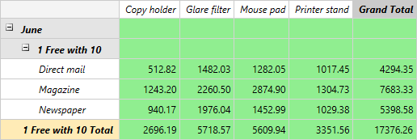
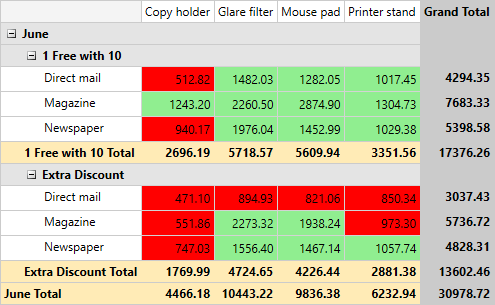
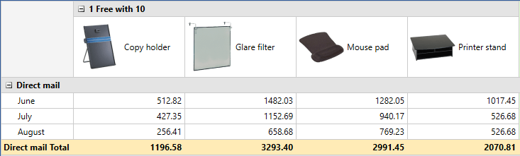

# Templating Headers and Cells

__RadPivotGrid__ provides few options to template its cells and headers out of the box. You can either apply one template to all of them using the __CellTemplate__, __RowHeaderTemplate__ and __ColumnHeaderTemplate__ properties of __RadPivotGrid__. Or you can use the __CellTemplateSelector__, __RowHeaderTemplateSelector__ and __ColumnHeaderTemplateSelector__ properties in order to implement custom TemplateSelector and template the headers and cells per condition. This article will show you how to improve the __RadPivotGrid__ appearance by applying custom Templates and implementing custom TemplateSelectors.      

## Using Custom Cell and Header Templates

The __CellTemplate__, __RowHeaderTemplate__ and __ColumnHeaderTemplate__ properties of __RadPivotGrid__ will help you to easily apply a custom template to all of the cells or to all of the column and row headers. You would simply need to define the needed DataTemplates and apply them to __RadPivotGrid__. For example if you need to have green cells and headers with Italic FontStyle you will need to define the following templates:        

<snippet id='radpivotgrid-styles-and-templates-templating-cells-block_1-xaml' />

And apply them as shown below:

<snippet id='radpivotgrid-styles-and-templates-templating-cells-block_2-xaml' />

__Figure 1__ demonstrates the final result.

Figure 1: Custom cell and header templates.

## Using Custom CellTemplateSelector

Implementing a custom __CellTemplateSelector__ allows you to apply different templates per a condition. For example depending on the cell value you can change its Background in order to indicate lower or higher value than a certain one. To get it started you would need to create a new class inheriting from the __DataTemplateSelector__ class and define the two Templates - one for the lower values and one for the higher ones. Afterwards you have to override the __SelectTemplate__ and implement the needed custom logic. So finally the custom __CellTemplateSelector__ should look the following way:        

<snippet id='radpivotgrid-styles-and-templates-templating-cells-block_3-cs' />

#### __VB__

<snippet id='radpivotgrid-styles-and-templates-templating-cells-block_4-vb' />

Next thing to do is to define the required templates in the XAML as shown below:        

<snippet id='radpivotgrid-styles-and-templates-templating-cells-block_5-xaml' />

And the last step would be to assign the __CellTemplateSelector__ to __RadPivotGrid__:        

<snippet id='radpivotgrid-styles-and-templates-templating-cells-block_6-xaml' />

You can see the final result on __Figure 2__.

Figure 2: Cells with values below 1000 are colored in red and the other cells in green using CellTemplateSelector.

>tip Find a runnable project of the previous example in the [WPF Samples GitHub repository](https://github.com/telerik/xaml-sdk/tree/master/PivotGrid/CustomCellTemplate).          

## Using Custom HeaderTemplateSelectors

By implementing a custom __HeaderTemplateSelector__ you are able to modify the templates only of the column header cells or row header cells. In this section you will see how to add images in the different header cells. Firstly you will need to create custom __HeaderTemplateSelector__ that inherits from __DataTemplateSelector__ and define a DataTemplate which will be used for the Product header cells. The selector should look as shown below:        

<snippet id='radpivotgrid-styles-and-templates-templating-cells-block_7-cs' />

#### __VB__

<snippet id='radpivotgrid-styles-and-templates-templating-cells-block_8-vb' />

Next thing to do is to define the required templates in the XAML the following way:        

<snippet id='radpivotgrid-styles-and-templates-templating-cells-block_9-xaml' />

Using an IValueConverter you will be able to return the path for the needed image depending content of the header cell:        

<snippet id='radpivotgrid-styles-and-templates-templating-cells-block_10-cs' />

#### __VB__

<snippet id='radpivotgrid-styles-and-templates-templating-cells-block_11-vb' />

Finaly you will have to assing the HeaderTemplateSelector to the __RowHeaderTemplateSelector__ and __ColumnHeaderTemplateSelector__ properties of __RadPivotGrid__.       

<snippet id='radpivotgrid-styles-and-templates-templating-cells-block_12-xaml' />

You can see the final result on __Figure 3__.

Figure 3: Header cells with different images.

>tip Find a runnable project of the previous example in the [WPF Samples GitHub repository](https://github.com/telerik/xaml-sdk/tree/master/PivotGrid/CustomHeaderTemplate).    

## See Also  
 * [QuickStyle]()