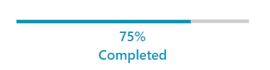

# Custom Content

`RadProgressBar` supports setting a complex structure of elements to the `ContentTemplate` property to represent the value set for the `Content` property. The Content property is of type __object__ and can hold a value of any type. 

__Setting the Content and ContentTemplate properties__
```XAML
    <telerik:RadProgressBar x:Name="progressBar"
                            Minimum="0"
                            Maximum="100"
                            Value="75"
                            Content="{Binding ElementName=progressBar, Path=Value}">
        <telerik:RadProgressBar.ContentTemplate>
            <DataTemplate>
                <StackPanel Orientation="Vertical">
                    <TextBlock Text="{Binding Path=., StringFormat={}{0}%}" 
                               TextAlignment="Center" 
                               FontSize="16" 
                               FontWeight="SemiBold"/>
                    <TextBlock Text="Completed"  
                               FontSize="16" 
                               FontWeight="SemiBold"/>
                </StackPanel>
            </DataTemplate>
        </telerik:RadProgressBar.ContentTemplate>
    </telerik:RadProgressBar>
```

__RadProgressBar with set Content and ContentTemplate properties__


## Setting Content Foreground

RadProgressBar exposes the `ContentForeground` property that will allow you to set the foreground color for the content. It will also be applied when having a custom DataTemplate for the ContentTemplate property without explicitly setting the Foreground property of the elements inside of it.

__Setting the ContentForeground property__
```XAML
    <telerik:RadProgressBar x:Name="progressBar"
                            Minimum="0"
                            Maximum="100"
                            Value="75"
                            ContentForeground="#FF0099BC"
                            Content="{Binding ElementName=progressBar, Path=Value}">
        <telerik:RadProgressBar.ContentTemplate>
            <DataTemplate>
                <StackPanel Orientation="Vertical">
                    <TextBlock Text="{Binding Path=., StringFormat={}{0}%}" 
                               TextAlignment="Center" 
                               FontSize="16" 
                               FontWeight="SemiBold"/>
                    <TextBlock Text="Completed"  
                               FontSize="16" 
                               FontWeight="SemiBold"/>
                </StackPanel>
            </DataTemplate>
        </telerik:RadProgressBar.ContentTemplate>
    </telerik:RadProgressBar>
```

__RadProgressBar with set ContentForeground property__



## Setting Vertical Content Alignment

The RadProgressBar control allows you to position the content via the `VerticalContentAlignment` property. 

__Setting the VerticalContentAlignment property to Top__
```XAML
    <telerik:RadProgressBar x:Name="progressBar"
                            Minimum="0"
                            Maximum="100"
                            Value="75"
                            ContentForeground="#FF0099BC"
                            VerticalContentAlignment="Top"
                            Content="{Binding ElementName=progressBar, Path=Value}">
        <telerik:RadProgressBar.ContentTemplate>
            <DataTemplate>
                <StackPanel Orientation="Vertical">
                    <TextBlock Text="{Binding Path=., StringFormat={}{0}%}" 
                               TextAlignment="Center" 
                               FontSize="16" 
                               FontWeight="SemiBold"/>
                    <TextBlock Text="Completed"  
                               FontSize="16" 
                               FontWeight="SemiBold"/>
                </StackPanel>
            </DataTemplate>
        </telerik:RadProgressBar.ContentTemplate>
    </telerik:RadProgressBar>
```

__RadProgressBar with set VerticalContentAlignment property__

