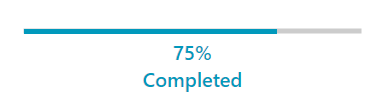

# Custom Content

`RadProgressBar` supports setting a complex structure of elements to the `ContentTemplate` property to represent the value set for the `Content` property. The Content property is of type __object__ and can hold a value of any type. 

__Setting the Content and ContentTemplate properties__
<snippet id='radprogressbar-features-custom-content-block_1-xaml' />

__RadProgressBar with set Content and ContentTemplate properties__

## Setting Content Foreground

RadProgressBar exposes the `ContentForeground` property that will allow you to set the foreground color for the content. It will also be applied when having a custom DataTemplate for the ContentTemplate property without explicitly setting the Foreground property of the elements inside of it.

__Setting the ContentForeground property__
<snippet id='radprogressbar-features-custom-content-block_2-xaml' />

__RadProgressBar with set ContentForeground property__

## Setting Vertical Content Alignment

The RadProgressBar control allows you to position the content via the `VerticalContentAlignment` property. 

__Setting the VerticalContentAlignment property to Top__
<snippet id='radprogressbar-features-custom-content-block_3-xaml' />

__RadProgressBar with set VerticalContentAlignment property__

