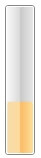

# Orientation

`RadProgressBar` has an `Orientation` property which can be set to either __Horizontal__ or __Vertical__. The two allowed values specify the direction in which the control is being "filled".

__Setting the Orientation property to Horizontal__
```XAML
	<telerik:RadProgressBar Value="35" Height="30" Width="150" Orientation="Horizontal" />
```

__Setting the Orientation property to Horizontal__
```C#
	RadProgressBar progressBar = new RadProgressBar();
	progressBar.Orientation = System.Windows.Controls.Orientation.Horizontal;
```
```VB.NET
	Dim progressBar As New RadProgressBar()
	progressBar.Orientation = System.Windows.Controls.Orientation.Horizontal
```


__Setting the Orientation property to Vertical__
```XAML
	<telerik:RadProgressBar Value="35" Height="150" Width="30" Orientation="Vertical" />
```

__Setting the Orientation property to Vertical__
```C#
	RadProgressBar progressBar = new RadProgressBar();
	progressBar.Orientation = System.Windows.Controls.Orientation.Vertical;
```
```VB.NET
	Dim progressBar As New RadProgressBar()
	progressBar.Orientation = System.Windows.Controls.Orientation.Vertical
```	



>Whenever you change the __Orientation__ property, it will make sense to also change the height and width of the control since the property only changes the direction in which __RadProgressBar__ is filled.