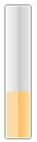

# Orientation

`RadProgressBar` has an `Orientation` property which can be set to either __Horizontal__ or __Vertical__. The two allowed values specify the direction in which the control is being "filled".

__Setting the Orientation property to Horizontal__
<snippet id='radprogressbar-features-orientation-block_1-xaml' />

__Setting the Orientation property to Horizontal__
<snippet id='radprogressbar-features-orientation-block_2-cs' />
<snippet id='radprogressbar-features-orientation-block_2-vb' />

__Setting the Orientation property to Vertical__
<snippet id='radprogressbar-features-orientation-block_3-xaml' />

__Setting the Orientation property to Vertical__
<snippet id='radprogressbar-features-orientation-block_4-cs' />
<snippet id='radprogressbar-features-orientation-block_4-vb' />

>Whenever you change the __Orientation__ property, it will make sense to also change the height and width of the control since the property only changes the direction in which __RadProgressBar__ is filled.