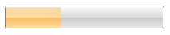

# Overview




Thank you for choosing Telerik __RadProgressBar__!				

Telerik __RadProgressBar__ is an advanced component allowing you to completely convey the progress of various tasks. The control’s appearance can be fully customized via __ControlTemplates__. The control ships with several pre-defined themes and animation.				

__Key Features:__

* __Orientation__ - Set the orientation of the control to either vertical or horizontal by changing the value of a single property called Orientation						

* __Configuration__ - Configure the behavior of the RadProgressBar control by defining the minimum and maximum value of the range element. You can also define the “step size” incrementing the value						

* __Styling and Appearance__ - Use __ControlTemplates__ to customize the look and feel of the control in your very custom manner. Along with the ControlTemplates you can use animation effects to enrich the appearance of __RadProgressBar__.						
