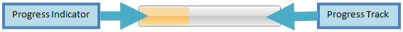

# Structure

This section defines terms and concepts used in the scope of __RadProgressBar__ you have to get familiar with prior to continue reading this help. They can also be helpful when contacting our support service in order to describe your issue better. For more detailed descriptions of the required parts of the control please visit the [Required Parts]() section.  

* __Progress Indicator__ - indicates the current status of the progress 
* __Progress Track__ - holder of the progress indicator used to hold and contrast the progress.

# See Also
 * [Required Parts]()
 * [Getting Started]()
