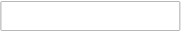
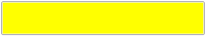
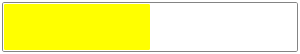
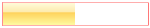

# Changing Colors

There are two ways of changing the colors of a __RadProgressBar__ – by setting the control's properties directly or by assigning a custom __Style__ to the control. Both methods can be used either in procedural code or in XAML.

This article will demonstrate a few examples of using RadProgressBar's properties to change the appearance of the control.

* __Background__: Modifies the color of the progress track.						

	__Example 1: Setting a yellow background in XAML__
	```XAML
		<UserControl.Resources>
			<Style x:Key="myStyle" TargetType="telerik:RadProgressBar">
				<Setter Property="Background" Value="Yellow" />
			</Style>
		</UserControl.Resources>
		<Grid>
			<!-- Set Background using a Style  -->
			<telerik:RadProgressBar Style="{StaticResource myStyle}" />
			<!-- Set Background directly -->
			<telerik:RadProgressBar Background="Yellow" />
		</Grid>
	```

	__Example 2: Setting a yellow background in code-behind__
	```C#
		RadProgressBar myProgressBar = new RadProgressBar();
		// Set Background directly 
		myProgressBar.Background = new SolidColorBrush(Colors.Yellow);
		// Set Background using a Style
		Style myStyle = new Style(typeof(RadProgressBar));
		myStyle.Setters.Add(new Setter(RadProgressBar.BackgroundProperty, new SolidColorBrush(Colors.Yellow)));
		myProgressBar.Style = myStyle;
	```
	```VB.NET
		Dim myProgressBar As New RadProgressBar()
		' Set Background directly '
		myProgressBar.Background = New SolidColorBrush(Colors.Yellow)
		' Set Background using a Style'
		Dim myStyle As New Style(GetType(RadProgressBar))
		myStyle.Setters.Add(New Setter(RadProgressBar.BackgroundProperty, New SolidColorBrush(Colors.Yellow)))
		myProgressBar.Style = myStyle			
	```

	Here is how the control looks before and after the change of the __Background__ property:

	*Before:*

	

	*After:*

	

* __Foreground__: Modifies the color of the progress indicator.						

	__Example 3: Setting a yellow indicator in XAML__
	```XAML
		<Style x:Key="myStyle2" TargetType="telerik:RadProgressBar">
			<Setter Property="Foreground" Value="Yellow" />
		</Style>
		<!--  Set Foreground using a Style  -->
		<telerik:RadProgressBar Value="50" Style="{StaticResource myStyle2}" />
		<!--  Set Foreground directly  -->
		<telerik:RadProgressBar Value="50" Foreground="Yellow" />
	```

	__Example 4: Setting a yellow indicator in code-behind__
	```C#
		// Set Foreground directly
		myProgressBar.Foreground = new SolidColorBrush(Colors.Yellow);
		// Set Foreground using a Style
		Style myStyle2 = new Style(typeof(RadProgressBar));
		myStyle2.Setters.Add(new Setter(RadProgressBar.ForegroundProperty, new SolidColorBrush(Colors.Yellow)));
		myProgressBar.Value = 50;
		myProgressBar.Style = myStyle2;
	```
	```VB.NET
		' Set Foreground directly'
		myProgressBar.Foreground = New SolidColorBrush(Colors.Yellow)
		' Set Foreground using a Style'
		Dim myStyle2 As New Style(GetType(RadProgressBar))
		myStyle2.Setters.Add(New Setter(RadProgressBar.ForegroundProperty, New SolidColorBrush(Colors.Yellow)))
		myProgressBar.Value = 50
		myProgressBar.Style = myStyle2
	```	
		
	Here is how the control looks before and after the change of the __Foreground__ property:

	*Before:*

	

	*After:*

	

* __BorderBrush__: Modifies the color of the RadProgressBar outer border.					

	__Example 5: Setting a red border brush in XAML__
	```XAML
		<Style x:Key="myStyle3" TargetType="telerik:RadProgressBar">
			<Setter Property="BorderBrush" Value="Red" />
		</Style>
		<!--  Set BorderBrush using a Style  -->
		<telerik:RadProgressBar Value="50" Style="{StaticResource myStyle3}" />
		<!--  Set BorderBrush directly  -->
		<telerik:RadProgressBar Value="50" BorderBrush="Red" />
	```

	__Example 6: Setting a red border brush in code-behind__
	```C#
		// Set BorderBrush  directly
		myProgressBar.BorderBrush = new SolidColorBrush(Colors.Red);
		// Set BorderBrush using a Style
		Style myStyle3 = new Style(typeof(RadProgressBar));
		myStyle3.Setters.Add(new Setter(RadProgressBar.BorderBrushProperty, new SolidColorBrush(Colors.Red)));
		myProgressBar.Value = 50;
		myProgressBar.Style = myStyle3;
	```
	```VB.NET
		' Set BorderBrush  directly'
		myProgressBar.BorderBrush = New SolidColorBrush(Colors.Red)
		' Set BorderBrush using a Style'
		Dim myStyle3 As New Style(GetType(RadProgressBar))
		myStyle3.Setters.Add(New Setter(RadProgressBar.BorderBrushProperty, New SolidColorBrush(Colors.Red)))
		myProgressBar.Value = 50;
		myProgressBar.Style = myStyle3
	```
	
Here is how the control looks before and after the change of the __BorderBrush__ property:

*Before:*


*After:*


