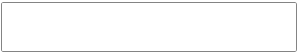
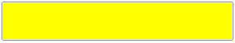
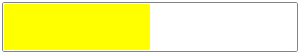
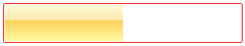

# Changing Colors

There are two ways of changing the colors of a __RadProgressBar__ – by setting the control's properties directly or by assigning a custom __Style__ to the control. Both methods can be used either in procedural code or in XAML.

This article will demonstrate a few examples of using RadProgressBar's properties to change the appearance of the control.

* __Background__: Modifies the color of the progress track.						

	__Example 1: Setting a yellow background in XAML__
	<snippet id='radprogressbar-styling-and-appearance-changing-colors-block_1-xaml' />

	__Example 2: Setting a yellow background in code-behind__
	<snippet id='radprogressbar-styling-and-appearance-changing-colors-block_2-cs' />
	<snippet id='radprogressbar-styling-and-appearance-changing-colors-block_2-vb' />

	Here is how the control looks before and after the change of the __Background__ property:

	*Before:*

	

	*After:*

	

* __Foreground__: Modifies the color of the progress indicator.						

	__Example 3: Setting a yellow indicator in XAML__
	<snippet id='radprogressbar-styling-and-appearance-changing-colors-block_3-xaml' />

	__Example 4: Setting a yellow indicator in code-behind__
	<snippet id='radprogressbar-styling-and-appearance-changing-colors-block_4-cs' />
	<snippet id='radprogressbar-styling-and-appearance-changing-colors-block_4-vb' />
		
	Here is how the control looks before and after the change of the __Foreground__ property:

	*Before:*

	

	*After:*

	

* __BorderBrush__: Modifies the color of the RadProgressBar outer border.					

	__Example 5: Setting a red border brush in XAML__
	<snippet id='radprogressbar-styling-and-appearance-changing-colors-block_5-xaml' />

	__Example 6: Setting a red border brush in code-behind__
	<snippet id='radprogressbar-styling-and-appearance-changing-colors-block_6-cs' />
	<snippet id='radprogressbar-styling-and-appearance-changing-colors-block_6-vb' />
	
Here is how the control looks before and after the change of the __BorderBrush__ property:

*Before:*

*After:*

