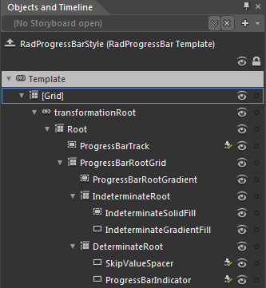

# Required Parts

## 

The control template of __RadProgressBar__ contains a number of elements needed for the correct functioning of the control. This section will explain the structure of the RadProgressBar's template. Here is a snapshot of the template generated in Expression Blend.

Here is a short description of some of the elements included in the default control template:

* __[Grid]__ - is of type __Grid__ and represents the layout root for the template.
						

* __transformationRoot__ - a __LayoutTransformControl__ that hosts the __RadProgressBar__ template elements.
								

* __Root__ - this Grid element servers as the container wrapping all other elements in the control template.
										

* __ProgressBarTrack__ - this Border element serves as the "empty" area of the ProgressBar which indicates the yet unfilled portion of the monitored operation.
											

* __ProgressBarRootGrid__ - this Grid element is used for positioning the elements it contains.
												

* __ProgressBarRootGradient__ - this element is used for styling purposes.
													

* __IndeterminateRoot__ - this Grid element contains all elements needed for the default visualization of the indeterminate state of the control.
														

* __IndeterminateSolidFill__ - this element is used for styling purposes.
															

* __IndeterminateradientFill__ - this element is used for styling purposes.
															

* __DeterminateRoot__ - this Grid element contains all elements needed for the default visualization of the determinate state of the control.
														

* __SkipValueSpacer__- this element is used when the __SkipValue__ property is set.
															

* __ProgressBarIndicator__ - this element is used for rendering the current progress(value) in the control.
															
