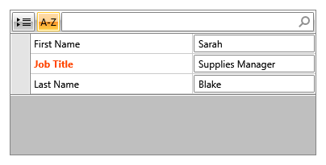
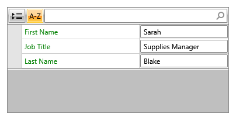
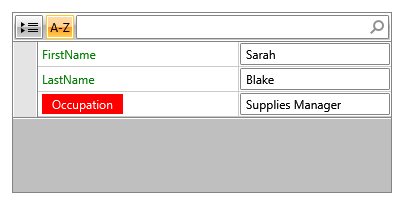

# Customizing Property Labels

Each field in **RadPropertyGrid** displays a label that identifies the underlying property. You can control the text of that label, apply a `Style` to it, or replace it entirely with a custom `DataTemplate` &mdash; either for a single field or for every field in the grid.

This article covers:

* [Setting the Label Text](#setting-the-label-text) with `PropertyDefinition.DisplayName`.
* [Styling the Label](#styling-the-label) with `PropertyDefinition.LabelStyle`.
* [Templating All Field Labels](#templating-all-field-labels) with `RadPropertyGrid.LabelTemplate`.
* [Overriding the Template for a Single Field](#overriding-the-template-for-a-single-field) with `PropertyDefinition.LabelTemplate`.

## Setting the Label Text

The `DisplayName` property of `PropertyDefinition` holds the text that is rendered by the field's label. When `RadPropertyGrid` auto-generates its property definitions, `DisplayName` defaults to the name of the underlying property, but you can override it for a manually defined `PropertyDefinition`.

__Setting DisplayName on a manually defined PropertyDefinition__

```XAML
<telerik:RadPropertyGrid Item="{Binding}" AutoGeneratePropertyDefinitions="False">
    <telerik:RadPropertyGrid.PropertyDefinitions>
        <telerik:PropertyDefinition Binding="{Binding FirstName}" DisplayName="First Name" />
        <telerik:PropertyDefinition Binding="{Binding LastName}" DisplayName="Last Name" />
        <telerik:PropertyDefinition Binding="{Binding Occupation}" DisplayName="Job Title" />
    </telerik:RadPropertyGrid.PropertyDefinitions>
</telerik:RadPropertyGrid>
```

To change the label text of an auto-generated field, set `DisplayName` in the `AutoGeneratingPropertyDefinition` event handler instead.

__Setting DisplayName for an auto-generated field__

```C#
private void PropertyGrid_AutoGeneratingPropertyDefinition(object sender, Telerik.Windows.Controls.Data.PropertyGrid.AutoGeneratingPropertyDefinitionEventArgs e)
{
    if (e.PropertyDefinition.Binding is Binding binding && binding.Path.Path == nameof(Employee.Occupation))
    {
        e.PropertyDefinition.DisplayName = "Job Title";
    }
}
```

>tip You can also drive `DisplayName` declaratively through the `Display` data annotation attribute. Read more in the [Data Annotations]() article.

## Styling the Label

The `LabelStyle` property of `PropertyDefinition` accepts a `Style` targeting `TextBlock` and is applied to that field's default label.

__Defining a label Style__

```XAML
<Window.Resources>
    <Style x:Key="HighlightedLabelStyle" TargetType="TextBlock">
        <Setter Property="Foreground" Value="OrangeRed" />
        <Setter Property="FontWeight" Value="Bold" />
    </Style>
</Window.Resources>
```

__Applying LabelStyle to a PropertyDefinition__

```XAML
<telerik:RadPropertyGrid Item="{Binding}" AutoGeneratePropertyDefinitions="False">
    <telerik:RadPropertyGrid.PropertyDefinitions>
        <telerik:PropertyDefinition Binding="{Binding Occupation}"
                                    DisplayName="Job Title"
                                    LabelStyle="{StaticResource HighlightedLabelStyle}" />
    </telerik:RadPropertyGrid.PropertyDefinitions>
</telerik:RadPropertyGrid>
```

__A field label styled through LabelStyle__



>important `LabelStyle` targets the default label `TextBlock` only. It has no effect on a field whose label is rendered through `RadPropertyGrid.LabelTemplate` or its own `PropertyDefinition.LabelTemplate`.

## Templating All Field Labels

The `LabelTemplate` property of `RadPropertyGrid` accepts a `DataTemplate` that is used to render the label of every field in the grid, unless a field's own `PropertyDefinition.LabelTemplate` is set. The template receives the corresponding `PropertyDefinition` instance as its `DataContext`, so you can bind to `DisplayName` or any other of its members.

__Setting RadPropertyGrid.LabelTemplate__

```XAML
<telerik:RadPropertyGrid Item="{Binding}">
    <telerik:RadPropertyGrid.LabelTemplate>
        <DataTemplate>
            <TextBlock Text="{Binding DisplayName}" Foreground="Green" />
        </DataTemplate>
    </telerik:RadPropertyGrid.LabelTemplate>
</telerik:RadPropertyGrid>
```

__All field labels rendered through RadPropertyGrid.LabelTemplate__



## Overriding the Template for a Single Field

`PropertyDefinition` also exposes its own `LabelTemplate` property. When set, it takes precedence over `RadPropertyGrid.LabelTemplate` for that particular field, which lets you single out one field for a different label presentation while every other field keeps using the grid-wide template.

__Defining a dedicated label template__

```XAML
<Window.Resources>
    <DataTemplate x:Key="OccupationLabelTemplate">
        <TextBlock Text="{Binding DisplayName}" Background="Red" Foreground="White" Padding="10,2" />
    </DataTemplate>
</Window.Resources>
```

__Assigning the template to a single auto-generated field__

```C#
private void PropertyGrid_AutoGeneratingPropertyDefinition(object sender, Telerik.Windows.Controls.Data.PropertyGrid.AutoGeneratingPropertyDefinitionEventArgs e)
{
    if (e.PropertyDefinition.DisplayName == nameof(Employee.Occupation))
    {
        e.PropertyDefinition.LabelTemplate = (DataTemplate)this.Resources["OccupationLabelTemplate"];
    }
}
```

__A single field label overridden through PropertyDefinition.LabelTemplate__



## See Also

* [Overview]()
* [Visual Structure]()
* [Autogenerated Property Definitions]()
* [Data Annotations]()
* [Styles and Templates Overview]()
