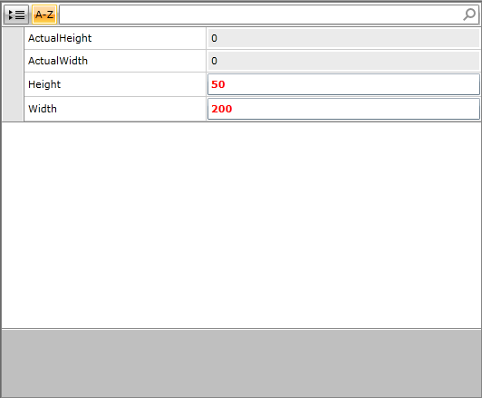

# AutoBind Attached Behavior

The need of reusable DataTemplates is a common scenario with quite few universal viable solutions. The AutoBind attached behavior enables RadPropertyGrid to use a single DataTemplate resource as an EditorTemplate value for multiple PropertyDefinitions without any additional effort on the users’ side.

[Here](http://www.telerik.com/help/silverlight/t_telerik_windows_controls_data_propertygrid_autobindbehavior.html)[Here](http://www.telerik.com/help/wpf/t_telerik_windows_controls_data_propertygrid_autobindbehavior.html) is the API reference for the AutoBindBehaviour.
        

Here is an example with RadPropertyGrid that has its Item property bound to a Button:

__Example 1: Using AutoBindBehavior__

	```XAML
	<Grid x:Name="LayoutRoot" Background="White">
	  <Grid.Resources>
	    <DataTemplate x:Key="editorTemplate">
	      <TextBox Foreground="Red" FontWeight="Bold" telerik:AutoBindBehavior.UpdateBindingOnElementLoaded="Text" />
	    </DataTemplate>
	  </Grid.Resources>
	  <telerik:RadPropertyGrid x:Name="rpg" AutoGeneratePropertyDefinitions="False">
	    <telerik:RadPropertyGrid.PropertyDefinitions>
	      <telerik:PropertyDefinition Binding="{Binding Height}"
	                                  EditorTemplate="{StaticResource editorTemplate}"
	                                  DisplayName="Height" />
	      <telerik:PropertyDefinition Binding="{Binding Width}"
	                                  EditorTemplate="{StaticResource editorTemplate}"
	                                  DisplayName="Width" />
	      <telerik:PropertyDefinition Binding="{Binding ActualHeight}"
	                                  IsReadOnly="True"
	                                  DisplayName="ActualHeight"/>
	      <telerik:PropertyDefinition Binding="{Binding ActualWidth}"
	                                  IsReadOnly="True"
	                                  DisplayName="ActualWidth"/>
	    </telerik:RadPropertyGrid.PropertyDefinitions>
	  </telerik:RadPropertyGrid>
	</Grid>
```



The AutoBind attached behavior is also available in scenarios with auto-generated fields. In order to achieve this one can either set a PropertyDefinition’s EditorTemplate on the AutogeneratingDataField, or utilize a [DataTemplateSelector]().

__TwoWay binding__ with the __AutoBindBehavior__ is supported for the following types:
        

* __Primitive types__
            

* __String__
            

* __Decimal__
            

* __Guid__
            

* __DateTime__
            

* __Enum__
            

* __Color__
            

* __TimeSpan__

* __GridLength__

* __Thickness__
            

## How does it work?

In most cases when a custom __DataTemplate__ is defined, the element within it would have to be explicitly bound to a particular property. This requires a __DataTemplate__ to be defined for each property as it cannot be reused. The __AutoBindBehavior__ provides a way to define a more __generic DataTemplate__ and reuse it for editing different properties. Shortly said, it matches the property of the editor with the one bound to a given __PropertyDefinition__. This is done through the __UpdateBindingOnElementLoaded__ property of the behavior. It has to be set to point to the property of the given editor that is used for editing a property value. Apparently, in our example it is __TextBox’s Text__ DependencyProperty.

>The AutoBind behavior is designed to function exclusively in the context of RadPropertyGrid.
          
## Set the BindingMode of Custom Data Type
By default, the __AutoBindBehavior__ supports __TwoWay Binding__ only for the data types listed in the previous section. For a __custom data type__, the __BindingMode__ is __OneWay__. This behavior can be altered through the __BindingModeOverride__ property. 

__Example 2: Setting the BindingModeOverride property to TwoWay__

	```XAML
	<Grid.Resources>
	  <DataTemplate x:Key="editorTemplate1">
	    <TextBox Foreground="Red" FontWeight="Bold"
	             telerik:AutoBindBehavior.BindingModeOverride="TwoWay"/>
	  </DataTemplate>
	</Grid.Resources>
```
          

## See Also

 * [Getting Started with RadPropertyGrid]()

 * [DataTemplateSelector]()
