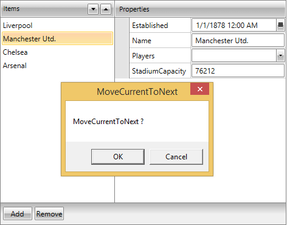

# CollectionEditors

## Overview

__CollectionEditor__ and __CollectionEditorPicker__ are editor controls that provide UI for editing collections and their items. Currently they are used in the domain of RadPropertyGrid as default editors for IEnumerable type-compatible properties, but they can be successfully used out of this context as standalone editors:

#### __[XAML]Example 1: Defining CollectionEditor__

	{{region radpropertygrid-collectioneditor_0}}
	  <telerik:CollectionEditor Source="{Binding Players}" 
	                            Header="Players" />
	
	{{endregion}}

>importantIf you want CollectionEditor to work with a __custom collection__, then the edited collection type should implement __ICollectionView__ and __IEditableCollectionView__ interfaces.

## Dependencies

Both of them are located in the __Telerik.Windows.Controls.Data__ assembly (Telerik.Windows.Controls.Data.PropertyGrid namespace) and depend on the following

 UI for WPF assemblies


UI for Silverlight assemblies


        
* __Telerik.Windows.Data__
  

* __Telerik.Windows.Controls__
  

* __Telerik.Windows.Controls.Data__
  

* __Telerik.Windows.Control.Input__
            

The mentioned namespace is mapped to the Telerik Uri namespace
          

#### __[XAML]Example 2: Telerik Uri namespace__

	{{region radpropertygrid-collectioneditor_1}}
	   http://schemas.telerik.com/2008/xaml/presentation
	{{endregion}}

## Internal Structure

CollectionEditor relies on the IEditableCollectionView interface. In case that the edited collection type implements ICollectionView and IEditableCollectionView, its custom implementation is utilized and if it does not, an instance of QueryableCollectionView is used instead.
        

The following listed commands, defined in the CollectionEditorCommands class, invoke their IEditableCollectionView method counterparts, when they are executed:
        

* __MoveCurrentToNext__
 

* __MoveCurrentToPrevious__
 

* __AddNew__
 

* __Delete__

## Customizing Commands

It is possible to customize the default commands for the CollectionEditor and the CollectionEditorPicker in a MVVM-friendly way. The following examples are using the CollectionEditor control but the same changes can be applied for the CollectionEditorPicker as well.

“Execute logic” methods

The methods listed below identify the logic that is executed when a certain command’s invocation takes place.

#### __[C#]__ Example 3: CollectionEditor`s executable commands  

	void MoveCurrentToNext()
	void MoveCurrentToPrevious()
	void Delete()
	void AddNew()

“Can-execute logic” methods

With the help of those methods you can identify whether a certain command can be executed or not.

#### __[C#]__ Example 4:CollectionEditor "can-execute" methods 

	bool CanMoveCurrentToNextExecute()
	bool CanMoveCurrentToPreviousExecute()
	bool CanDeleteExecute()
	bool CanAddNewExecute()

## Designing a custom CommandProvider

The first step is to create your own class that inherits from CollectionNavigatorBaseCommandProvider:

#### __[C#]__ Example 5: Creating a class that provides the custom commands

{{region collectioneditor-customize-commands_1}}

	public class CustomCommandProvider : CollectionNavigatorBaseCommandProvider
	{
		public CustomCommandProvider() : base(null)
		{
		}
	 
		public CustomCommandProvider(CollectionNavigatorBase collectionEditor)
            : base(collectionEditor)
		{
            this.CollectionNavigator = collectionEditor;
		}
		//. . .
	}
	
	{{endregion}}

Those commands, which logic is up to get customized, should have their corresponding methods overridden. In the following example we will customize: MoveCurrentToNext, MoveCurrentToPrevious.

## MoveCurrentToNext and MoveCurrentToPrevious

In case you have a requirement to ask for the customer`s approval when moving through items, you need to update the commands as in the following examples:

#### __[C#]__ Example 6: Overriding the default commands

{{region collectioneditor-customize-commands_2}}

		public override void MoveCurrentToNext()
		{
			MessageBoxResult result = MessageBox.Show("MoveCurrentToNext ?", "MoveCurrentToNext", MessageBoxButton.OKCancel);
			if (result == MessageBoxResult.OK)
			{
				this.CollectionNavigator.MoveCurrentToNext();
			}
		}

        public override void MoveCurrentToPrevious()
		{
			MessageBoxResult result = MessageBox.Show("MoveCurrentToPrevious ?", "MoveCurrentToPrevious", MessageBoxButton.OKCancel);
			if (result == MessageBoxResult.OK)
			{
				this.CollectionNavigator.MoveCurrentToPrevious();
			}
		}
	
	{{endregion}}

The last thing to be done is to set CommandProvider Property of the CollectionEditor to be the newly-created CustomCommandProvider class:
        

#### __[XAML]__ Example 7: Assigning the CommandProvider 

{{region collectioneditor-customize-commands_3}}

	
	<telerik:CollectionEditor x:Name="CollectionEditor"
	                     	  Source="{Binding Employees}"/>
	{{endregion}}

#### __[C#]__ Example 8: Assigning the CommandProvider 

{{region collectioneditor-customize-commands_4}}

	this.CollectionEditor.CommandProvider = new CustomCommandProvider(this.CollectionEditor);
	{{endregion}}

Modifying the methods will result in the following action when trying to move to the next item:

# See Also

* [Nested Properties]()

* [Data Annotations]()

* [Defining Property Sets]()
