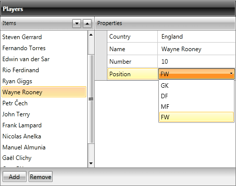
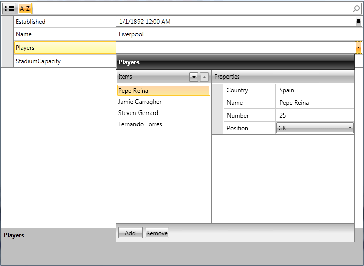

# CollectionEditors

## Overview

__CollectionEditor__ and __CollectionEditorPicker__ are editor controls that provide UI for editing collections and their items. Currently they are used in the domain of RadPropertyGrid as default editors for IEnumerable type-compatible properties, but they can be successfully used out of this context as standalone editors:

#### __[XAML]Example 1: Defining CollectionEditor__

	{{region radpropertygrid-collectioneditor_0}}
	  <telerik:CollectionEditor Source="{Binding Players}" 
	                            Header="Players" />
	
	{{endregion}}

>importantIf you want CollectionEditor to work with a __custom collection__, then the edited collection type should implement __ICollectionView__ and __IEditableCollectionView__ interfaces.

## Dependencies

Both of them are located in the __Telerik.Windows.Controls.Data__ assembly (Telerik.Windows.Controls.Data.PropertyGrid namespace) and depend on the following

 UI for WPF assemblies


UI for Silverlight assemblies


        
* __Telerik.Windows.Data__
  

* __Telerik.Windows.Controls__
  

* __Telerik.Windows.Controls.Data__
  

* __Telerik.Windows.Control.Input__
            

The mentioned namespace is mapped to the Telerik Uri namespace
          

#### __[XAML]Example 2: Telerik Uri namespace__

	{{region radpropertygrid-collectioneditor_1}}
	   http://schemas.telerik.com/2008/xaml/presentation
	{{endregion}}

## Internal Structure

CollectionEditor relies on the IEditableCollectionView interface. In case that the edited collection type implements ICollectionView and IEditableCollectionView, its custom implementation is utilized and if it does not, an instance of QueryableCollectionView is used instead.
        

The following listed commands, defined in the CollectionEditorCommands class, invoke their IEditableCollectionView method counterparts, when they are executed:
        

* __MoveCurrentToNext__
 

* __MoveCurrentToPrevious__
 

* __AddNew__
 

* __Delete__