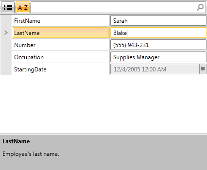
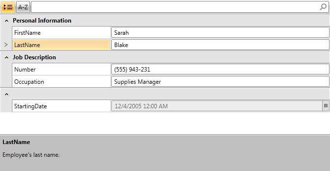

# Data Annotations

This article will show you how to use **Data Annotations** with **RadPropertyGrid**.

We will discuss the following attributes:

* [Display](#display)

* [ReadOnly](#readonly)

* [Browsable](#browsable)

They allow you to categorize different properties into separate groups, set some of them as read-only or define description for each one of them.

## Creating RadPropertyGrid Application

First, for the purpose of this article, we will create a new **Employee** class with a couple of properties:

__Example 1: Creating the Employee class__

```C#
	public class Employee
	{
	    public string FirstName { get; set; }
	    public string LastName { get; set; }
	    public string PhoneNum { get; set; }
	    public int Salary { get; set; }
	    public string Occupation { get; set; }
	    public DateTime StartingDate { get; set; }
	}
```
```VB.NET
	Public Class Employee
	    Public Property FirstName() As String
	    Public Property LastName() As String
	    Public Property PhoneNum() As String
	    Public Property Salary() As Integer
	    Public Property Occupation() As String
	    Public Property StartingDate() As Date
	End Class
```

The declaration of RadPropertyGrid control inside the Grid:        

__Example 2: Declaring RadPropertyGrid__

```XAML
	<telerik:RadPropertyGrid x:Name="propertyGrid1" />
```

Once the class Employee is defined, you may use it for creating an object of this type and bind it to RadPropertyGrid:

__Example 3: Binding Employee instance to RadPropertyGrid__

```C#
	this.propertyGrid1.Item = new Employee()
	{
	    FirstName = "Sarah",
	    LastName = "Blake",
	    PhoneNum = "(555) 943-231",
	    Occupation = "Supplies Manager",
	    Salary = 3500,
	    StartingDate = new DateTime(2005, 12, 4)
	};
```
```VB.NET
	Me.propertyGrid1.Item = New Employee() With {
	  .FirstName = "Sarah",
	  .LastName = "Blake",
	  .Occupation = "Supplied Manager",
	  .StartingDate = New DateTime(2005, 4, 12),
	  .Salary = 3500
	}
```

After you run the application you should see the following:

#### __Figure 1: RadPropertyGrid bound to an Employee instance__


>importantIf you want to use Data Annotations in your application, you have to add a reference to the **System.ComponentModel.DataAnnotations** assembly.

## Display

The **Display** attribute specifies localizable strings for data types and members that are used in the user interface. You can use its following properties:

* __Name__: The value to be displayed instead of the property name.

* __Description__: A description of the property. This will be shown in RadPropertyGrid's [DescriptionPanel]().

* __GroupName__: Used when you want to categorize different properties into separate groups.

* __Order__: Used when you want to set a property's display order.
              
**Example 4** demonstrates how you can specify a Display attribute for a property:

__Example 4: Setting Display attribute__

```C#
	//Rename the StartingDate property to Year in the UI
	[Display(Name = "Year")]
	public DateTime StartingDate { get; set; }
	//Set a description to the FirstName property and categorize it to be from the group "Personal Information"
	[Display(Description = "Employee's first name.", GroupName = "Personal Information")]
	public string FirstName { get; set; }
	//Set a description to the LastName property and categorize it to be from the group "Personal Information"
	[Display(Description = "Employee's last name.", GroupName = "Personal Information")]
	public string LastName { get; set; }
```
```VB.NET
	'Rename the StartingDate property to Year in the UI
	<Display(Name:="Year")>
	Public Property StartingDate() As Date
	'Set a description to the FirstName property and categorize it to be from the group "Personal Information"
	<Display(Description:="Employee's first name.", GroupName:="Personal Information")>
	Public Property FirstName() As String
	'Set a description to the LastName property and categorize it to be from the group "Personal Information"
	<Display(Description:="Employee's last name.", GroupName:="Personal Information")>
	Public Property LastName() As String
```

## Browsable

The **Browsable** attribute specifies whether a property should be displayed or not.

__Example 5: Setting Browsable attribute__

```C#
	//Hide StartingDate from the UI
	[Browsable(false)]
	public DateTime StartingDate { get; set; }
```
```VB.NET
	'Hide StartingDate from the UI
	<Browsable(False)>
	Public Property StartingDate() As Date
```

## ReadOnly

The **ReadOnly** attribute specifies whether the property this attribute is bound to is read-only or read/write.

__Example 6: Setting ReadOnly attribute__

```C#
	//Set StartingDate as Read-Only
	[ReadOnly(true)]
	public DateTime StartingDate { get; set; }
```
```VB.NET
	'Set StartingDate as Read-Only
	<[ReadOnly](True)>
	Public Property StartingDate() As Date
```

To see these attributes in action, let's modify the Employee class and see the result in RadPropertGrid.

__Example 7: Modifying sample data__

```C#
	[Display(Description = "Employee's first name.", GroupName = "Personal Information")]
	public string FirstName { get; set; }
	[Display(Description = "Employee's last name.", GroupName = "Personal Information")]
	public string LastName { get; set; }
	[Display(Name = "Occupation", GroupName = "Job Description")]
	public string Occupation { get; set; }
	[Browsable(false)]
	public int Salary { get; set; }
	[Display(Name = "Number", GroupName = "Job Description")]
	public string PhoneNum { get; set; }
	[ReadOnly(true)]
	public DateTime StartingDate { get; set; }
```
```VB.NET
	<Display(Description:="Employee's first name.", GroupName:="Personal Information")>
	Public Property FirstName() As String
	<Display(Description:="Employee's last name.", GroupName:="Personal Information")>
	Public Property LastName() As String
	<Display(Name:="Occupation", GroupName:="Job Description")>
	Public Property Occupation() As String
	<Browsable(False)>
	Public Property Salary() As Integer
	<Display(Name:="Number", GroupName:="Job Description")>
	Public Property PhoneNum() As String
	<[ReadOnly](True)>
	Public Property StartingDate() As Date
```

Here's the resulting RadPropertyGrid sorted alphabetically and in grouped mode:

#### __Figure 2: RadPropertyGrid with data annotations sorted alphabetically__



#### __Figure 3: RadPropertyGrid with data annotations in grouped mode__



## See also

* [Editor Attribute]()

* [Grouping Support]()