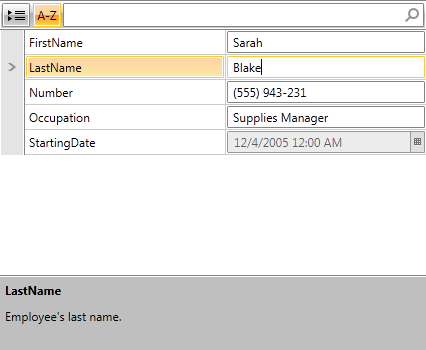
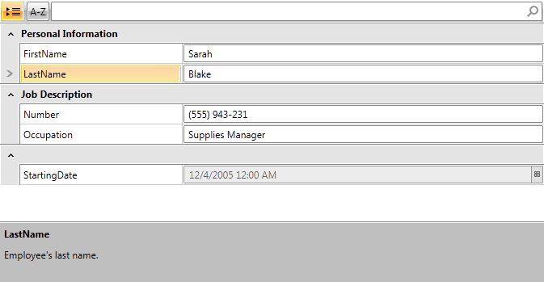

# Data Annotations

This article will show you how to use **Data Annotations** with **RadPropertyGrid**.

We will discuss the following attributes:

* [Display](#display)

* [ReadOnly](#readonly)

* [Browsable](#browsable)

They allow you to categorize different properties into separate groups, set some of them as read-only or define description for each one of them.

## Creating RadPropertyGrid Application

First, for the purpose of this article, we will create a new **Employee** class with a couple of properties:

__Example 1: Creating the Employee class__

<snippet id='radpropertygrid-features-data-annotations-block_1-cs' />
<snippet id='radpropertygrid-features-data-annotations-block_1-vb' />

The declaration of RadPropertyGrid control inside the Grid:        

__Example 2: Declaring RadPropertyGrid__

<snippet id='radpropertygrid-features-data-annotations-block_2-xaml' />

Once the class Employee is defined, you may use it for creating an object of this type and bind it to RadPropertyGrid:

__Example 3: Binding Employee instance to RadPropertyGrid__

<snippet id='radpropertygrid-features-data-annotations-block_3-cs' />
<snippet id='radpropertygrid-features-data-annotations-block_3-vb' />

After you run the application you should see the following:

#### __Figure 1: RadPropertyGrid bound to an Employee instance__

>important If you want to use Data Annotations in your application, you have to add a reference to the **System.ComponentModel.DataAnnotations** assembly.

## Display

The **Display** attribute specifies localizable strings for data types and members that are used in the user interface. You can use its following properties:

* __Name__: The value to be displayed instead of the property name.

* __Description__: A description of the property. This will be shown in RadPropertyGrid's [DescriptionPanel]().

* __GroupName__: Used when you want to categorize different properties into separate groups.

* __Order__: Used when you want to set a property's display order.
              
**Example 4** demonstrates how you can specify a Display attribute for a property:

__Example 4: Setting Display attribute__

<snippet id='radpropertygrid-features-data-annotations-block_4-cs' />
<snippet id='radpropertygrid-features-data-annotations-block_4-vb' />

## Browsable

The **Browsable** attribute specifies whether a property should be displayed or not.

__Example 5: Setting Browsable attribute__

<snippet id='radpropertygrid-features-data-annotations-block_5-cs' />
<snippet id='radpropertygrid-features-data-annotations-block_5-vb' />

## ReadOnly

The **ReadOnly** attribute specifies whether the property this attribute is bound to is read-only or read/write.

__Example 6: Setting ReadOnly attribute__

<snippet id='radpropertygrid-features-data-annotations-block_6-cs' />
<snippet id='radpropertygrid-features-data-annotations-block_6-vb' />

To see these attributes in action, let's modify the Employee class and see the result in RadPropertGrid.

__Example 7: Modifying sample data__

<snippet id='radpropertygrid-features-data-annotations-block_7-cs' />
<snippet id='radpropertygrid-features-data-annotations-block_7-vb' />

Here's the resulting RadPropertyGrid sorted alphabetically and in grouped mode:

#### __Figure 2: RadPropertyGrid with data annotations sorted alphabetically__

#### __Figure 3: RadPropertyGrid with data annotations in grouped mode__

## See also

* [Editor Attribute]()

* [Grouping Support]()