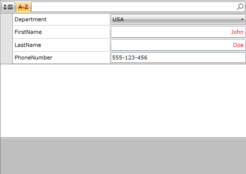

# DataTemplateSelector Support

The __DataTemplateSelector__ approach enables conditional selection of __DataTemplates__, based on information provided by the respective bound data item.

Read more about __DataTemplateSelectors__ in the [Template Selectors]() article.

## DataTemplateSelectors in RadPropertyGrid

RadPropertyGrid enables its users to implement conditional editor __DataTemplate__ selection for its __PropertyGridFields__ trough a __DataTemplateSelector__:

__Example 1: Creating custom DataTemplateSelector__

```C#
	public class Customer
	{
	    public string FirstName { get; set; }
	    public string LastName { get; set; }
	    public string PhoneNumber { get; set; }
	    public Department Department { get; set; }
	}
	 
	public class FieldTemplateSelector : DataTemplateSelector
	{
	    public override DataTemplate SelectTemplate(object item, DependencyObject container)
	    {
	        PropertyDefinition propDef = item as PropertyDefinition;
	        if (propDef.DisplayName == "PhoneNumber")
	        {
	            return this.PhoneNumberDataTemplate;
	        }
	        if (propDef.SourceProperty.PropertyType == typeof(string))
	        {
	            return this.StringDataTemplate;
	        }
	        return null;
	    }
	 
	    public DataTemplate PhoneNumberDataTemplate { get; set; }
	    public DataTemplate StringDataTemplate { get; set; }
	}
```
```VB.NET
	Public Class Customer
	    Public Property FirstName() As String
	    Public Property LastName() As String
	    Public Property PhoneNumber() As String
	    Public Property Department() As Department
	End Class
	Public Class FieldTemplateSelector
	    Inherits DataTemplateSelector
	    Public Overrides Function SelectTemplate(item As Object, container As DependencyObject) As DataTemplate
	        Dim propDef As PropertyDefinition = TryCast(item, PropertyDefinition)
	        If propDef.DisplayName = "PhoneNumber" Then
	            Return Me.PhoneNumberDataTemplate
	        End If
	        If propDef.SourceProperty.PropertyType = GetType(String) Then
	            Return Me.StringDataTemplate
	        End If
	        Return Nothing
	    End Function
	    Public Property PhoneNumberDataTemplate() As DataTemplate
	        Get
	            Return m_PhoneNumberDataTemplate
	        End Get
	        Set(value As DataTemplate)
	            m_PhoneNumberDataTemplate = value
	        End Set
	    End Property
	    Private m_PhoneNumberDataTemplate As DataTemplate
	    Public Property StringDataTemplate() As DataTemplate
	        Get
	            Return m_StringDataTemplate
	        End Get
	        Set(value As DataTemplate)
	            m_StringDataTemplate = value
	        End Set
	    End Property
	    Private m_StringDataTemplate As DataTemplate
	End Class
```

__Example 2: Defining custom DataTemplateSelector__

```XAML
			<Grid>
			    <Grid.Resources>
			        <local:FieldTemplateSelector x:Key="DataTemplateSelector">
			            <local:FieldTemplateSelector.StringDataTemplate>
			                <DataTemplate>
			                    <TextBox Foreground="Red"
			         TextAlignment="Right"
			         telerik:AutoBindBehavior.UpdateBindingOnElementLoaded="Text" />
			                </DataTemplate>
			            </local:FieldTemplateSelector.StringDataTemplate>
			            <local:FieldTemplateSelector.PhoneNumberDataTemplate>
			                <DataTemplate>
			                    <telerik:RadMaskedTextInput Mask="###-###-###" Value="{Binding PhoneNumber, Mode=TwoWay}" />
			                </DataTemplate>
			            </local:FieldTemplateSelector.PhoneNumberDataTemplate>
			        </local:FieldTemplateSelector>
			    </Grid.Resources>
			    <telerik:RadPropertyGrid x:Name="rpg" EditorTemplateSelector="{StaticResource DataTemplateSelector}" />
			</Grid>
```

>You might wonder where these "telerik" and "local", in front of the tags RadPropertyGrid and __FieldTemplateSelector__, came from. Well, these are the names of the namespaces you give when you import the appropriate assembly or your custom __DataTemplateSelector__ class into the XAML file.



>The AutoBind attached behavior is fully compatible with the __DataTemplateSelector__ approach.

## See Also

 * [AutoBind Behaviour]()
