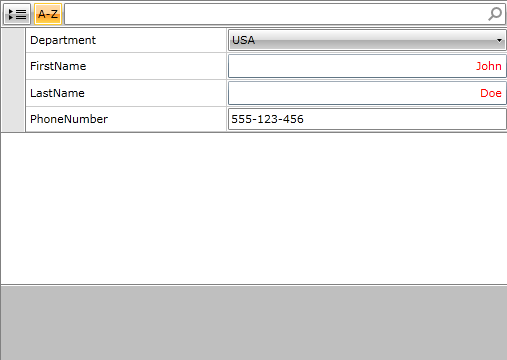

# DataTemplateSelector Support

The __DataTemplateSelector__ approach enables conditional selection of __DataTemplates__, based on information provided by the respective bound data item.

Read more about __DataTemplateSelectors__ in the [Template Selectors]() article.

## DataTemplateSelectors in RadPropertyGrid

RadPropertyGrid enables its users to implement conditional editor __DataTemplate__ selection for its __PropertyGridFields__ trough a __DataTemplateSelector__:

__Example 1: Creating custom DataTemplateSelector__

<snippet id='radpropertygrid-features-datatemplateselector-block_1-cs' />
<snippet id='radpropertygrid-features-datatemplateselector-block_1-vb' />

__Example 2: Defining custom DataTemplateSelector__

<snippet id='radpropertygrid-features-datatemplateselector-block_2-xaml' />

>You might wonder where these "telerik" and "local", in front of the tags RadPropertyGrid and __FieldTemplateSelector__, came from. Well, these are the names of the namespaces you give when you import the appropriate assembly or your custom __DataTemplateSelector__ class into the XAML file.

>The AutoBind attached behavior is fully compatible with the __DataTemplateSelector__ approach.

## See Also

 * [AutoBind Behaviour]()