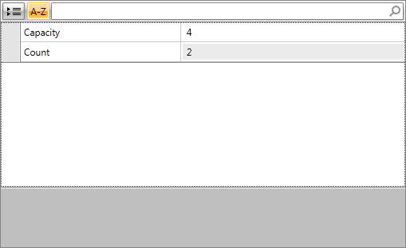
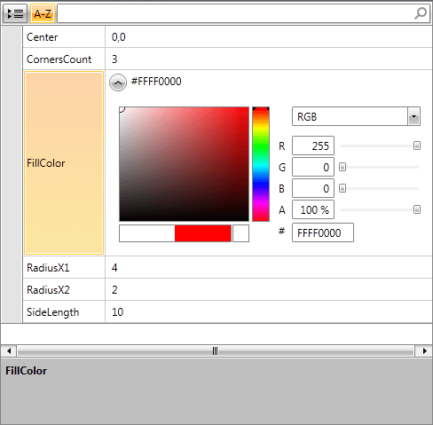
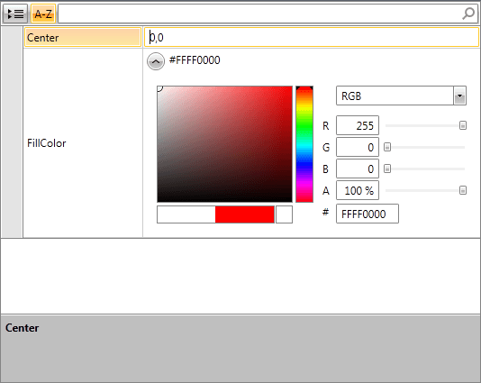
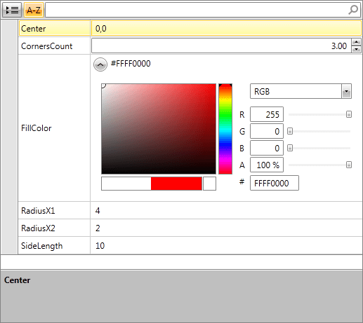

# Property Sets

With the __property sets__ feature RadPropertyGrid enables its users to process multiple items' properties simultaneously. You no longer need to provide additional view models to expose those properties or manage their changes backwards to your business object instances. Everything now happens under the hood.

>Property sets do not support nested properties. You need to create a computed property in your business objects pointing to the nested property to enable this functionality. For example, you can define a **CountryName** property returning the value of the nested **Name** property of the bound objects' **Country**.

## Setup

In order to benefit from this feature, you should set RadPropertyGrid's **PropertySetMode** property to an appropriate value and provide an **IEnumerable** instance that contains the business objects. 

For the means of illustrating the separate mode values, the following types will be used:

__Example 1: Preparing sample data__

```C#
	public class Ellipse
	{
	    public Color FillColor { get; set; }
	    public double RadiusX1 { get; set; }
	    public double RadiusX2 { get; set; }
	    public Point Center { get; set; }
	}

	public class RegularPolygon
	{
	    public int CornersCount { get; set; }
	    public Color FillColor { get; set; }
	    public Point Center { get; set; }
	    public double SideLength { get; set; }
	}

	public class ViewModel
	{
	    public IEnumerable<object> Shapes
	    {
	        get
	        {
	            return new List<object>()
	            {
	                new Ellipse()
	                {
	                    Center = new Point(1,1),
	                    FillColor = Colors.Red,
	                    RadiusX1 = 4, RadiusX2 = 2
	                    },
	                    new RegularPolygon()
	                {
	                    Center = new Point(3,2),
	                    FillColor = Colors.Blue,
	                    CornersCount = 3,
	                    SideLength = 10
	                }
	            };
	        }
	    }
	}
```
```VB.NET
	Public Class Ellipse
	    Public Property FillColor() As Color
	    Public Property RadiusX1() As Double
	    Public Property RadiusX2() As Double
	    Public Property Center() As Point
	End Class

	Public Class RegularPolygon
	    Public Property CornersCount() As Integer
	    Public Property FillColor() As Color
	    Public Property Center() As Point
	    Public Property SideLength() As Double
	End Class

	Public Class ViewModel
	    Public ReadOnly Property Shapes() As IEnumerable(Of Object)
	        Get
	            Return New List(Of Object)() From {
	                New Ellipse() With {
	                    .Center = New Point(1, 1),
	                    .FillColor = Colors.Red,
	                    .RadiusX1 = 4,
	                    .RadiusX2 = 2
	                },
	                New RegularPolygon() With {
	                    .Center = New Point(3, 2),
	                    .FillColor = Colors.Blue,
	                    .CornersCount = 3,
	                    .SideLength = 10
	                }
	            }
	        End Get
	    End Property
	End Class
```

__Example 2: Defining RadPropertyGrid__

```XAML
	<Grid>
	    <Grid.Resources>
	        <local:ViewModel x:Key="ViewModel" />
	    </Grid.Resources>
	    <telerik:RadPropertyGrid DataContext="{StaticResource ViewModel}" Item="{Binding Shapes}" />
	</Grid>
```

## Property Set Modes

The PropertySetMode property accepts values of type **PropertySetOperation** which is an enumeration that has three values - [None](#none), [Union](#union) and [Intersection](#intersection).

### None

**None** is the default value of RadPropertyGrid’s **PropertySetMode** property. In this case the item value is processed as a single object, regardless of its type. It is a List of objects instance in our occasion.

#### Figure 1: RadPropertyGrid with PropertySetMode set to None



Both **RegularPolygon** and **Ellipse**'s properties have been disregarded and only the two public properties of the **List** class are displayed.

### Union

When **Union** is the active mode, a union set of the items' properties is constructed. In case that a property that is common for several items has the same value for each of them, RadPropertyGrid displays this value in the respective editor. On the other hand, if it has different values for the separate items, the editor displays either null, or the default value for this type.

#### Figure 2: RadPropertyGrid with PropertySetMode set to Union



Notice that all 6 distinct properties are displayed.

### Intersection

The **Intersection** mode works in a similar way to the "Union" mode, however, in this case RadPropertyGrid constructs an intersection set instead. Here is the output when "Intersection" mode is applied over the same data source:

#### Figure 3: RadPropertyGrid with PropertySetMode set to Intersection



In this case, only the **Center** and **FillColor** properties which are common for both classes are displayed.

## PropertySet Property

RadPropertyGrid exposes a **PropertySet** property of type PropertySet which is a basic implementation of the **DynamicObject** class. Thus, you can access and modify each of the properties of the set through its indexer.

> More information about the DynamicObject class can be found in [this MSDN article](https://msdn.microsoft.com/en-us/library/system.dynamic.dynamicobject).

__Example 3: Update PropertySet value__

```C#
	this.RadPropertyGrid.PropertySet["FillColor"] = Colors.Blue;
```
```VB.NET
	Me.RadPropertyGrid.PropertySet("FillColor") = Colors.Blue
```

The control also provides an **UpdatePropertySetValue** which accepts three arguments:

* **propertyName**: The name of the updated property
* **propertyValue**: The value of the updated property
* **shouldUpdateBoundData**: Indicates whether the bound data (item) should be updated

**Example 4** demonstrates how to update the property set similarly to **Example 3** but without propagating the changed values back to the underlying models.

__Example 4: Update PropertySet value without notifying underlying models__

```C#
	this.RadPropertyGrid.UpdatePropertySetValue("FillColor", Colors.Blue, false);
```
```VB.NET
	Me.RadPropertyGrid.UpdatePropertySetValue("FillColor", Colors.Blue, False)
```

>You can check the __Validating Property Sets__ section from the control's [Validation]() article for information on how to apply validation for property sets.

## Customizing PropertyDefinitions

When RadPropertyGrid's PropertySetMode is set to Union or Intersection, the DataContext of the created editors is an instance of **PropertySetViewModel**. It exposes the **CurrentPropertySet** property which is the same instance provided by the PropertySet property of the RadPropertyGrid control. You can use this to define your customized property definitions. However, as dynamic properties do not contain any information about their underlying type, an **IValueConverter** might be needed in certain scenarios.

**Examples 5-7** demonstrate how to use a custom **EditorTemplate** for the integer property of a property set.

__Example 5: Defining editor template__

```XAML
	<Grid x:Name="LayoutRoot">
	    <Grid.Resources>
	        <local:ViewModel x:Key="vm" />
	        <local:MyConverter x:Key="cnv" />
	        <DataTemplate x:Key="editorTemplate">
	            <telerik:RadNumericUpDown Value="{Binding CurrentPropertySet[CornersCount], Mode=TwoWay, Converter={StaticResource cnv}}" />
	        </DataTemplate>
	    </Grid.Resources>
	    <telerik:RadPropertyGrid DataContext="{StaticResource vm}" 
	                         Item="{Binding Shapes}" 
	                         PropertySetMode="Union" 
	                         AutoGeneratingPropertyDefinition="RadPropertyGrid_AutoGeneratingPropertyDefinition"/>
	</Grid>
```

__Example 6: Setting EditorTemplate of a PropertyDefinition__

```C#
	private void RadPropertyGrid_AutoGeneratingPropertyDefinition(object sender, Telerik.Windows.Controls.Data.PropertyGrid.AutoGeneratingPropertyDefinitionEventArgs e)
	{
	    if (e.PropertyDefinition.DisplayName == "CornersCount")
	    {
	        e.PropertyDefinition.EditorTemplate = LayoutRoot.Resources["editorTemplate"] as DataTemplate;
	    }
	}
```
```VB.NET
	Private Sub RadPropertyGrid_AutoGeneratingPropertyDefinition(sender As Object, e As Telerik.Windows.Controls.Data.PropertyGrid.AutoGeneratingPropertyDefinitionEventArgs)
	    If e.PropertyDefinition.DisplayName = "CornersCount" Then
	        e.PropertyDefinition.EditorTemplate = TryCast(LayoutRoot.Resources("editorTemplate"), DataTemplate)
	    End If
	End Sub
```
	
__Example 7: Defining IValueConverter__

```C#
	public class MyConverter : IValueConverter
	{
	    public object Convert(object value, Type targetType, object parameter, System.Globalization.CultureInfo culture)
	    {
	        return Int32.Parse(value.ToString());
	    }
	    public object ConvertBack(object value, Type targetType, object parameter, System.Globalization.CultureInfo culture)
	    {
	        return value;
	    }
	}
```
```VB.NET
	Public Class MyConverter
	    Implements IValueConverter
	    Public Function Convert(value As Object, targetType As Type, parameter As Object, culture As System.Globalization.CultureInfo) As Object Implements IValueConverter.Convert
	        Return Int32.Parse(value.ToString())
	    End Function
	    Public Function ConvertBack(value As Object, targetType As Type, parameter As Object, culture As System.Globalization.CultureInfo) As Object Implements IValueConverter.ConvertBack
	        Return value
	    End Function
	End Class
```

#### Figure 4: RadNumericUpDown for integer property of property set



## Disable creating object instance for null value

By default, __RadPropertyGrid__ will create an object instance for a property of custom data type with null value. This behavior can be altered through the __ShouldAddNullForNonMatchingValues__ boolean property. Its default value is __False__. When set to __True__, the control __will not create a new instance__ for __null property values__. 

__Example 8: Setting the ShouldAddNullForNonMatchingValues property to True__

```XAML
	  <telerik:RadPropertyGrid DataContext="{StaticResource vm}"
								 Item="{Binding Shapes}"
								 PropertySetMode="Union"
								 telerik:PropertySet.ShouldAddNullForNonMatchingValues="True"/>
```

## See Also

 * [Edit Modes]()
 * [Validation]() 
