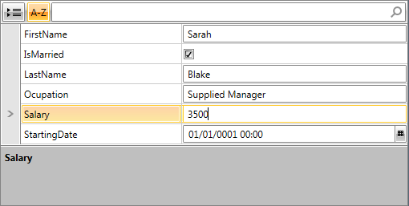
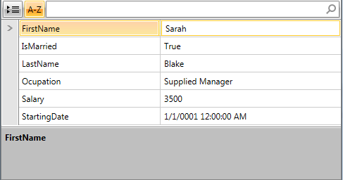

# Edit Modes

RadPropertyGrid exposes __EditMode__ property of type __PropertyGridEditMode__, which provides different options for __editing behavior__.

## Edit Modes

As to configuring RadPropertyGrid and assigning an __Item__ to it, please check the [Getting Started with RadPropertyGrid]() help article.
        

### Default

The default option behaves similarly for both __Flat and Hierarchical__ [RenderMode](). It __utilizes much lighter UI, but also provides fewer options__:
                  

1. All __PropertyGridFields__ editors are accessible from the UI and the correctness of an edit operation is ensured only by the data-binding mechanism.
                    

2. There are __not distinct visual states of PropertyGridField__ that indicate whether it is being currently edited, or not.
                    

3. When a __validation error occurs, users are not encouraged to fix it, or cancel their change__, by blocking the UI.
                    

#### __[XAML]Example 1: RadPropertyGrid with Default EditMode__

	{{region xaml-radpropertygrid-edit-modes_0}}
	<telerik:RadPropertyGrid RenderMode="Flat" EditMode="Default">
	{{endregion}}

__Figure 1__: RadPropertyGrid with Default EditMode

### Single

Single EditMode introduces the concept of __editing properties one at a time__. An editor is created only for the currently edited property. The other values are displayed in TextBlocks
                  

It relies on PropertyDefinition’s Binding property. Setting this mode is not supported with dynamic data or when [Property-Sets are defined]().
                

>important__Single EditMode__ is supported only when __RenderMode is set to Flat__. For more information on the different rendering modes, please check the [Layout Rendering Modes]() article.
                  
              

#### __[XAML]Example 2: RadPropertyGrid with EditMode set to Single__

{{region xaml-radpropertygrid-edit-modes_1}}

	<telerik:RadPropertyGrid x:Name="PropertyGrid1" RenderMode="Flat" EditMode="Single">
{{endregion}}

__Figure 2__: RadPropertyGrid with Single EditMode

## Events

### BeginEdit

__BeginEditMethod__ has two overloads:

1. __BeginEdit()__ – starts an edit operation for the current PropertyDefinition.
                

2. __BeginEdit(PropertyDefinition propertyDefinition)__ – starts an edit operation for the PropertyDefinition that is passed as a parameter.
                

If the edit operation is successfully initiated, RadPropertyGrid’s __BeginningEdit event is raised__ . It is a cancellable event so one can prevent the edit operation there, in accordance to some custom logic:
                      

#### __[C#]Example 3: Canceling the edit as BeginningEdit event is raised__

{{region cs-radpropertygrid-edit-modes_0}}

	void RpgBeginningEdit(object sender, PropertyGridBeginningEditEventArgs e)
	{
	    // Custom logic
		e.Cancel = true;
	}
{{endregion}}

#### __[VB]Example 3: Canceling the edit as BeginningEdit event is raised__

{{region vb-radpropertygrid-edit-modes_0}}

	    Private Sub RpgBeginningEdit(sender As Object, e As PropertyGridBeginningEditEventArgs)
	        ' Custom logic
	        e.Cancel = True
	    End Sub
{{endregion}}

Then __PropertyGridField__’s display content (TextBlock) is replaced by an editor.
            

### Finishing Edit

There are __two alternative options__ for finishing an edit operation:
            

1. __CommitEdit__ – tries to change the value of the bound property. First, it invokes the validation logic (raising the Validating, Validated events).
                

2. __CancelEdit__ – revers the old value without validating the new ones.
                

Both operations result in __raising of the EditEnded event__, which indicates the executed operation and the Old and New value after it.
            

These __edit actions are integrated__ with [RadPropertyGrid’s Keyboard navigation]() (i.e. clicking on a display TextBlock triggers edit, pressing Esc cancels edit etc).
            

# See Also

 * [Getting Started with RadPropertyGrid]()

 * [Layout Rendering Modes]()

 * [Keyboard Support]()

 * [Defining Property-Sets]()
