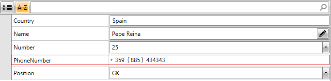
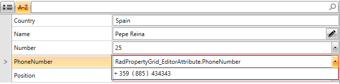
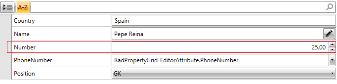
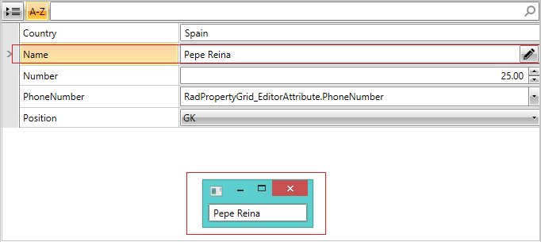

# Editor Attribute

__RadPropertyGrid now provides support for the new Telerik attribute EditorAttribute__ that enables the user to define an editor for each property directly in its definition.

__EditorAttribute__ is placed in __Telerik.Windows.Controls.Data binary in Telerik.Windows.Controls.Data.PropertyGrid namespace__. You need to have a reference to the assembly and add a using for the namespace. You can check the [Getting Started with RadPropertyGrid]() article for more basic information.

It has tree properties:

* __EditorType__: Specifies the type of the editor used for the property.

* __TargetProperty__: Defines the property of the custom editor that will be used for the binding.     

* __EditorStyle__: Sets the style of the UI component used for hosting the custom editor. Its values can be:

	* __DropDown__: A dropdown button which content is the custom editor to be displayed.

	* __Modal__: A button that shows a modal dialog window with the custom editor inside.

	* __None (default value)__: The editor will be placed directly in PropertyGridField and no special UI element will be used.

Consequently, __EditorAttribute has a couple of constructors__ that can be used depending on the necessities:

* __public  EditorAttribute(Type editorType)__

* __public EditorAttribute(Type editorType, EditorStyle editorStyle)__

* __public EditorAttribute(Type editorType, string targetProperty)__

* __public EditorAttribute(Type editorType, string targetProperty, EditorStyle editorStyle)__

For the purposes of this example, the definition of RadPropertyGrid is:

#### __[XAML] Example 1: Defining RadPropertyGrid__

	{{region xaml-radpropertygrid-editor-attribute_0}}
	<telerik:RadPropertyGrid x:Name="propertyGrid" Item="{Binding Captain}" />
{{endregion}}

The property __Captain__ is defined in the ViewModel as follows:

#### __[C#] Example 2: Defining property in the ViewModel__

{{region cs-radpropertygrid-editor-attribute_8}}
	private Player captain;
	public Player Captain
	{
	    get
	    {
	        if (this.captain == null)
	        {
	            this.captain = new Player("Pepe Reina", 25, Position.GK, "Spain") { PhoneNumber = new PhoneNumber() { CountryCode = "359", RegionCode = "885", Number = "434343" } };
	        }
	        return this.captain;
	    }
	}
{{endregion}}

#### __[VB.NET] Example 2: Defining property in the ViewModel__

{{region vb-radpropertygrid-editor-attribute_8}}
	Private _captain As Player
	Public ReadOnly Property Captain() As Player
	    Get
	        If Me._captain Is Nothing Then
	            Me._captain = New Player("Pepe Reina", 25, Position.GK, "Spain") With {
	                .PhoneNumber = New PhoneNumber() With {
	                    .CountryCode = "359",
	                    .RegionCode = "885",
	                    .Number = "434343"
	                }
	            }
	        End If
	        Return Me._captain
	    End Get
	End Property
{{endregion}}

The definitions of the Custom editor __PhoneEditorControl__, the __Player business object__ used and the full implementation on the __PhoneNumber class__ can be found in the [Definitions](33f1dce2-0b7d-43b4-af52-4312258b380a#definitions) section.

* __EditorAttribute(Type editorType)__ – only the type of the editor can be specified. 

For example:
        

#### __[C#] Example 3: Specifying the type of the editor__

	{{region cs-radpropertygrid-editor-attribute_2}}
	private PhoneNumber phoneNumber;
	[Telerik.Windows.Controls.Data.PropertyGrid.Editor(typeof(PhoneEditorControl))]
	public PhoneNumber PhoneNumber
	{
	    get
	    {
	        return this.phoneNumber;
	    }
	    set
	    {
	        if (this.phoneNumber != value)
	        {
	            this.phoneNumber = value;
	            this.OnPropertyChanged("PhoneNumber");
	        }
	    }
	}
{{endregion}}

#### __[VB.NET] Example 3: Specifying the type of the editor__

	{{region vb-radpropertygrid-editor-attribute_2}}
	Private _phoneNumber As PhoneNumber
	<Telerik.Windows.Controls.Data.PropertyGrid.Editor(GetType(PhoneEditorControl))>
	Public Property PhoneNumber() As PhoneNumber
	    Get
	        Return Me._phoneNumber
	    End Get
	    Set(ByVal value As PhoneNumber)
	        If Me._phoneNumber IsNot value Then
	            Me._phoneNumber = value
	            Me.OnPropertyChanged("PhoneNumber")
	        End If
	    End Set
	End Property
{{endregion}}

It will look like:
        
__Figure 1__: EditorAtrribute with editorType specified

* __EditorAttribute(Type editorType, EditorStyle editorStyle)__ – the type of the editor and the style of the containing host:

#### __[C#] Example 4: Specifying the type of the editor and the style of the containing host__

	{{region cs-radpropertygrid-editor-attribute_3}}
	private PhoneNumber phoneNumber;
	[Telerik.Windows.Controls.Data.PropertyGrid.Editor(typeof(PhoneEditorControl), Telerik.Windows.Controls.Data.PropertyGrid.EditorStyle.DropDown)]
	public PhoneNumber PhoneNumber
	{
	    get
	    {
	        return this.phoneNumber;
	    }
	    set
	    {
	        if (this.phoneNumber != value)
	        {
	            this.phoneNumber = value;
	            this.OnPropertyChanged("PhoneNumber");
	        }
	    }
	}
{{endregion}}

#### __[VB.NET] Example 4: Specifying the type of the editor and the style of the containing host__

	{{region vb-radpropertygrid-editor-attribute_3}}
	Private _phoneNumber As PhoneNumber
	<Telerik.Windows.Controls.Data.PropertyGrid.Editor(GetType(PhoneEditorControl), EditorStyle.DropDown)>
	Public Property PhoneNumber() As PhoneNumber
	    Get
	        Return Me._phoneNumber
	    End Get
	    Set(ByVal value As PhoneNumber)
	        If Me._phoneNumber IsNot value Then
	            Me._phoneNumber = value
	            Me.OnPropertyChanged("PhoneNumber")
	        End If
	    End Set
	End Property
{{endregion}}

In this case PhoneEditorControl will be defined in a DropDownEditor control and it will look like:

__Figure 2__: EditorAtrribute with editorType and editorStyle specified

* __EditorAttribute(Type editorType, string targetProperty)__ – the type of the editor and its property that you want to bind to. For instance:

#### __[C#] Example 5: Specifying the type of the editor and the target property__

{{region cs-radpropertygrid-editor-attribute_4}}
	private int number;
	[Telerik.Windows.Controls.Data.PropertyGrid.Editor(typeof(RadNumericUpDown), "Value")]
	public int Number
	{
	    get { return this.number; }
	    set
	    {
	        if (value != this.number)
	        {
	            this.number = value;
	            this.OnPropertyChanged("Number");
	        }
	    }
	}
{{endregion}}

#### __[VB.NET] Example 5: Specifying the type of the editor and the target property__

{{region vb-radpropertygrid-editor-attribute_4}}
	Private _number As Integer
	<Telerik.Windows.Controls.Data.PropertyGrid.Editor(GetType(RadNumericUpDown), "Value")>
	Public Property Number() As Integer
	    Get
	        Return Me._number
	    End Get
	    Set(ByVal value As Integer)
	        If value <> Me._number Then
	            Me._number = value
	            Me.OnPropertyChanged("Number")
	        End If
	    End Set
	End Property
{{endregion}}

In this case the property from your business object – Number – will be bound to the ValueProperty of RadNumericUpDown control.     
        

The result will be:
        
__Figure 3__: EditorAtrribute with editorType and targetProperty specified

* __EditorAttribute(Type editorType, string targetProperty, EditorStyle editorStyle)__ – with this constructor all properties are set – the type of the editor, its property that will be used for the binding and the type of the host it will be placed inside. For example:

#### __[C#] Example 6: Specifying the type of the editor, the target property and style of the containing host__

	{{region cs-radpropertygrid-editor-attribute_5}}
	private string name;
	[Telerik.Windows.Controls.Data.PropertyGrid.Editor(typeof(TextBox), "Text", EditorStyle.Modal)]
	public string Name
	{
	    get { return this.name; }
	    set
	    {
	        if (value != this.name)
	        {
	            this.name = value;
	            this.OnPropertyChanged("Name");
	        }
	    }
	}
{{endregion}}

#### __[VB.NET] Example 6: Specifying the type of the editor, the target property and style of the containing host__

	{{region vb-radpropertygrid-editor-attribute_5}}
	Private _name As String
	<Telerik.Windows.Controls.Data.PropertyGrid.Editor(GetType(TextBox), "Text", EditorStyle.Modal)>
	Public Property Name() As String
	    Get
	        Return Me._name
	    End Get
	    Set(ByVal value As String)
	        If value <> Me._name Then
	            Me._name = value
	            Me.OnPropertyChanged("Name")
	        End If
	    End Set
	End Property
{{endregion}}

It will look like:
        
 Figure 4: EditorAtrribute with editorType, targetProperty and editorStyle specified

 

## Definitions

The definition of the Custom editor __PhoneEditorControl__ is:

#### __[XAML] Example 7: Defining the custom editor__

	{{region xaml-radpropertygrid-editor-attribute_1}}
	<UserControl xmlns="http://schemas.microsoft.com/winfx/2006/xaml/presentation"
	      xmlns:x="http://schemas.microsoft.com/winfx/2006/xaml"
	      xmlns:mc="http://schemas.openxmlformats.org/markup-compatibility/2006" 
	      xmlns:d="http://schemas.microsoft.com/expression/blend/2008" 
	      mc:Ignorable="d" >
	    <UserControl.Resources>
	        
	    </UserControl.Resources>
	    <StackPanel Orientation="Horizontal" Height="20">
	        <TextBlock Text="+" />
	        <TextBox Text="{Binding CountryCode, Mode=TwoWay}" />
	        <TextBlock Text=" (" />
	        <TextBox Text="{Binding RegionCode, Mode=TwoWay}" />
	        <TextBlock Text=") " />
	        <TextBox Text="{Binding Number, Mode=TwoWay}" />
	    </StackPanel>
	</UserControl>
{{endregion}}

The definition of the __PhoneNumber__ class is:

#### __[C#] Example 8: Defining PhoneNumber object__

	{{region cs-radpropertygrid-editor-attribute_6}}
	public class PhoneNumber : INotifyPropertyChanged
	{
	    private string countryCode;
	    public string CountryCode
	    {
	        get
	        {
	            return this.countryCode;
	        }
	        set
	        {
	            if (this.countryCode != value)
	            {
	                this.countryCode = value;
	                this.OnPropertyChanged("CountryCode");
	            }
	        }
	    }
	    private string number;
	    public string Number
	    {
	        get
	        {
	            return this.number;
	        }
	        set
	        {
	            if (this.number != value)
	            {
	                this.number = value;
	                this.OnPropertyChanged("Number");
	            }
	        }
	    }
	    private string regionCode;
	    public string RegionCode
	    {
	        get
	        {
	            return this.regionCode;
	        }
	        set
	        {
	            if (this.regionCode != value)
	            {
	                this.regionCode = value;
	                this.OnPropertyChanged("RegionCode");
	            }
	        }
	    }
	    public event PropertyChangedEventHandler PropertyChanged;
	    private void OnPropertyChanged(string propertyName)
	    {
	        if (this.PropertyChanged != null)
	            this.PropertyChanged(this, new PropertyChangedEventArgs(propertyName));
	    }
	}
{{endregion}}

#### __[VB.NET] Example 8: Defining PhoneNumber object__

	{{region vb-radpropertygrid-editor-attribute_6}}
	Public Class PhoneNumber
	    Implements INotifyPropertyChanged
	    Private _countryCode As String
	    Public Property CountryCode() As String
	        Get
	            Return Me._countryCode
	        End Get
	        Set(ByVal value As String)
	            If Me._countryCode <> value Then
	                Me._countryCode = value
	                Me.OnPropertyChanged("CountryCode")
	            End If
	        End Set
	    End Property
	    Private _number As String
	    Public Property Number() As String
	        Get
	            Return Me._number
	        End Get
	        Set(ByVal value As String)
	            If Me._number <> value Then
	                Me._number = value
	                Me.OnPropertyChanged("Number")
	            End If
	        End Set
	    End Property
	    Private _regionCode As String
	    Public Property RegionCode() As String
	        Get
	            Return Me._regionCode
	        End Get
	        Set(ByVal value As String)
	            If Me._regionCode <> value Then
	                Me._regionCode = value
	                Me.OnPropertyChanged("RegionCode")
	            End If
	        End Set
	    End Property
	    Public Event PropertyChanged As PropertyChangedEventHandler Implements INotifyPropertyChanged.PropertyChanged
	    Private Sub OnPropertyChanged(ByVal propertyName As String)
	        RaiseEvent PropertyChanged(Me, New PropertyChangedEventArgs(propertyName))
	    End Sub
	End Class
{{endregion}}

The definition of the __Player business object__ used for the example is:

#### __[C#] Example 9: Defining Player object__
	
	{{region cs-radpropertygrid-editor-attribute_7}}
	public class Player : INotifyPropertyChanged
	{
	    public event PropertyChangedEventHandler PropertyChanged;
	    private string name;
	    private int number;
	    private Position position;
	    private string country;
	    private PhoneNumber phoneNumber;
	    [Telerik.Windows.Controls.Data.PropertyGrid.Editor(typeof(TextBox), "Text", EditorStyle.Modal)]
	    public string Name
	    {
	        get { return this.name; }
	        set
	        {
	            if (value != this.name)
	            {
	                this.name = value;
	                this.OnPropertyChanged("Name");
	            }
	        }
	    }
	    [Telerik.Windows.Controls.Data.PropertyGrid.Editor(typeof(RadNumericUpDown), "Value")]
	    public int Number
	    {
	        get { return this.number; }
	        set
	        {
	            if (value != this.number)
	            {
	                this.number = value;
	                this.OnPropertyChanged("Number");
	            }
	        }
	    }
	    public Position Position
	    {
	        get { return this.position; }
	        set
	        {
	            if (value != this.position)
	            {
	                this.position = value;
	                this.OnPropertyChanged("Position");
	            }
	        }
	    }
	    [Telerik.Windows.Controls.Data.PropertyGrid.Editor(typeof(PhoneEditorControl), Telerik.Windows.Controls.Data.PropertyGrid.EditorStyle.DropDown)]
	    public PhoneNumber PhoneNumber
	    {
	        get
	        {
	            return this.phoneNumber;
	        }
	        set
	        {
	            if (this.phoneNumber != value)
	            {
	                this.phoneNumber = value;
	                this.OnPropertyChanged("PhoneNumber");
	            }
	        }
	    }
	    public string Country
	    {
	        get { return this.country; }
	        set
	        {
	            if (value != this.country)
	            {
	                this.country = value;
	                this.OnPropertyChanged("Country");
	            }
	        }
	    }
	    public Player()
	    {
	    }
	    public Player(string name, int number, Position position, string country)
	    {
	        this.name = name;
	        this.number = number;
	        this.position = position;
	        this.country = country;
	    }
	    protected virtual void OnPropertyChanged(PropertyChangedEventArgs args)
	    {
	        PropertyChangedEventHandler handler = this.PropertyChanged;
	        if (handler != null)
	        {
	            handler(this, args);
	        }
	    }
	    private void OnPropertyChanged(string propertyName)
	    {
	        this.OnPropertyChanged(new PropertyChangedEventArgs(propertyName));
	    }
	}
{{endregion}}

#### __[VB.NET] Example 9: Defining Player object__
	
	{{region vb-radpropertygrid-editor-attribute_7}}
	Public Class Player
	    Implements INotifyPropertyChanged
	    Public Event PropertyChanged As PropertyChangedEventHandler Implements INotifyPropertyChanged.PropertyChanged
	    Private _name As String
	    Private _number As Integer
	    Private _position As Position
	    Private _country As String
	    Private _phoneNumber As PhoneNumber
	    <Telerik.Windows.Controls.Data.PropertyGrid.Editor(GetType(TextBox), "Text", EditorStyle.Modal)>
	    Public Property Name() As String
	        Get
	            Return Me._name
	        End Get
	        Set(ByVal value As String)
	            If value <> Me._name Then
	                Me._name = value
	                Me.OnPropertyChanged("Name")
	            End If
	        End Set
	    End Property
	    <Telerik.Windows.Controls.Data.PropertyGrid.Editor(GetType(RadNumericUpDown), "Value")>
	    Public Property Number() As Integer
	        Get
	            Return Me._number
	        End Get
	        Set(ByVal value As Integer)
	            If value <> Me._number Then
	                Me._number = value
	                Me.OnPropertyChanged("Number")
	            End If
	        End Set
	    End Property
	    Public Property Position() As Position
	        Get
	            Return Me._position
	        End Get
	        Set(ByVal value As Position)
	            If value <> Me._position Then
	                Me._position = value
	                Me.OnPropertyChanged("Position")
	            End If
	        End Set
	    End Property
	    <Telerik.Windows.Controls.Data.PropertyGrid.Editor(GetType(PhoneEditorControl), EditorStyle.DropDown)>
	    Public Property PhoneNumber() As PhoneNumber
	        Get
	            Return Me._phoneNumber
	        End Get
	        Set(ByVal value As PhoneNumber)
	            If Me._phoneNumber IsNot value Then
	                Me._phoneNumber = value
	                Me.OnPropertyChanged("PhoneNumber")
	            End If
	        End Set
	    End Property
	    Public Property Country() As String
	        Get
	            Return Me._country
	        End Get
	        Set(ByVal value As String)
	            If value <> Me._country Then
	                Me._country = value
	                Me.OnPropertyChanged("Country")
	            End If
	        End Set
	    End Property
	    Public Sub New()
	    End Sub
	    Public Sub New(ByVal name As String, ByVal number As Integer, ByVal position As Position, ByVal country As String)
	        Me._name = name
	        Me._number = number
	        Me._position = position
	        Me._country = country
	    End Sub
	    Protected Overridable Sub OnPropertyChanged(ByVal args As PropertyChangedEventArgs)
	        Dim handler As PropertyChangedEventHandler = Me.PropertyChangedEvent
	        If handler IsNot Nothing Then
	            handler(Me, args)
	        End If
	    End Sub
	    Private Sub OnPropertyChanged(ByVal propertyName As String)
	        Me.OnPropertyChanged(New PropertyChangedEventArgs(propertyName))
	    End Sub
	End Class
{{endregion}}

# See Also

 * [Getting Started with RadPropertyGrid]()
