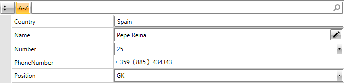
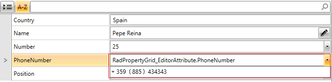
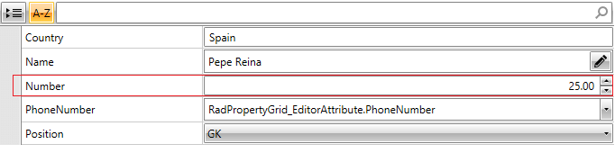
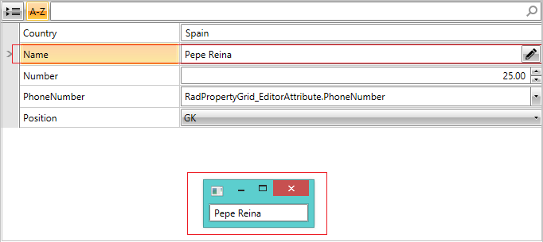

# Editor Attribute

RadPropertyGrid provides support for the Telerik attribute __EditorAttribute__ that enables the user to define an editor for each property directly in its definition.

__EditorAttribute__ is placed in __Telerik.Windows.Controls.Data binary in Telerik.Windows.Controls.Data.PropertyGrid namespace__. You need to have a reference to the assembly and add a using for the namespace. You can check the [Getting Started with RadPropertyGrid]() article for more basic information.

It has three properties:

* __EditorType__: Specifies the type of the editor used for the property.

* __TargetProperty__: Defines the property of the custom editor that will be used for the binding.     

* __EditorStyle__: Sets the style of the UI component used for hosting the custom editor. Its values can be:

	* __DropDown__: A dropdown button which content is the custom editor to be displayed.

	* __Modal__: A button that shows a modal dialog window with the custom editor inside. Read more about it [here]().

	* __None (default value)__: The editor will be placed directly in PropertyGridField and no special UI element will be used.

## Constructors

Consequently, __EditorAttribute has various constructors__ that can be used depending on the necessities. Their main difference is that either the __Type__ of the editor is passed as parameter, or the string representation of the editor's __Type__. 

* __public  EditorAttribute(Type editorType)__

* __public EditorAttribute(Type editorType, EditorStyle editorStyle)__

* __public EditorAttribute(Type editorType, string targetProperty)__

* __public EditorAttribute(Type editorType, string targetProperty, EditorStyle editorStyle)__

* __public EditorAttribute(string editorTypeName, string assemblyFile)__

* __public EditorAttribute(string editorTypeName, string assemblyFile, EditorStyle editorStyle)__

* __public EditorAttribute(string editorTypeName, string assemblyFile, string targetProperty)__

* __public EditorAttribute(string editorTypeName, string assemblyFile, string targetProperty, EditorStyle editorStyle)__

> The __assemblyFile__ parameter represents the __absolute file path__ of the needed assembly

For the purposes of this example, the definition of __RadPropertyGrid__ is:

__Example 1: Defining RadPropertyGrid__

<snippet id='radpropertygrid-features-editor-attribute-block_1-xaml' />

The property __Captain__ is defined in the ViewModel as follows:

__Example 2: Defining property in the ViewModel__

<snippet id='radpropertygrid-features-editor-attribute-block_2-cs' />
<snippet id='radpropertygrid-features-editor-attribute-block_2-vb' />

The definitions of the Custom editor __PhoneEditorControl__, the __Player business object__ used and the full implementation of the __PhoneNumber class__ can be found in the [Define Data](#define-data) section.

* __EditorAttribute(Type editorType)__ – only the type of the editor can be specified:
        

__Example 3: Specifying the type of the editor__

<snippet id='radpropertygrid-features-editor-attribute-block_3-cs' />
<snippet id='radpropertygrid-features-editor-attribute-block_3-vb' />

* __EditorAttribute(string editorTypeName, string assemblyFile)__ – the string representation of the editor's type and the absolute file path of the assembly can be specified:

__Example 4: Specifying the type of the editor as string and passing the absolute file path of the assembly__
	
<snippet id='radpropertygrid-features-editor-attribute-block_4-cs' />
<snippet id='radpropertygrid-features-editor-attribute-block_4-vb' />

It will look like:
        
__Figure 1__: EditorAtrribute with editorType specified

* __EditorAttribute(Type editorType, EditorStyle editorStyle)__ – the type of the editor and the style of the containing host:

__Example 5: Specifying the type of the editor and the style of the containing host__

<snippet id='radpropertygrid-features-editor-attribute-block_5-cs' />
<snippet id='radpropertygrid-features-editor-attribute-block_5-vb' />

* __EditorAttribute(string editorTypeName, string assemblyFile, EditorStyle editorStyle)__ - the style of the containing host can be specified:

__Example 6: Specifying the type of the editor and the absolute file path of the assembly as string, as well the style of the containing host__

<snippet id='radpropertygrid-features-editor-attribute-block_6-cs' />
<snippet id='radpropertygrid-features-editor-attribute-block_6-vb' />

In this case PhoneEditorControl will be defined in a DropDownEditor control and it will look like:

__Figure 2__: EditorAtrribute with editorType and editorStyle specified

* __EditorAttribute(Type editorType, string targetProperty)__ – the type of the editor and its property that you want to bind to. For instance:

__Example 7: Specifying the type of the editor and the target property__

<snippet id='radpropertygrid-features-editor-attribute-block_7-cs' />
<snippet id='radpropertygrid-features-editor-attribute-block_7-vb' />

* __EditorAttribute(string editorTypeName, string assemblyFile, string targetProperty)__ - the target property can be specified:

__Example 8: Specifying the type of the editor and the absolute file path of the assembly as string, as well the target property__

<snippet id='radpropertygrid-features-editor-attribute-block_8-cs' />
<snippet id='radpropertygrid-features-editor-attribute-block_8-vb' />
	
In this case the property from your business object – Number – will be bound to the ValueProperty of RadNumericUpDown control.     
        

The result will be:
        
__Figure 3__: EditorAtrribute with editorType and targetProperty specified

* __EditorAttribute(Type editorType, string targetProperty, EditorStyle editorStyle)__ – with this constructor all properties are set – the type of the editor, its property that will be used for the binding and the type of the host it will be placed inside. For example:

__Example 9: Specifying the type of the editor, the target property and style of the containing host__

<snippet id='radpropertygrid-features-editor-attribute-block_9-cs' />
<snippet id='radpropertygrid-features-editor-attribute-block_9-vb' />

* __EditorAttribute(string editorTypeName, string assemblyFile, string targetProperty, EditorStyle editorStyle)__ - specifying both the target property

__Example 10: Specifying the type of the editor and the absolute file path of the assembly as string, the target property and the style for the containing host__

<snippet id='radpropertygrid-features-editor-attribute-block_10-cs' />
<snippet id='radpropertygrid-features-editor-attribute-block_10-vb' />

It will look like:
        
 Figure 4: EditorAtrribute with editorType, targetProperty and editorStyle specified

 

## Define Data

The definition of the Custom editor __PhoneEditorControl__ is:

__Example 11: Defining the custom editor__

<snippet id='radpropertygrid-features-editor-attribute-block_11-xaml' />

The definition of the __PhoneNumber__ class is:

__Example 12: Defining PhoneNumber object__

<snippet id='radpropertygrid-features-editor-attribute-block_12-cs' />
<snippet id='radpropertygrid-features-editor-attribute-block_12-vb' />

The definition of the __Player business object__ used for the example is:

__Example 13: Defining Player object__
	
<snippet id='radpropertygrid-features-editor-attribute-block_13-cs' />
<snippet id='radpropertygrid-features-editor-attribute-block_13-vb' />

## See Also

* [Edit Modes]()
* [FlagEnumEditor]()
* [Getting Started with RadPropertyGrid]()
* [Modal Editor]()