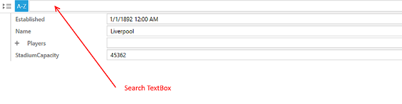

# Filtering Support

__RadPropertyGrid__ supports filtering through its built-in search TextBox. The default behavior is __"search as you type"__ meaning that each time you modify the text, property definitions will be filtered based on their __DisplayName__ property.

* [Custom Filtering](#custom-filtering)

* [Deferred Filtering](#deferred-filtering)

* [Filtering Events](#filtering-events)



## Custom Filtering

RadPropertyGrid exposes an **EnableCustomFiltering** property which indicates whether RadPropertyGrid should allow custom filtering. Its default value is **False**.

__Example 1: Set EnableCustomFiltering__

```XAML
	<telerik:RadPropertyGrid EnableCustomFiltering="True" />
```

In addition to this, in order to define your own filtering criteria, rather than filter based only on the  definitions' **DisplayName**, you must create a custom class which inherits from **PropertyDefinition** and override the **IsFiltered** property. 

For example, you may want to filter on the PropertyDefinition's **DisplayName** as well as **Value**. This can be done with the help of the **SearchString** property which gets the string used to filter properties in the search-as-you-type box.

__Example 2: Creating a custom class which inherits from PropertyDefinition__

```C#
    public class MyPropertyDefinition : PropertyDefinition
    {
        public override bool IsFiltered
        {
            get
            {
                if (!string.IsNullOrEmpty(this.SearchString))
                {
                    return this.Value.ToString().Contains(this.SearchString) || this.DisplayName.Contains(this.SearchString);
                }
                else
                {
                    return true;
                }
            }
        }
    }
```
```VB.NET

    Public Class MyPropertyDefinition
        Inherits PropertyDefinition

        Public Overrides ReadOnly Property IsFiltered() As Boolean
            Get
                If Not String.IsNullOrEmpty(Me.SearchString) Then
                    Return Me.Value.ToString().Contains(Me.SearchString) OrElse Me.DisplayName.Contains(Me.SearchString)
                Else
                    Return True
                End If
            End Get
        End Property
    End Class
```

You can then use this new class in XAML.

__Example 3: Use the custom property definition__

```XAML
    <telerik:RadPropertyGrid.PropertyDefinitions>
        <my:MyPropertyDefinition Binding="{Binding Name}" DisplayName="Name" />
        <my:MyPropertyDefinition Binding="{Binding Established}" DisplayName="Established" />
        <my:MyPropertyDefinition Binding="{Binding StadiumCapacity}" DisplayName="StadiumCapacity" />
    </telerik:RadPropertyGrid.PropertyDefinitions>
```

Now, typing in the search TextBox will result in a case-sensitive search in both **DisplayName** and **Value**.

## Deferred Filtering

RadPropertyGrid exposes the __EnableDeferredFiltering__ property, which determines whether the filtering through the search text box will be performed dynamically. Its default value is __False__.

When __EnableDeferredFiltering__ is set to __True__, the filtering will be executed when the editor commits its value either on __lost focus__ or when the users presses the __Enter__ or __Tab__ key. 

__Example 1: Enabling Deferred Filtering__

```XAML
	<telerik:RadPropertyGrid x:Name="propertyGrid" 
	                  EnableDeferredFiltering="True">
	</telerik:RadPropertyGrid>
```

## Filtering Events

RadPropertyGrid exposes two events related to filtering:

* **Filtering**: Occurs when filtering RadPropertyGrid. Through the **PropertyGridFilteringEventArgs**, you can access the following properties:

	* **Cancel**: A boolean value indicating whether the event should be canceled.
	
	* **FilterText**: The value that has been typed in the search TextBox.

* **Filtered**: Occurs after filtering is applied to RadPropertyGrid. Does not get fired if the **Filtering** event is canceled.

## See also

* [Getting Started with RadPropertyGrid]()

* [Grouping Support]()

* [Validation Support]()
