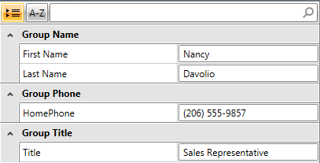

# Grouping Support

RadPropertyGrid supports grouping. Its __IsGrouped__ property controls the current RadPropertyGrid's state. You can set it to __true__ and you will have RadPropertyGrid __initially grouped__. If you set it to __false__, then you will have RadProperty __sorted__. By default the control is shown as sorted.

>Please note all the groups will be auto expanded. In case you want to initially collapse a group, you can do this once RadPropertyGrid is loaded using a Dispatcher. Please refer to the [Expand/Collapse Groups](#expand-collapse-groups) section below.

Another property you can configure is __SortAndGroupButtonsVisibility__. It sets the visibility mode of the sort and group buttons. By default the buttons will be visible.

For example, lets have the following declaration of the RadPropertyGrid control:

__Example 1: Declaring RadPropertyGrid__

```XAML
	<telerik:RadPropertyGrid Grid.Row="0" x:Name="PropertyGrid1"
	                          RenderMode="Flat"
	                          AutoGeneratePropertyDefinitions="False"
	                          IsGrouped="True">
	    <telerik:RadPropertyGrid.PropertyDefinitions>
	        <telerik:PropertyDefinition Binding="{Binding FirstName}" GroupName="Group Name" DisplayName="First Name"/>
	        <telerik:PropertyDefinition Binding="{Binding LastName}" GroupName="Group Name" DisplayName="Last Name"/>
	        <telerik:PropertyDefinition Binding="{Binding Title}" GroupName="Group Title" DisplayName="Title"/>
	        <telerik:PropertyDefinition Binding="{Binding HomePhone}" GroupName="Group Phone" DisplayName="HomePhone"/>
	    </telerik:RadPropertyGrid.PropertyDefinitions>
	</telerik:RadPropertyGrid>
```

Its Item is set like so:

__Example 2: Setting RadPropertyGrid Item__

```C#
	Employee Employee = new Employee()
	{
	    FirstName = "Nancy",
	    LastName = "Davolio",
	    Title = "Sales Representative",
	    HomePhone = "(206) 555-9857"
	};
	this.PropertyGrid1.Item = Employee;
```
```VB.NET
	Dim Employee As New Employee() With {
	    .FirstName = "Nancy",
	    .LastName = "Davolio",
	    .Title = "Sales Representative",
	    .HomePhone = "(206) 555-9857"
	}
	Me.PropertyGrid1.Item = Employee
```

Now, if you run your application, you will see this result:



## Expand/Collapse Groups

The user can control the group state from the UI.

He can also collapse and expand groups in RadPropertyGrid in code using its methods:

* __ExpandGroup(object GroupKey)__: Sets expand state for the given GroupDefinition

__Example 3: Expanding RadPropertyGrid Group__

```C#
	this.PropertyGrid1.ExpandGroup("Group Name");
```
```VB.NET
	Me.PropertyGrid1.ExpandGroup("Group Name")
```

* __CollapseGroup(object GroupKey)__: Collapses the visual group for the given GroupDefinition

__Example 4: Collapsing RadPropertyGrid Group__

```C#
	this.PropertyGrid1.CollapseGroup("Group Name");
```
```VB.NET
	Me.PropertyGrid1.CollapseGroup("Group Name")
```

* __ExpandAllGroups()__: Expands all groups recursively

__Example 5: Expanding all RadPropertyGrid Groups__

```C#
	this.PropertyGrid1.ExpandAllGroups();
```
```VB.NET
	Me.PropertyGrid1.ExpandAllGroups()
```

* __CollapseAllGroups()__: Collapses all groups recursively.

__Example 6: Collapsing all RadPropertyGrid Groups__

```C#
	this.PropertyGrid1.CollapseAllGroups();
```
```VB.NET
	Me.PropertyGrid1.CollapseAllGroups()
```

>important You need to set __RenderMode="Flat"__ in order to be able to execute the methods above. For more information check [Layout Rendering Modes]().

## GroupDefinitions

The GroupDefinitions property gets a collection of GroupDefinition objects used to group RadPropertyGrid.

It has two methods:

* __SuspendNotifications()__: Suspends the notifications.

* __ResumeNotifications()__: Resumes the notifications.

__Example 7: Suspending and Resuming notifications__

```C#
	this.PropertyGrid1.GroupDefinitions.SuspendNotifications();
	// Execute additional logic
	this.PropertyGrid1.GroupDefinitions.ResumeNotifications();
```
```VB.NET
	Me.PropertyGrid1.GroupDefinitions.SuspendNotifications()
	' Execute additional logic
	Me.PropertyGrid1.GroupDefinitions.ResumeNotifications()
```

>important You need to set __RenderMode="Flat"__ in order to be able to work with the GroupDefinitions collection. For more information check [Layout Rendering Modes]().

## AutoExpandGroups

As of **R2 2019**, the RadPropertyGrid control exposes a new boolean property - **AutoExpandGroups**. It controls whether groups should be expanded or not when loaded. The default value is **True** meaning that all groups are initially expanded.

__Example 8: Set groups' initial state to collapsed__

```C#
	this.PropertyGrid1.AutoExpandGroups = false;
```
```VB.NET
	this.PropertyGrid1.AutoExpandGroups = False
```

## See Also

 * [Getting Started with RadPropertyGrid]()

 * [Edit Modes]()

 * [Scrolling into View]()
