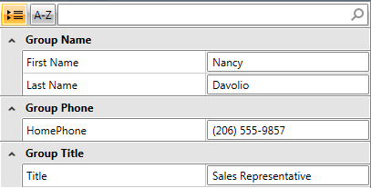

# Grouping Support

RadPropertyGrid supports grouping. Its __IsGrouped__ property controls the current RadPropertyGrid's state. You can set it to __true__ and you will have RadPropertyGrid __initially grouped__. If you set it to __false__, then you will have RadProperty __sorted__. By default the control is shown as sorted.

>Please note all the groups will be auto expanded. In case you want to initially collapse a group, you can do this once RadPropertyGrid is loaded using a Dispatcher. Please refer to the [Expand/Collapse Groups](#expand-collapse-groups) section below.

Another property you can configure is __SortAndGroupButtonsVisibility__. It sets the visibility mode of the sort and group buttons. By default the buttons will be visible.

For example, lets have the following declaration of the RadPropertyGrid control:

__Example 1: Declaring RadPropertyGrid__

<snippet id='radpropertygrid-features-grouping-block_1-xaml' />

Its Item is set like so:

__Example 2: Setting RadPropertyGrid Item__

<snippet id='radpropertygrid-features-grouping-block_2-cs' />
<snippet id='radpropertygrid-features-grouping-block_2-vb' />

Now, if you run your application, you will see this result:

## Expand/Collapse Groups

The user can control the group state from the UI.

He can also collapse and expand groups in RadPropertyGrid in code using its methods:

* __ExpandGroup(object GroupKey)__: Sets expand state for the given GroupDefinition

__Example 3: Expanding RadPropertyGrid Group__

<snippet id='radpropertygrid-features-grouping-block_3-cs' />
<snippet id='radpropertygrid-features-grouping-block_3-vb' />

* __CollapseGroup(object GroupKey)__: Collapses the visual group for the given GroupDefinition

__Example 4: Collapsing RadPropertyGrid Group__

<snippet id='radpropertygrid-features-grouping-block_4-cs' />
<snippet id='radpropertygrid-features-grouping-block_4-vb' />

* __ExpandAllGroups()__: Expands all groups recursively

__Example 5: Expanding all RadPropertyGrid Groups__

<snippet id='radpropertygrid-features-grouping-block_5-cs' />
<snippet id='radpropertygrid-features-grouping-block_5-vb' />

* __CollapseAllGroups()__: Collapses all groups recursively.

__Example 6: Collapsing all RadPropertyGrid Groups__

<snippet id='radpropertygrid-features-grouping-block_6-cs' />
<snippet id='radpropertygrid-features-grouping-block_6-vb' />

>important You need to set __RenderMode="Flat"__ in order to be able to execute the methods above. For more information check [Layout Rendering Modes]().

## GroupDefinitions

The GroupDefinitions property gets a collection of GroupDefinition objects used to group RadPropertyGrid.

It has two methods:

* __SuspendNotifications()__: Suspends the notifications.

* __ResumeNotifications()__: Resumes the notifications.

__Example 7: Suspending and Resuming notifications__

<snippet id='radpropertygrid-features-grouping-block_7-cs' />
<snippet id='radpropertygrid-features-grouping-block_7-vb' />

>important You need to set __RenderMode="Flat"__ in order to be able to work with the GroupDefinitions collection. For more information check [Layout Rendering Modes]().

## AutoExpandGroups

As of **R2 2019**, the RadPropertyGrid control exposes a new boolean property - **AutoExpandGroups**. It controls whether groups should be expanded or not when loaded. The default value is **True** meaning that all groups are initially expanded.

__Example 8: Set groups' initial state to collapsed__

<snippet id='radpropertygrid-features-grouping-block_8-cs' />
<snippet id='radpropertygrid-features-grouping-block_8-vb' />

## See Also

 * [Getting Started with RadPropertyGrid]()

 * [Edit Modes]()

 * [Scrolling into View]()