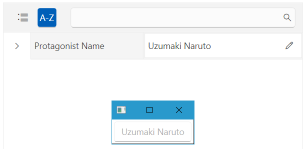
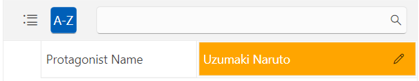

# Modal Editor

The `ModalEditor` element allows you to edit the value of a `PropertyDefinition` in a modal dialog window.

## Showing the ModalEditor via the EditorTemplate of a PropertyDefinition

The PropertyDefinition exposes the `EditorTemplate` property that will allow you to define a new ModalEditor instance for it. Via the `SourceProperty` of the ModalEditor, you can set the property from your business object that will be used for the binding. To use your custom editor, you can utilize the `Editor` property, which expects a value of the type of `FrameworkElement`.

__Defining the business object__
```C#
    public class CharacterInfo
    {
        public string ProtagonistName { get; set; }
    }
```
```VB.NET
    Public Class CharacterInfo
        Public Property ProtagonistName As String
    End Class
```

__Setting the ModalEditor via the EditorTemplate property__
```XAML
    <telerik:RadPropertyGrid.PropertyDefinitions>
        <telerik:PropertyDefinition DisplayName="Protagonist Name" Binding="{Binding ProtagonistName}">
            <telerik:PropertyDefinition.EditorTemplate>
                <DataTemplate>
                    <telerik:ModalEditor SourceProperty="{Binding ProtagonistName}">
                        <telerik:ModalEditor.Editor>
                            <TextBox Text="{Binding ProtagonistName}" telerik:StyleManager.Theme="Windows11"/>
                        </telerik:ModalEditor.Editor>
                    </telerik:ModalEditor>
                </DataTemplate>
            </telerik:PropertyDefinition.EditorTemplate>
        </telerik:PropertyDefinition>
    </telerik:RadPropertyGrid.PropertyDefinitions>
```

__ModalEditor defined via the EditorTemplate property__



## Showing the ModalEditor When Using the EditorAttribute

When using the [EditorAttribute](), if its `EditorStyle` property is set to `Modal`, a new ModalEditor element is created.

__Setting the EditorStyle property to Modal__
```C#
    public class CharacterInfo
    {
        [Editor(typeof(TextBox), "Text", EditorStyle.Modal)]
        public string ProtagonistName { get; set; }
    }
```
```VB.NET
    Public Class CharacterInfo
        <Editor(GetType(TextBox), "Text", EditorStyle.Modal)>
        Public Property ProtagonistName As String
    End Class
```

__ModalEditor defined via the EditorStyle property of the EditorAttribute__


## Customizing the ModalEditor

To customize the ModalEditor element, you can either create a `Style` that targets it or use the [FieldLoaded]() event. You can retrieve it through the `Content` property of the `Field` object that is provided by the event's arguments.

__Customizing the ModalEditor via a Style__
```XAML
    <!--If you are using NoXaml assemblies: BasedOn="{StaticResource ModalEditorStyle}"-->
    <Style TargetType="telerik:ModalEditor">
        <Setter Property="Foreground" Value="White"/>
        <Setter Property="Background" Value="Orange"/>
    </Style>
```

__Customizing the ModalEditor via the FieldLoaded event__
```C#
    private void RadPropertyGrid_FieldLoaded(object sender, FieldEventArgs e)
    {
        var modalEditor = e.Field.Content as ModalEditor;

        if (modalEditor != null)
        {
            modalEditor.Foreground = Brushes.White;
            modalEditor.Background = Brushes.Orange;
        }
    }
```
```VB.NET
    Private Sub RadPropertyGrid_FieldLoaded(ByVal sender As Object, ByVal e As FieldEventArgs)
        Dim modalEditor = TryCast(e.Field.Content, ModalEditor)

        If modalEditor IsNot Nothing Then
            modalEditor.Foreground = Brushes.White
            modalEditor.Background = Brushes.Orange
        End If
    End Sub
```

__Customized ModalEditor__



## Positioning the ModalEditor

The ModalEditor element provides the functionality to position the modal dialog window. To do so, you can utilize the `WindowStartupLocation`, `WindowTop`, and `WindowLeft` properties.

>important In order for the `WindowTop` and `WindowLeft` properties to be taken into account, the `WindowStartupLocation` property has to be set to `Manual`.

__Positioning the ModalEditor via Style__
```XAML
    <!--If you are using NoXaml assemblies: BasedOn="{StaticResource ModalEditorStyle}"-->
	<Style TargetType="telerik:ModalEditor">
		<Setter Property="WindowStartupLocation" Value="Manual"/>
		<Setter Property="WindowTop" Value="500"/>
		<Setter Property="WindowLeft" Value="250"/>
	</Style>
```

__Positioning the ModalEditor via the FieldLoaded event__
```C#
	private void PropertyGrid_FieldLoaded(object sender, Telerik.Windows.Controls.Data.PropertyGrid.FieldEventArgs e)
	{
		var modalEditor = e.Field.Content as ModalEditor;

		if (modalEditor != null)
		{
			modalEditor.WindowStartupLocation = WindowStartupLocation.Manual;
			modalEditor.WindowTop = 500;
			modalEditor.WindowLeft = 250;
		}
	}
```
```VB.NET
	Private Sub PropertyGrid_FieldLoaded(ByVal sender As Object, ByVal e As Telerik.Windows.Controls.Data.PropertyGrid.FieldEventArgs)
		Dim modalEditor = TryCast(e.Field.Content, ModalEditor)

		If modalEditor IsNot Nothing Then
			modalEditor.WindowStartupLocation = WindowStartupLocation.Manual
			modalEditor.WindowTop = 500
			modalEditor.WindowLeft = 250
		End If
	End Sub
```

## See Also

* [Editor Attribute]()