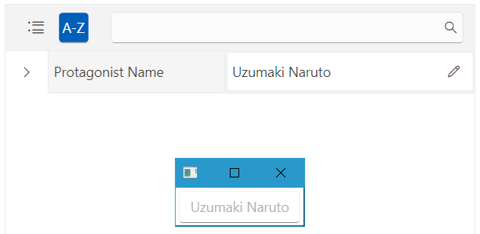
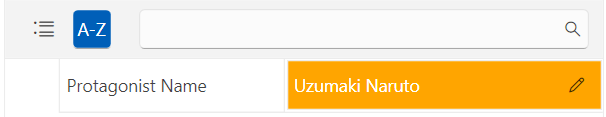

# Modal Editor

The `ModalEditor` element allows you to edit the value of a `PropertyDefinition` in a modal dialog window.

## Showing the ModalEditor via the EditorTemplate of a PropertyDefinition

The PropertyDefinition exposes the `EditorTemplate` property that will allow you to define a new ModalEditor instance for it. Via the `SourceProperty` of the ModalEditor, you can set the property from your business object that will be used for the binding. To use your custom editor, you can utilize the `Editor` property, which expects a value of the type of `FrameworkElement`.

__Defining the business object__
<snippet id='radpropertygrid-features-modal-editor-block_1-cs' />
<snippet id='radpropertygrid-features-modal-editor-block_1-vb' />

__Setting the ModalEditor via the EditorTemplate property__
<snippet id='radpropertygrid-features-modal-editor-block_2-xaml' />

__ModalEditor defined via the EditorTemplate property__

## Showing the ModalEditor When Using the EditorAttribute

When using the [EditorAttribute](), if its `EditorStyle` property is set to `Modal`, a new ModalEditor element is created.

__Setting the EditorStyle property to Modal__
<snippet id='radpropertygrid-features-modal-editor-block_3-cs' />
<snippet id='radpropertygrid-features-modal-editor-block_3-vb' />

__ModalEditor defined via the EditorStyle property of the EditorAttribute__

## Customizing the ModalEditor

To customize the ModalEditor element, you can either create a `Style` that targets it or use the [FieldLoaded]() event. You can retrieve it through the `Content` property of the `Field` object that is provided by the event's arguments.

__Customizing the ModalEditor via a Style__
<snippet id='radpropertygrid-features-modal-editor-block_4-xaml' />

__Customizing the ModalEditor via the FieldLoaded event__
<snippet id='radpropertygrid-features-modal-editor-block_5-cs' />
<snippet id='radpropertygrid-features-modal-editor-block_5-vb' />

__Customized ModalEditor__

## Positioning the ModalEditor

The ModalEditor element provides the functionality to position the modal dialog window. To do so, you can utilize the `WindowStartupLocation`, `WindowTop`, and `WindowLeft` properties.

>important In order for the `WindowTop` and `WindowLeft` properties to be taken into account, the `WindowStartupLocation` property has to be set to `Manual`.

__Positioning the ModalEditor via Style__
<snippet id='radpropertygrid-features-modal-editor-block_6-xaml' />

__Positioning the ModalEditor via the FieldLoaded event__
<snippet id='radpropertygrid-features-modal-editor-block_7-cs' />
<snippet id='radpropertygrid-features-modal-editor-block_7-vb' />

## See Also

* [Editor Attribute]()